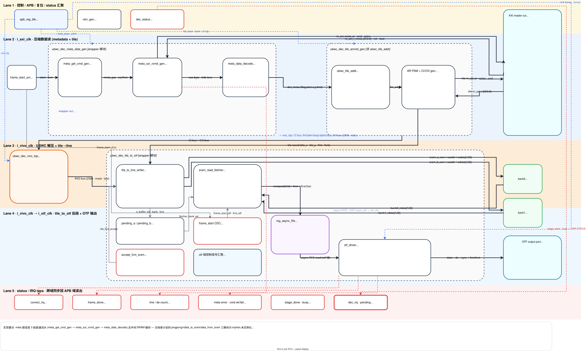

# UBWC ENC/DEC 系统级 Spec

本文整理当前 UBWC ENC/DEC wrapper、APB 寄存器、软件配置流程、调试方案和 PPA 约束。ENC 与 DEC 分开描述，每个模块都按 1 Feature、2 Interface、3 Register、4 Diagram、5 Work Mode、6 Debug、7 PPA 的结构组织。

## 版本变更记录

后续每次迭代都需要在本表追加一行，记录版本号、日期、影响范围和修改摘要；已有版本记录只追加、不覆盖。若同一轮迭代同时修改 RTL、寄存器、配置工具和文档，需要在同一行中明确列出影响范围。

| 版本 | 日期 | 影响范围 | 修改内容 | 文档/验证状态 |
| --- | --- | --- | --- | --- |
| R0.7-dev | 2026-07-24 | ENC APB、wrapper、tile/meta 地址链路、配置工具、系统 spec | ENC 输出地址从 slot0/slot1 双地址队列改为唯一地址组。四个 64-bit base 写完并以 `REG_TILE_BASE_UV_HI` 收尾后，`START` 锁存唯一地址快照；后续 VSYNC 持续复用，直到下一次 START 替换。`fcnt[0]` 只保留帧标识和统计分组语义，不再选择地址。`REG_STATUS0[10]` 改为单一 `addr_cfg_valid`，`[12:11]` 改为保留位。 | APB 配置提交定向测试通过；ENC wrapper Verilator lint 无错误；服务器 VCS case 0055～0058 均完成连续两帧，`stage_done=0xaa`，CVO、tile/meta AXI 写出及最终 memory compare 全部为 0 mismatch。回归命令仍因既有 RVI tiled-uncompressed reference checker 的独立数据重排失配返回非零。 |
| R0.6-dev | 2026-07-24 | ENC reset、APB config commit、wrapper、配置工具、系统 spec | ENC 帧控制职责拆分：每个输入 VSYNC 上升沿固定触发 AXI drain、全链路帧复位并在复位释放后自动运行；`REG_IRQ_CTRL[5] START` 只校验并锁存工作寄存器和当前地址 slot 快照，不再触发复位或启动帧。配置无效或当前 `fcnt[0]` 对应地址 slot 无效时，`o_otf_ready` 保持为 0；`REG_STATUS0[14] cfg_valid` 反映最近一次 START 的提交结果；原 `IRQ_CTRL[6] vsync_reset_en` 改为保留位。 | START 配置提交定向测试和 VSYNC reset/drain 定向测试通过；ENC 顶层 Verilator lint 无错误；服务器 VCS NV12、RGBA8888、RGBA1010102、P010 均完成连续两帧，CVO、tile/meta AXI 写出及最终 memory compare 全部为 0 mismatch。回归命令仍因既有 RVI tiled-uncompressed reference checker 的独立数据重排失配返回非零。 |
| R0.5-dev | 2026-07-24 | ENC OTF data packer、系统 spec | ENC fcnt 改为 OTF 域内部生成：`rst_n_otf=0` 时 `otf_fcnt_int/locked_fcnt` 清 0；每个 VSYNC 上升沿将递增前的 `otf_fcnt_int` 锁存为本帧 `locked_fcnt`，同时准备下一帧计数；`din_fcnt` 全程使用 `locked_fcnt`。外部 `i_otf_fcnt` 端口暂时保留兼容，但不再参与 packer 帧号生成。 | ENC 顶层和完整 fake TB Verilator elaboration/lint 无错误；VCS 连续帧回归待执行。 |
| R0.4-dev | 2026-07-24 | ENC wrapper、OTF-to-tile、验证环境、系统 spec | 回退 ENC 内部自增 fcnt：恢复外部 `i_otf_fcnt[3:0]`；START CDC FIFO 只传启动 token；`ubwc_enc_otf_data_packer` 在 VSYNC 边界锁存本帧 `locked_fcnt`，并将其随像素、tile、metadata 和 AXI ID 数据链路传递。START/soft reset 不再自行分配帧号。 | ENC 顶层 Verilator elaboration/lint 无错误；VCS 多帧回归待执行。 |
| R0.3-dev | 2026-07-24 | ENC wrapper、验证环境、系统 spec | ENC 内部 4 bit fcnt 纳入 soft reset：进入内部 reset hold 时清 0，复位释放后首个被接受的 START 使用 `fcnt=0`；验证环境分别统计 START 接受总数和 soft reset 后的期望 fcnt，避免跨复位连续递增的旧假设。 | `git diff --check` 通过；ENC 顶层 Verilator elaboration/lint 无错误；VCS 多帧回归待执行。 |
| R0.2-dev | 2026-07-24 | ENC wrapper、OTF-to-tile、验证环境、系统 spec | ENC frame count 改为硬件内部维护：每次有效 `START` 分配一个 4 bit fcnt，首帧为 0，随后模 16 递增；start token 与 fcnt 作为同一 CDC payload 从 AXI 域送到 OTF 域；删除 ENC 外部 `i_otf_fcnt` 接口，内部继续使用 `fcnt[0]` 选择地址 slot，并使用完整 4 bit fcnt 贯穿 tile/metadata/AXI ID 数据链路。 | Verilator elaboration/lint 无错误；服务器 VCS case 0021 RGBA8888 与 case 0027 NV12 均完成连续 4 帧回归，两个 case 均为 `internal_fcnt_starts=4`、`internal_fcnt_mis=0`；case 0021 另完成连续 18 帧回归，`internal_fcnt_starts=18`、`internal_fcnt_mis=0`，覆盖 `4'hf -> 4'h0` 回绕。 |
| R0.1-dev | 2026-05-19 | ENC reset、AXI wrapper、寄存器、配置工具、系统 spec | 增加 ENC `IRQ_CTRL[6] vsync_reset_en`，支持输入 `i_otf_vsync` 上升沿触发 AXI-drain soft reset 并重新 arm frame start；`ubwc_cfg`/`vrf` ENC 配置函数增加 `vsync_reset_en` 参数；ENC/DEC 对外 `AXI_LENW` 默认改为 5 bit，支持最大 32 beat；系统 spec 将对外 `AXI_IDW` 默认值按 5 bit 表达，内部低 4 bit 保留 FCNT/ID 语义。 | 文档已同步；ENC APB 寄存器表已更新；本地 lint/单元检查已完成。 |
| R0 | 2026-05-19 | ENC/DEC wrapper、寄存器、系统 spec、回归基线 | 建立 R0 系统级 spec 结构；整理 ENC/DEC Feature、Interface、Register、Diagram、Work Mode、Debug、PPA；完成连续两帧 RGBA8888、NV12、P010/G016 回归记录。 | R0 release tag：`R0`；回归记录见文末。 |

## ENC

### ENC 1. Feature

ENC 将输入 OTF 像素流编码为 UBWC compressed tile 数据和 metadata，并通过 AXI write master 写入外部 memory。

| 特性 | 说明 |
| --- | --- |
| 输入接口 | OTF input，包含 `vsync/hsync/de/data/fcnt/lcnt/ready`；外部 `i_otf_fcnt[3:0]` 随像素、tile、metadata 和内部 AXI ID 链路传递 |
| 输出接口 | AXI write master，分别写 compressed tile 数据和 metadata |
| 推荐时钟 | APB/PCLK 100 MHz；AXI/i_axi_clk 500 MHz；Core/i_vivo_clk 200 MHz；OTF/i_otf_clk 320 MHz |
| 支持格式 | RGBA8888、RGBA1010102、YUV420_8/NV12、YUV420_10/P010、RGBA8888 lossy 2:1 |
| 支持像素尺寸 | 当前 SRAM/line-buffer 规格按最大有效宽度 4096 px 设计；1440x3200 属于该宽度范围内。实际配置以 OTF width/height 和 layout 计算结果为准 |
| SRAM | 当前外部工作 SRAM 为 bank0/bank1 两个同规格 bank，单 bank 64 KiB，两 bank 合计 128 KiB。SRAM 容量主要由最大支持图像宽度决定；图像高度只影响行组处理次数，不增加单 bank 容量；小于或等于 4096 px 宽的 RGBA/YUV420 场景复用同一规格 SRAM |
| 连续帧 | 每个输入 VSYNC 上升沿采样本帧配置/地址有效性，并触发 AXI drain 和 ENC 帧级全链路复位；复位释放后仅在该次采样有效时自动处理本帧，不依赖 START 启动 |
| 配置提交 | `REG_IRQ_CTRL[5] START` 只校验并锁存完整配置快照；已提交配置在下一次 START 前保持不变 |
| 输出地址 | 仅一组 Y/RGBA metadata、Y/RGBA tile、UV metadata、UV tile base；START 锁存后跨帧复用，`fcnt[0]` 不参与地址选择；配置无效时整帧 `o_otf_ready=0` |
| 中断 | 正确中断在最后有效输出完成后产生；错误中断用于地址未配置、OTF 行/帧错误、FIFO overflow、VIVO/metadata error |

### ENC 2. Interface

ENC wrapper 参数：

| 参数 | 默认值 | 说明 |
| --- | --- | --- |
| `SB_WIDTH` | 1 | Sideband width |
| `APB_AW` | 16 | APB byte address width |
| `APB_DW` | 32 | APB data width |
| `APB_BLK_NREG` | 64 | APB register count |
| `AXI_AW` | 64 | AXI address width |
| `AXI_DW` | 64 | AXI data width |
| `AXI_LENW` | 5 | 对外 AXI burst length width，支持最大 32 beat |
| 外部 `AXI_IDW` | 5 | wrapper 对外 AXI ID 端口默认 5 bit；内部有效 FCNT/ID 语义为低 4 bit |
| `COM_BUF_AW` | 12 | SRAM word address width |
| `COM_BUF_DW` | 128 | SRAM data width |

ENC wrapper port：

| 接口组 | 信号 | 方向 | 位宽 | 说明 |
| --- | --- | --- | --- | --- |
| APB slave | `PCLK` | input | 1 bit | APB clock |
| APB slave | `PRESETn` | input | 1 bit | APB async reset, active low |
| APB slave | `PSEL` | input | 1 bit | APB select |
| APB slave | `PENABLE` | input | 1 bit | APB enable phase |
| APB slave | `PADDR` | input | `APB_AW` | APB byte address |
| APB slave | `PWRITE` | input | 1 bit | APB write/read select |
| APB slave | `PWDATA` | input | `APB_DW` | APB write data |
| APB slave | `PREADY` | output | 1 bit | APB ready |
| APB slave | `PSLVERR` | output | 1 bit | APB slave error |
| APB slave | `PRDATA` | output | `APB_DW` | APB read data |
| AXI clock/reset | `i_axi_clk` | input | 1 bit | AXI/control clock |
| AXI clock/reset | `i_axi_rstn` | input | 1 bit | `i_axi_clk` domain synchronous reset, active low |
| OTF clock/reset | `i_otf_clk` | input | 1 bit | OTF input clock |
| OTF clock/reset | `i_otf_rstn` | input | 1 bit | `i_otf_clk` domain synchronous reset, active low |
| VIVO clock/reset | `i_vivo_clk` | input | 1 bit | VIVO clock |
| VIVO clock/reset | `i_vivo_rstn` | input | 1 bit | `i_vivo_clk` domain synchronous reset, active low |
| OTF input | `i_otf_vsync` | input | 1 bit | Input frame sync |
| OTF input | `i_otf_hsync` | input | 1 bit | Input line sync |
| OTF input | `i_otf_de` | input | 1 bit | Input data enable |
| OTF input | `i_otf_data` | input | 128 bit | Input pixel data |
| OTF input | `i_otf_fcnt` | input | 4 bit | 当前帧编号；随像素进入 packer，并贯穿 tile、metadata 和内部 AXI ID 数据路径；`fcnt[0]` 仅用于统计分组和 sideband，不选择地址 |
| OTF input | `i_otf_lcnt` | input | 12 bit | Input line count |
| OTF input | `o_otf_ready` | output | 1 bit | ENC 对 OTF 输入的反压 |
| SRAM bank0 | `o_bank0_en` | output | 1 bit | Bank0 SRAM enable |
| SRAM bank0 | `o_bank0_wen` | output | 1 bit | Bank0 SRAM write enable |
| SRAM bank0 | `o_bank0_addr` | output | `COM_BUF_AW` | Bank0 SRAM address |
| SRAM bank0 | `o_bank0_din` | output | `COM_BUF_DW` | Bank0 SRAM write data |
| SRAM bank0 | `i_bank0_dout` | input | `COM_BUF_DW` | Bank0 SRAM read data |
| SRAM bank0 | `i_bank0_dout_vld` | input | 1 bit | Bank0 SRAM read data valid |
| SRAM bank1 | `o_bank1_en` | output | 1 bit | Bank1 SRAM enable |
| SRAM bank1 | `o_bank1_wen` | output | 1 bit | Bank1 SRAM write enable |
| SRAM bank1 | `o_bank1_addr` | output | `COM_BUF_AW` | Bank1 SRAM address |
| SRAM bank1 | `o_bank1_din` | output | `COM_BUF_DW` | Bank1 SRAM write data |
| SRAM bank1 | `i_bank1_dout` | input | `COM_BUF_DW` | Bank1 SRAM read data |
| SRAM bank1 | `i_bank1_dout_vld` | input | 1 bit | Bank1 SRAM read data valid |
| AXI AW | `o_m_axi_awid` | output | 5 bit | 对外 AXI AW ID；内部有效 FCNT/ID 语义为低 4 bit |
| AXI AW | `o_m_axi_awaddr` | output | `AXI_AW` | AXI AW address |
| AXI AW | `o_m_axi_awlen` | output | `AXI_LENW` | AXI AW burst length |
| AXI AW | `o_m_axi_awsize` | output | 3 bit | AXI AW beat size |
| AXI AW | `o_m_axi_awburst` | output | 2 bit | AXI AW burst type |
| AXI AW | `o_m_axi_awlock` | output | 2 bit | AXI AW lock |
| AXI AW | `o_m_axi_awcache` | output | 4 bit | AXI AW cache attribute |
| AXI AW | `o_m_axi_awprot` | output | 3 bit | AXI AW protection attribute |
| AXI AW | `o_m_axi_awvalid` | output | 1 bit | AXI AW valid |
| AXI AW | `i_m_axi_awready` | input | 1 bit | AXI AW ready |
| AXI W | `o_m_axi_wdata` | output | `AXI_DW` | AXI W data |
| AXI W | `o_m_axi_wstrb` | output | `AXI_DW/8` | AXI W byte strobe |
| AXI W | `o_m_axi_wvalid` | output | 1 bit | AXI W valid |
| AXI W | `o_m_axi_wlast` | output | 1 bit | AXI W last beat |
| AXI W | `i_m_axi_wready` | input | 1 bit | AXI W ready |
| AXI B | `i_m_axi_bid` | input | 5 bit | 对外 AXI B ID；低 4 bit 对应内部 FCNT/ID 语义 |
| AXI B | `i_m_axi_bresp` | input | 2 bit | AXI B response |
| AXI B | `i_m_axi_bvalid` | input | 1 bit | AXI B valid |
| AXI B | `o_m_axi_bready` | output | 1 bit | AXI B ready |
| Done/IRQ | `o_stage_done` | output | 8 bit | Stage done bitmap |
| Done/IRQ | `o_frame_done` | output | 1 bit | Frame done flag |
| Done/IRQ | `o_irq` | output | 1 bit | Interrupt output |

### ENC 3. Register

ENC register 总表：

以下总表按 field 逐行展开，`说明` 列给出每个 field 的用途和软件配置注意事项。

| Offset | Register | Access | Reset | Bit | Field | 说明 |
| --- | --- | --- | --- | --- | --- | --- |
| `0x0000` | `REG_VERSION` | RO | `0x00010000` | `[31:0]` | `version` | IP version，上电后读一次确认软件/RTL 兼容性。 |
| `0x0004` | `REG_DATE` | RO | `0x20260406` | `[31:0]` | `date` | RTL date，上电后读一次。 |
| `0x0008` | `REG_TILE_CFG0` | RW | `0` | `[0]` | `enc_ubwc_en` | ENC UBWC enable；格式/尺寸/layout 变化时配置。 |
| `0x0008` | `REG_TILE_CFG0` | RW | `0` | `[1]` | `lvl1_bank_swizzle_en` | Level-1 bank swizzle 配置和 AP 配置同步。 |
| `0x0008` | `REG_TILE_CFG0` | RW | `0` | `[2]` | `lvl2_bank_swizzle_en` | Level-2 bank swizzle 配置和 AP 配置同步。 |
| `0x0008` | `REG_TILE_CFG0` | RW | `0` | `[3]` | `lvl3_bank_swizzle_en` | Level-3 bank swizzle 配置和 AP 配置同步。 |
| `0x0008` | `REG_TILE_CFG0` | RW | `0` | `[12:8]` | `highest_bank_bit` | highest bank bit 配置和 AP 配置同步。 |
| `0x0008` | `REG_TILE_CFG0` | RW | `0` | `[16]` | `bank_spread_en` | bank spread 配置和 AP 配置同步。 |
| `0x000c` | `REG_TILE_CFG1` | RW | `0` | `[0]` | `four_line_format` | 不同图像格式配置：RGBA/RGBA10 写 1；YUV420/NV12/P010 写 0。 |
| `0x000c` | `REG_TILE_CFG1` | RW | `0` | `[1]` | `is_lossy_rgba_2_1_format` | RGBA 2:1 lossy format select。 |
| `0x000c` | `REG_TILE_CFG1` | RW | `0` | `[26:16]` | `tile_pitch` | Compressed tile pitch，单位为 16 bytes。 |
| `0x0010` | `REG_ENC_CI_CFG0` | RW | `0` | `[0]` | `enc_ci_input_type` | CI input type 配置；1=tiled data，0=linear data；寄存器复位值为 0，普通 tiled UBWC 路径软件应配置为 1。 |
| `0x0010` | `REG_ENC_CI_CFG0` | RW | `0` | `[10:8]` | `enc_ci_alen` | CI alen 配置；寄存器复位值为 0，普通 VIVO_ENC 配置软件应写 7。 |
| `0x0014` | `REG_ENC_CI_CFG1` | RW | `0` | `[16]` | `enc_ci_lossy` | lossy 模式使能。 |
| `0x0018` | `REG_ENC_CI_CFG2` | RW | `0` | `[2:0]` | `cfg0` | VIVO_ENC 模块使用，默认写 0；除非 VIVO_ENC 集成规格明确要求，否则软件保持 0。 |
| `0x0018` | `REG_ENC_CI_CFG2` | RW | `0` | `[5:3]` | `cfg1` | VIVO_ENC 模块使用，默认写 0；除非 VIVO_ENC 集成规格明确要求，否则软件保持 0。 |
| `0x0018` | `REG_ENC_CI_CFG2` | RW | `0` | `[9:6]` | `cfg2` | VIVO_ENC 模块使用，默认写 0；除非 VIVO_ENC 集成规格明确要求，否则软件保持 0。 |
| `0x0018` | `REG_ENC_CI_CFG2` | RW | `0` | `[13:10]` | `cfg3` | VIVO_ENC 模块使用，默认写 0；除非 VIVO_ENC 集成规格明确要求，否则软件保持 0。 |
| `0x0018` | `REG_ENC_CI_CFG2` | RW | `0` | `[17:14]` | `cfg4` | VIVO_ENC 模块使用，默认写 0；除非 VIVO_ENC 集成规格明确要求，否则软件保持 0。 |
| `0x0018` | `REG_ENC_CI_CFG2` | RW | `0` | `[21:18]` | `cfg5` | VIVO_ENC 模块使用，默认写 0；除非 VIVO_ENC 集成规格明确要求，否则软件保持 0。 |
| `0x0018` | `REG_ENC_CI_CFG2` | RW | `0` | `[23:22]` | `cfg6` | VIVO_ENC 模块使用，默认写 0；除非 VIVO_ENC 集成规格明确要求，否则软件保持 0。 |
| `0x0018` | `REG_ENC_CI_CFG2` | RW | `0` | `[25:24]` | `cfg7` | VIVO_ENC 模块使用，默认写 0；除非 VIVO_ENC 集成规格明确要求，否则软件保持 0。 |
| `0x0018` | `REG_ENC_CI_CFG2` | RW | `0` | `[27:26]` | `cfg8` | VIVO_ENC 模块使用，默认写 0；除非 VIVO_ENC 集成规格明确要求，否则软件保持 0。 |
| `0x0018` | `REG_ENC_CI_CFG2` | RW | `0` | `[30:28]` | `cfg9` | VIVO_ENC 模块使用，默认写 0；除非 VIVO_ENC 集成规格明确要求，否则软件保持 0。 |
| `0x001c` | `REG_ENC_CI_CFG3` | RW | `0` | `[5:0]` | `cfg10` | VIVO_ENC 模块使用，默认写 0；除非 VIVO_ENC 集成规格明确要求，否则软件保持 0。 |
| `0x001c` | `REG_ENC_CI_CFG3` | RW | `0` | `[13:8]` | `cfg11` | VIVO_ENC 模块使用，默认写 0；除非 VIVO_ENC 集成规格明确要求，否则软件保持 0。 |
| `0x0020` | `REG_OTF_CFG0` | RW | `0` | `[2:0]` | `otf_cfg_format` | 输入格式：0 RGBA8888，1 RGBA1010102，2 NV12，3 P010。 |
| `0x0024` | `REG_OTF_CFG1` | RW | `0` | `[15:0]` | `otf_cfg_width` | 输入 active width。 |
| `0x0024` | `REG_OTF_CFG1` | RW | `0` | `[31:16]` | `otf_cfg_height` | 输入 active height。 |
| `0x0028` | `REG_OTF_CFG2` | RW | `0` | `[15:0]` | `otf_cfg_tile_w` | Tile width。 |
| `0x0028` | `REG_OTF_CFG2` | RW | `0` | `[19:16]` | `otf_cfg_tile_h` | Tile height。 |
| `0x002c` | `REG_OTF_CFG3` | RW | `0` | `[15:0]` | `otf_cfg_y_tile_cols` | Y/RGBA plane tile column count。 |
| `0x002c` | `REG_OTF_CFG3` | RW | `0` | `[31:16]` | `otf_cfg_uv_tile_cols` | UV plane tile column count；RGBA 写 0。 |
| `0x0030` | `REG_META_BASE_Y_LO` | RW | `0` | `[31:0]` | `meta_y_base_offset_addr[31:0]` | 唯一 Y/RGBA metadata 存储基地址低 32 bit；首次或输出 buffer 地址变化时配置。 |
| `0x0034` | `REG_META_BASE_Y_HI` | RW | `0` | `[31:0]` | `meta_y_base_offset_addr[63:32]` | 唯一 Y/RGBA metadata 存储基地址高 32 bit；首次或输出 buffer 地址变化时配置。 |
| `0x0038` | `REG_TILE_BASE_Y_LO` | RW | `0` | `[31:0]` | `y_base_offset_addr[31:0]` | 唯一 Y/RGBA compressed tile 存储基地址低 32 bit；首次或输出 buffer 地址变化时配置。 |
| `0x003c` | `REG_TILE_BASE_Y_HI` | RW | `0` | `[31:0]` | `y_base_offset_addr[63:32]` | 唯一 Y/RGBA compressed tile 存储基地址高 32 bit；首次或输出 buffer 地址变化时配置。 |
| `0x0040` | `REG_META_BASE_UV_LO` | RW | `0` | `[31:0]` | `meta_uv_base_offset_addr[31:0]` | UV metadata 存储基地址低 32 bit；RGBA 写 0。 |
| `0x0044` | `REG_META_BASE_UV_HI` | RW | `0` | `[31:0]` | `meta_uv_base_offset_addr[63:32]` | UV metadata 存储基地址高 32 bit；RGBA 写 0。 |
| `0x0048` | `REG_TILE_BASE_UV_LO` | RW | `0` | `[31:0]` | `uv_base_offset_addr[31:0]` | UV compressed tile 存储基地址低 32 bit；RGBA 写 0。 |
| `0x004c` | `REG_TILE_BASE_UV_HI` | RW | `0` | `[31:0]` | `uv_base_offset_addr[63:32]` | UV compressed tile 存储基地址高 32 bit；必须作为八个地址 word 的最后一笔写入，用于标记唯一工作地址组完整，随后写 START 锁存。 |
| `0x0050` | `REG_META_ACTIVE_SIZE` | RW | `0` | `[15:0]` | `meta_active_width_px` | Metadata 有效图像宽度。 |
| `0x0050` | `REG_META_ACTIVE_SIZE` | RW | `0` | `[31:16]` | `meta_active_height_px` | Metadata 有效图像高度。 |
| `0x0054` | `REG_META_PITCH` | RW | `0` | `[31:0]` | `meta_data_plane_pitch` | Metadata plane pitch。 |
| `0x0058` | `REG_STATUS0` | RO | dynamic | `[0]` | `enc_idle` | ENC idle。 |
| `0x0058` | `REG_STATUS0` | RO | dynamic | `[1]` | `enc_error` | ENC error。 |
| `0x0058` | `REG_STATUS0` | RO | dynamic | `[2]` | `otf_to_tile_busy` | OTF-to-tile busy。 |
| `0x0058` | `REG_STATUS0` | RO | dynamic | `[3]` | `otf_to_tile_overflow` | OTF-to-tile overflow。 |
| `0x0058` | `REG_STATUS0` | RO | dynamic | `[4]` | `otf_err_bline` | OTF bad line。 |
| `0x0058` | `REG_STATUS0` | RO | dynamic | `[5]` | `otf_err_bframe` | OTF bad frame。 |
| `0x0058` | `REG_STATUS0` | RO | dynamic | `[6]` | `meta_err_0` | Metadata co-buffer overflow。 |
| `0x0058` | `REG_STATUS0` | RO | dynamic | `[7]` | `meta_err_1` | Metadata tile order error。 |
| `0x0058` | `REG_STATUS0` | RO | dynamic | `[8]` | `frame_done` | Frame done。 |
| `0x0058` | `REG_STATUS0` | RO | dynamic | `[9]` | `addr_cfg_invalid` | 唯一地址组无效 sticky 状态；数据链路检查地址时，如果最近一次 START 锁存的 META Y、TILE Y、META UV、TILE UV 地址组无效，该 bit 置 1 并保持并参与 error IRQ。 |
| `0x0058` | `REG_STATUS0` | RO | dynamic | `[10]` | `addr_cfg_valid` | 最近一次 START 已锁存完整有效的唯一地址组；后续帧持续复用。 |
| `0x0058` | `REG_STATUS0` | - | `0` | `[12:11]` | `reserved` | 保留，读回 0。 |
| `0x0058` | `REG_STATUS0` | RO | dynamic | `[13]` | `rst_drain_timeout` | 软复位等待 AXI drain 超时 sticky 状态；ENC 进入 soft reset 前会停止发起新的 AXI 写事务，并等待 tile/meta AXI 写通路 outstanding 清空。如果等待超过 `16'hffff` 个 `i_axi_clk` 周期仍未进入 idle，则该 bit 置 1 并保持；软件写 `REG_IRQ_CTRL[1] irq_clear` 或硬复位后清零。 |
| `0x0058` | `REG_STATUS0` | RO | dynamic | `[14]` | `cfg_valid` | 最近一次 `START` 配置提交结果。格式、尺寸、tile 参数、metadata 参数及唯一地址组均有效时置 1；否则清 0。该 bit 为 0 时 ENC 阻塞 OTF 输入，`o_otf_ready=0`。 |
| `0x005c` | `REG_STATUS1` | RO | dynamic | `[7:0]` | `stage_done` | ENC stage done bitmap。 |
| `0x0060` | `REG_IRQ_CTRL` | RW | `0` | `[0]` | `irq_enable` | 中断使能；寄存器复位值为 0，需要中断输出时软件应配置为 1。 |
| `0x0060` | `REG_IRQ_CTRL` | W1P | `0` | `[1]` | `irq_clear` | 写 1 清 pending/status sticky。 |
| `0x0060` | `REG_IRQ_CTRL` | RO | dynamic | `[2]` | `irq_pending` | Any IRQ pending。 |
| `0x0060` | `REG_IRQ_CTRL` | RO | dynamic | `[3]` | `irq_correct_pending` | Correct IRQ pending。 |
| `0x0060` | `REG_IRQ_CTRL` | RO | dynamic | `[4]` | `irq_error_pending` | Error IRQ pending。 |
| `0x0060` | `REG_IRQ_CTRL` | W1P | `0` | `[5]` | `start` | 写 1 校验并锁存完整 ENC 配置快照；不触发帧复位，也不启动 OTF 数据处理。 |
| `0x0060` | `REG_IRQ_CTRL` | - | `0` | `[6]` | `reserved` | 保留，写入无效，读回 0。 |
| `0x0064` | `REG_STATUS2` | RO | dynamic | `[0]` | `irq_status_any` | Any IRQ mirror。 |
| `0x0064` | `REG_STATUS2` | RO | dynamic | `[1]` | `irq_status_correct` | Correct IRQ mirror。 |
| `0x0064` | `REG_STATUS2` | RO | dynamic | `[2]` | `irq_status_error` | Error IRQ mirror。 |
| `0x0068` | `REG_META_COUNT0` | RO | dynamic | `[31:0]` | `meta_count0` | `fcnt[0]=0` 的 metadata 统计计数，与地址选择无关。 |
| `0x006c` | `REG_META_COUNT1` | RO | dynamic | `[31:0]` | `meta_count1` | `fcnt[0]=1` 的 metadata 统计计数，与地址选择无关。 |
| `0x0070` | `REG_TILEADDR_COUNT0` | RO | dynamic | `[31:0]` | `tileaddr_count0` | `fcnt[0]=0` 的 tile address 统计计数。 |
| `0x0074` | `REG_TILEADDR_COUNT1` | RO | dynamic | `[31:0]` | `tileaddr_count1` | `fcnt[0]=1` 的 tile address 统计计数。 |
| `0x0078` | `REG_OTF_TILE_COUNT0` | RO | dynamic | `[31:0]` | `otf_tile_count0` | `fcnt[0]=0` 的 OTF-to-tile tile 统计计数。 |
| `0x007c` | `REG_OTF_TILE_COUNT1` | RO | dynamic | `[31:0]` | `otf_tile_count1` | `fcnt[0]=1` 的 OTF-to-tile tile 统计计数。 |
| `0x0080` | `REG_OTF_DE_COUNT0` | RO | dynamic | `[31:0]` | `otf_de_count0` | `fcnt[0]=0` 的 `de && ready` 统计计数。 |
| `0x0084` | `REG_OTF_DE_COUNT1` | RO | dynamic | `[31:0]` | `otf_de_count1` | `fcnt[0]=1` 的 `de && ready` 统计计数。 |
| `0x0088` | `REG_OTF_LINE_COUNT0` | RO | dynamic | `[31:0]` | `otf_line_count0` | `fcnt[0]=0` 的 OTF line 统计计数。 |
| `0x008c` | `REG_OTF_LINE_COUNT1` | RO | dynamic | `[31:0]` | `otf_line_count1` | `fcnt[0]=1` 的 OTF line 统计计数。 |
| `0x0090` | `REG_TILE_AXI_W_CNT0` | RO | dynamic | `[31:0]` | `tile_axi_w_cnt0` | `fcnt[0]=0` 的 tile AXI W 统计计数。 |
| `0x0094` | `REG_TILE_AXI_W_CNT1` | RO | dynamic | `[31:0]` | `tile_axi_w_cnt1` | `fcnt[0]=1` 的 tile AXI W 统计计数。 |
| `0x0098` | `REG_META_AXI_W_CNT0` | RO | dynamic | `[31:0]` | `meta_axi_w_cnt0` | `fcnt[0]=0` 的 metadata AXI W 统计计数。 |
| `0x009c` | `REG_META_AXI_W_CNT1` | RO | dynamic | `[31:0]` | `meta_axi_w_cnt1` | `fcnt[0]=1` 的 metadata AXI W 统计计数。 |

APB 访问规则：

| 项目 | 规则 |
| --- | --- |
| 寄存器宽度 | 32 bit |
| 地址单位 | Byte offset，4 byte 对齐 |
| 64 bit base address | 先写 low 32 bit，再写 high 32 bit |
| `PREADY/PSLVERR` | 当前 RTL 固定 `PREADY=1`，`PSLVERR=0` |
| `W1P` | 写 1 产生 pulse，读回值不表示该 bit 保持为 1 |

ENC Register 逐项说明：

#### 3.1 Version

寄存器：`REG_VERSION`；地址：`0x0000`

| Bit | Field | Access | Reset | 说明 |
| --- | --- | --- | --- | --- |
| `[31:0]` | `version` | RO | `0x00010000` | IP version。 |

计算说明：只读识别寄存器，无软件计算；上电后读取一次用于版本匹配。

#### 3.2 Date

寄存器：`REG_DATE`；地址：`0x0004`

| Bit | Field | Access | Reset | 说明 |
| --- | --- | --- | --- | --- |
| `[31:0]` | `date` | RO | `0x20260406` | RTL date。 |

计算说明：只读识别寄存器，无软件计算；用于定位当前 RTL 交付版本。

#### 3.3 Tile CFG0

寄存器：`REG_TILE_CFG0`；地址：`0x0008`

| Bit | Field | Access | Reset | 说明 |
| --- | --- | --- | --- | --- |
| `[0]` | `enc_ubwc_en` | RW | 0 | ENC UBWC enable。 |
| `[1]` | `lvl1_bank_swizzle_en` | RW | 0 | Level-1 bank swizzle 配置和 AP 配置同步。 |
| `[2]` | `lvl2_bank_swizzle_en` | RW | 0 | Level-2 bank swizzle 配置和 AP 配置同步。 |
| `[3]` | `lvl3_bank_swizzle_en` | RW | 0 | Level-3 bank swizzle 配置和 AP 配置同步。 |
| `[12:8]` | `highest_bank_bit` | RW | 0 | highest bank bit 配置和 AP 配置同步。 |
| `[16]` | `bank_spread_en` | RW | 0 | bank spread 配置和 AP 配置同步。 |

计算说明：这些字段来自系统 memory layout/bank swizzle 策略，不随每帧地址变化；图像格式、尺寸或 layout 策略变化时重新配置。

#### 3.4 Tile CFG1

寄存器：`REG_TILE_CFG1`；地址：`0x000c`

| Bit | Field | Access | Reset | 说明 |
| --- | --- | --- | --- | --- |
| `[0]` | `four_line_format` | RW | 0 | 不同图像格式配置：RGBA/RGBA10 写 1；YUV420/NV12/P010 写 0。 |
| `[1]` | `is_lossy_rgba_2_1_format` | RW | 0 | RGBA 2:1 lossy format select。 |
| `[26:16]` | `tile_pitch` | RW | 0 | Compressed tile pitch，单位为 16 bytes。 |

计算说明：`tile_pitch = tile_pitch_bytes / 16`。`tile_pitch_bytes` 由格式和有效宽度对齐得到：RGBA 按 4 bytes/pixel 计算，NV12/P010 按 plane pitch 计算，并按 UBWC layout 要求对齐。

#### 3.5 ENC CI CFG0

寄存器：`REG_ENC_CI_CFG0`；地址：`0x0010`

| Bit | Field | Access | Reset | 说明 |
| --- | --- | --- | --- | --- |
| `[0]` | `enc_ci_input_type` | RW | 0 | CI input type 配置；1=tiled data，0=linear data；寄存器复位值为 0，普通 tiled UBWC 路径软件应配置为 1。 |
| `[10:8]` | `enc_ci_alen` | RW | 0 | CI alen 配置；寄存器复位值为 0，普通 VIVO_ENC 配置软件应写 7。 |

计算说明：`REG_ENC_CI_CFG0` 复位值为 `0x0000_0000`；普通 tiled UBWC 场景软件应写 `input_type=1`、`alen=7`。

#### 3.6 ENC CI CFG1

寄存器：`REG_ENC_CI_CFG1`；地址：`0x0014`

| Bit | Field | Access | Reset | 说明 |
| --- | --- | --- | --- | --- |
| `[16]` | `enc_ci_lossy` | RW | 0 | lossy 模式使能。 |

计算说明：与压缩策略一致；lossless 场景写 0，启用对应 lossy 策略时写 1。

#### 3.7 ENC CI CFG2

寄存器：`REG_ENC_CI_CFG2`；地址：`0x0018`

| Bit | Field | Access | Reset | 说明 |
| --- | --- | --- | --- | --- |
| `[2:0]` | `cfg0` | RW | 0 | UBWC CI configuration。 |
| `[5:3]` | `cfg1` | RW | 0 | UBWC CI configuration。 |
| `[9:6]` | `cfg2` | RW | 0 | UBWC CI configuration。 |
| `[13:10]` | `cfg3` | RW | 0 | UBWC CI configuration。 |
| `[17:14]` | `cfg4` | RW | 0 | UBWC CI configuration。 |
| `[21:18]` | `cfg5` | RW | 0 | UBWC CI configuration。 |
| `[23:22]` | `cfg6` | RW | 0 | UBWC CI configuration。 |
| `[25:24]` | `cfg7` | RW | 0 | UBWC CI configuration。 |
| `[27:26]` | `cfg8` | RW | 0 | UBWC CI configuration。 |
| `[30:28]` | `cfg9` | RW | 0 | UBWC CI configuration。 |

计算说明：当前软件模板写 0；若后续 CI 算法参数开放，应由压缩策略表生成。

#### 3.8 ENC CI CFG3

寄存器：`REG_ENC_CI_CFG3`；地址：`0x001c`

| Bit | Field | Access | Reset | 说明 |
| --- | --- | --- | --- | --- |
| `[5:0]` | `cfg10` | RW | 0 | UBWC CI configuration。 |
| `[13:8]` | `cfg11` | RW | 0 | UBWC CI configuration。 |

计算说明：当前软件模板写 0；若后续 CI 算法参数开放，应由压缩策略表生成。

#### 3.9 OTF CFG0

寄存器：`REG_OTF_CFG0`；地址：`0x0020`

| Bit | Field | Access | Reset | 说明 |
| --- | --- | --- | --- | --- |
| `[2:0]` | `otf_cfg_format` | RW | 0 | 0 RGBA8888，1 RGBA1010102，2 NV12/YUV420_8，3 P010/YUV420_10。 |

计算说明：由输入像素格式直接映射；格式变化时，tile size、pitch、metadata 尺寸和地址 layout 必须同步重算。

#### 3.10 OTF CFG1

寄存器：`REG_OTF_CFG1`；地址：`0x0024`

| Bit | Field | Access | Reset | 说明 |
| --- | --- | --- | --- | --- |
| `[15:0]` | `otf_cfg_width` | RW | 0 | 输入 active width。 |
| `[31:16]` | `otf_cfg_height` | RW | 0 | 输入 active height。 |

计算说明：写入原始有效像素尺寸；内部 layout 需要的 padded/stored size 由后续 tile、pitch、metadata 配置描述。

#### 3.11 OTF CFG2

寄存器：`REG_OTF_CFG2`；地址：`0x0028`

| Bit | Field | Access | Reset | 说明 |
| --- | --- | --- | --- | --- |
| `[15:0]` | `otf_cfg_tile_w` | RW | 0 | Tile width。 |
| `[19:16]` | `otf_cfg_tile_h` | RW | 0 | Tile height。 |

计算说明：RGBA8888/RGBA1010102 使用 `16x4`，NV12 使用 `32x8`，P010 使用 `32x4`。这些值随格式变化配置。

#### 3.12 OTF CFG3

寄存器：`REG_OTF_CFG3`；地址：`0x002c`

| Bit | Field | Access | Reset | 说明 |
| --- | --- | --- | --- | --- |
| `[15:0]` | `otf_cfg_y_tile_cols` | RW | 0 | Y/RGBA plane tile column count。 |
| `[31:16]` | `otf_cfg_uv_tile_cols` | RW | 0 | UV plane tile column count；RGBA 写 0。 |

计算说明：`y_tile_cols = ceil(y_plane_width / tile_w)`，`uv_tile_cols = ceil(uv_plane_width / tile_w)`；RGBA 没有 UV plane，`uv_tile_cols=0`。

#### 3.13 Meta/Tile Base 地址组

寄存器范围：`0x0030` 到 `0x004c`。首次配置或输出 buffer 地址变化时写入；地址不变的连续帧直接复用。

| Register | Address | Bit | Field | Access | Reset | 说明 |
| --- | --- | --- | --- | --- | --- | --- |
| `REG_META_BASE_Y_LO` | `0x0030` | `[31:0]` | `meta_y_base_offset_addr[31:0]` | RW | 0 | Y/RGBA metadata 存储基地址低 32 bit。 |
| `REG_META_BASE_Y_HI` | `0x0034` | `[31:0]` | `meta_y_base_offset_addr[63:32]` | RW | 0 | Y/RGBA metadata 存储基地址高 32 bit。 |
| `REG_TILE_BASE_Y_LO` | `0x0038` | `[31:0]` | `y_base_offset_addr[31:0]` | RW | 0 | Y/RGBA compressed tile 存储基地址低 32 bit。 |
| `REG_TILE_BASE_Y_HI` | `0x003c` | `[31:0]` | `y_base_offset_addr[63:32]` | RW | 0 | Y/RGBA compressed tile 存储基地址高 32 bit。 |
| `REG_META_BASE_UV_LO` | `0x0040` | `[31:0]` | `meta_uv_base_offset_addr[31:0]` | RW | 0 | UV metadata 存储基地址低 32 bit；RGBA 写 0。 |
| `REG_META_BASE_UV_HI` | `0x0044` | `[31:0]` | `meta_uv_base_offset_addr[63:32]` | RW | 0 | UV metadata 存储基地址高 32 bit；RGBA 写 0。 |
| `REG_TILE_BASE_UV_LO` | `0x0048` | `[31:0]` | `uv_base_offset_addr[31:0]` | RW | 0 | UV compressed tile 存储基地址低 32 bit；RGBA 写 0。 |
| `REG_TILE_BASE_UV_HI` | `0x004c` | `[31:0]` | `uv_base_offset_addr[63:32]` | RW | 0 | UV compressed tile 存储基地址高 32 bit；RGBA 写 0。 |

地址 layout 计算公式：

```text
align(x, a) = round_up(x, a)
y_tile_cols = ceil(y_plane_width / tile_w)
y_tile_rows = ceil(y_plane_height / tile_h)
uv_tile_cols = has_uv ? ceil(uv_plane_width / tile_w) : 0
uv_tile_rows = has_uv ? ceil(uv_plane_height / tile_h) : 0

meta_y_pitch = align(y_tile_cols, 64)
meta_y_size  = align(meta_y_pitch * align(y_tile_rows, 16), 4096)
tile_y_size  = align(tile_y_pitch_bytes * stored_y_height, 4096)

meta_uv_pitch = has_uv ? align(uv_tile_cols, 64) : 0
meta_uv_size  = has_uv ? align(meta_uv_pitch * align(uv_tile_rows, 16), 4096) : 0
tile_uv_size  = has_uv ? align(tile_uv_pitch_bytes * stored_uv_height, 4096) : 0

meta_y_base = frame_base
tile_y_base = meta_y_base + meta_y_size
meta_uv_base = has_uv ? tile_y_base + tile_y_size : 0
tile_uv_base = has_uv ? meta_uv_base + meta_uv_size : 0

REG_META_BASE_Y_LO  = meta_y_base[31:0]
REG_META_BASE_Y_HI  = meta_y_base[63:32]
REG_TILE_BASE_Y_LO  = tile_y_base[31:0]
REG_TILE_BASE_Y_HI  = tile_y_base[63:32]
REG_META_BASE_UV_LO = meta_uv_base[31:0]
REG_META_BASE_UV_HI = meta_uv_base[63:32]
REG_TILE_BASE_UV_LO = tile_uv_base[31:0]
REG_TILE_BASE_UV_HI = tile_uv_base[63:32]
```

说明：`tile_y_pitch_bytes`、`tile_uv_pitch_bytes`、`stored_y_height`、`stored_uv_height` 由格式、pitch 和 UBWC layout 对齐规则计算，必须和 `REG_TILE_CFG1`、`REG_META_ACTIVE_SIZE`、`REG_META_PITCH` 保持一致。地址组写完后，软件写 `REG_IRQ_CTRL[5]=1` 校验并锁存完整配置，再读取 `REG_STATUS0[14]` 确认提交有效。

#### 3.14 Meta Active Size

寄存器：`REG_META_ACTIVE_SIZE`；地址：`0x0050`

| Bit | Field | Access | Reset | 说明 |
| --- | --- | --- | --- | --- |
| `[15:0]` | `meta_active_width_px` | RW | 0 | UBWC metadata 覆盖的有效图像宽度。 |
| `[31:16]` | `meta_active_height_px` | RW | 0 | UBWC metadata 覆盖的有效图像高度。 |

计算说明：

`REG_OTF_CFG1` 描述 OTF 输入流的 active width/height，也就是硬件在 OTF 接口上接收的图像/画布尺寸。

`REG_META_ACTIVE_SIZE` 描述 UBWC metadata 和边界 tile 需要覆盖的有效图像区域。当前 RTL 中该寄存器非 0 时作为 `active_width_px/active_height_px` 使用；若配置为 0，则回退使用 `REG_OTF_CFG1` 的 width/height。

通常没有 padding/crop 时，两者配置一致。例如 544x1200 RGBA8888：

```text
REG_OTF_CFG1.width         = 544
REG_OTF_CFG1.height        = 1200
REG_META_ACTIVE_SIZE.width = 544
REG_META_ACTIVE_SIZE.height= 1200
```

只有当 OTF 输入画布尺寸和真实有效压缩区域不一致时才分开配置。例如 OTF 实际输入 544x1216，但只有 544x1200 是有效图像：

```text
REG_OTF_CFG1.height        = 1216
REG_META_ACTIVE_SIZE.height= 1200
```

这种配置表示 OTF 接口按 1216 行接收数据，但 UBWC metadata、有效 tile 覆盖和右/下边界处理按 1200 行有效图像生成。

#### 3.15 Meta Pitch

寄存器：`REG_META_PITCH`；地址：`0x0054`

| Bit | Field | Access | Reset | 说明 |
| --- | --- | --- | --- | --- |
| `[31:0]` | `meta_data_plane_pitch` | RW | 0 | Metadata plane pitch，单位 byte。 |

计算说明：`meta_data_plane_pitch = align(y_tile_cols, 64)`，即按 tile columns 生成 metadata 行 pitch 并 64-byte 对齐。

#### 3.16 Status0

寄存器：`REG_STATUS0`；地址：`0x0058`

| Bit | Field | Access | Reset | 说明 |
| --- | --- | --- | --- | --- |
| `[0]` | `enc_idle` | RO | dynamic | ENC idle。 |
| `[1]` | `enc_error` | RO | dynamic | ENC error。 |
| `[2]` | `otf_to_tile_busy` | RO | dynamic | OTF-to-tile busy。 |
| `[3]` | `otf_to_tile_overflow` | RO | dynamic | OTF-to-tile overflow。 |
| `[4]` | `otf_err_bline` | RO | dynamic | OTF bad line。 |
| `[5]` | `otf_err_bframe` | RO | dynamic | OTF bad frame。 |
| `[6]` | `meta_err_0` | RO | dynamic | Metadata co-buffer overflow。 |
| `[7]` | `meta_err_1` | RO | dynamic | Metadata tile order error。 |
| `[8]` | `frame_done` | RO | dynamic | Frame done。 |
| `[9]` | `addr_cfg_invalid` | RO | dynamic | 唯一地址组无效 sticky 状态；数据链路检查地址时，如果最近一次 START 锁存的四个 64-bit base 不完整，该 bit 置 1 并保持并参与 error IRQ。 |
| `[10]` | `addr_cfg_valid` | RO | dynamic | 最近一次 START 已锁存完整有效的唯一地址组；后续帧持续复用。 |
| `[12:11]` | `reserved` | - | 0 | 保留，读回 0。 |
| `[13]` | `rst_drain_timeout` | RO | dynamic | 软复位等待 AXI drain 超时 sticky 状态；ENC 进入 soft reset 前会停止发起新的 AXI 写事务，并等待 tile/meta AXI 写通路 outstanding 清空。如果等待超过 `16'hffff` 个 `i_axi_clk` 周期仍未进入 idle，则该 bit 置 1 并保持；软件写 `REG_IRQ_CTRL[1] irq_clear` 或硬复位后清零。 |
| `[14]` | `cfg_valid` | RO | dynamic | 最近一次 START 提交的配置有效标志；为 0 时 `o_otf_ready` 保持为 0。 |

计算说明：只读状态由硬件实时或 sticky 产生；软件无需计算，可用于判断配置提交、地址配置、中断来源、OTF 输入异常和复位 drain 是否异常。`cfg_valid=0` 表示最近一次 START 提交未通过完整性检查，硬件会保持 OTF 反压；软件应补齐工作寄存器和唯一地址组后重新写 START。`addr_cfg_valid=1` 表示该地址组已锁存并可跨帧复用。`addr_cfg_invalid=1` 表示数据链路曾尝试使用无效地址组；软件应按顺序重写全部地址、重新 START，再清错误。`rst_drain_timeout=1` 表示本次 VSYNC 帧复位没有正常等到 AXI 写通路排空；软件应检查外部 AXI slave/interconnect 是否长时间不返回 ready/response。

#### 3.17 Status1

寄存器：`REG_STATUS1`；地址：`0x005c`

| Bit | Field | Access | Reset | 说明 |
| --- | --- | --- | --- | --- |
| `[7:0]` | `stage_done` | RO | dynamic | ENC stage done bitmap。 |

计算说明：硬件根据真实 stage done 事件锁存；软件只读，不参与 done 推导。

#### 3.18 IRQ Control

寄存器：`REG_IRQ_CTRL`；地址：`0x0060`

| Bit | Field | Access | Reset | 说明 |
| --- | --- | --- | --- | --- |
| `[0]` | `irq_enable` | RW | 0 | 中断使能；寄存器复位值为 0，需要中断输出时软件应配置为 1。 |
| `[1]` | `irq_clear` | W1P | 0 | 写 1 清 pending/status sticky。 |
| `[2]` | `irq_pending` | RO | dynamic | Any IRQ pending。 |
| `[3]` | `irq_correct_pending` | RO | dynamic | Correct IRQ pending。 |
| `[4]` | `irq_error_pending` | RO | dynamic | Error IRQ pending。 |
| `[5]` | `start` | W1P | 0 | 写 1 校验并锁存 TILE/CI/OTF/META 配置及唯一地址组；不复位、不启动帧。 |
| `[6]` | `reserved` | - | 0 | 保留，写入无效，读回 0。 |

计算说明：静态配置或地址组更新后写 `REG_IRQ_CTRL[5]=1` 提交配置，并轮询 `REG_STATUS0[14] cfg_valid`。输入 VSYNC 到来时硬件自动执行 AXI drain、帧级全链路复位并在释放后开始接收该帧；START 不参与这一时序。中断处理完成后写 `REG_IRQ_CTRL[1]=1` 清除。

#### 3.19 Status2

寄存器：`REG_STATUS2`；地址：`0x0064`

| Bit | Field | Access | Reset | 说明 |
| --- | --- | --- | --- | --- |
| `[0]` | `irq_status_any` | RO | dynamic | Any IRQ。 |
| `[1]` | `irq_status_correct` | RO | dynamic | Correct IRQ。 |
| `[2]` | `irq_status_error` | RO | dynamic | Error IRQ。 |

计算说明：IRQ mirror 由硬件锁存；软件用于区分正常完成和错误中断。

#### 3.20 Meta Count0

寄存器：`REG_META_COUNT0`；地址：`0x0068`

| Bit | Field | Access | Reset | 说明 |
| --- | --- | --- | --- | --- |
| `[31:0]` | `meta_count0` | RO | dynamic | `fcnt[0]=0` 的 metadata count，与地址选择无关。 |

计算说明：硬件统计计数，只用于 debug 和吞吐量核对。

#### 3.21 Meta Count1

寄存器：`REG_META_COUNT1`；地址：`0x006c`

| Bit | Field | Access | Reset | 说明 |
| --- | --- | --- | --- | --- |
| `[31:0]` | `meta_count1` | RO | dynamic | `fcnt[0]=1` 的 metadata count，与地址选择无关。 |

计算说明：硬件统计计数，只用于 debug 和吞吐量核对。

#### 3.22 Tile Address Count0

寄存器：`REG_TILEADDR_COUNT0`；地址：`0x0070`

| Bit | Field | Access | Reset | 说明 |
| --- | --- | --- | --- | --- |
| `[31:0]` | `tileaddr_count0` | RO | dynamic | `fcnt[0]=0` 的 tile address count。 |

计算说明：硬件统计计数，只用于 debug，不作为 frame done 判断依据。

#### 3.23 Tile Address Count1

寄存器：`REG_TILEADDR_COUNT1`；地址：`0x0074`

| Bit | Field | Access | Reset | 说明 |
| --- | --- | --- | --- | --- |
| `[31:0]` | `tileaddr_count1` | RO | dynamic | `fcnt[0]=1` 的 tile address count。 |

计算说明：硬件统计计数，只用于 debug，不作为 frame done 判断依据。

#### 3.24 OTF Tile Count0

寄存器：`REG_OTF_TILE_COUNT0`；地址：`0x0078`

| Bit | Field | Access | Reset | 说明 |
| --- | --- | --- | --- | --- |
| `[31:0]` | `otf_tile_count0` | RO | dynamic | `fcnt[0]=0` 的 OTF-to-tile tile count。 |

计算说明：硬件统计计数，只用于 debug。

#### 3.25 OTF Tile Count1

寄存器：`REG_OTF_TILE_COUNT1`；地址：`0x007c`

| Bit | Field | Access | Reset | 说明 |
| --- | --- | --- | --- | --- |
| `[31:0]` | `otf_tile_count1` | RO | dynamic | `fcnt[0]=1` 的 OTF-to-tile tile count。 |

计算说明：硬件统计计数，只用于 debug。

#### 3.26 OTF DE Count0

寄存器：`REG_OTF_DE_COUNT0`；地址：`0x0080`

| Bit | Field | Access | Reset | 说明 |
| --- | --- | --- | --- | --- |
| `[31:0]` | `otf_de_count0` | RO | dynamic | `fcnt[0]=0` 的 `i_otf_de && o_otf_ready` count。 |

计算说明：硬件统计 OTF 有效输入 beat，只用于 debug。

#### 3.27 OTF DE Count1

寄存器：`REG_OTF_DE_COUNT1`；地址：`0x0084`

| Bit | Field | Access | Reset | 说明 |
| --- | --- | --- | --- | --- |
| `[31:0]` | `otf_de_count1` | RO | dynamic | `fcnt[0]=1` 的 `i_otf_de && o_otf_ready` count。 |

计算说明：硬件统计 OTF 有效输入 beat，只用于 debug。

#### 3.28 OTF Line Count0

寄存器：`REG_OTF_LINE_COUNT0`；地址：`0x0088`

| Bit | Field | Access | Reset | 说明 |
| --- | --- | --- | --- | --- |
| `[31:0]` | `otf_line_count0` | RO | dynamic | `fcnt[0]=0` 的 OTF line count。 |

计算说明：硬件统计 OTF line，只用于 debug。

#### 3.29 OTF Line Count1

寄存器：`REG_OTF_LINE_COUNT1`；地址：`0x008c`

| Bit | Field | Access | Reset | 说明 |
| --- | --- | --- | --- | --- |
| `[31:0]` | `otf_line_count1` | RO | dynamic | `fcnt[0]=1` 的 OTF line count。 |

计算说明：硬件统计 OTF line，只用于 debug。

#### 3.30 Tile AXI W Count0

寄存器：`REG_TILE_AXI_W_CNT0`；地址：`0x0090`

| Bit | Field | Access | Reset | 说明 |
| --- | --- | --- | --- | --- |
| `[31:0]` | `tile_axi_w_cnt0` | RO | dynamic | `fcnt[0]=0` 的 tile AXI W beat count。 |

计算说明：硬件统计 tile AXI W beat，只用于 debug。

#### 3.31 Tile AXI W Count1

寄存器：`REG_TILE_AXI_W_CNT1`；地址：`0x0094`

| Bit | Field | Access | Reset | 说明 |
| --- | --- | --- | --- | --- |
| `[31:0]` | `tile_axi_w_cnt1` | RO | dynamic | `fcnt[0]=1` 的 tile AXI W beat count。 |

计算说明：硬件统计 tile AXI W beat，只用于 debug。

#### 3.32 Meta AXI W Count0

寄存器：`REG_META_AXI_W_CNT0`；地址：`0x0098`

| Bit | Field | Access | Reset | 说明 |
| --- | --- | --- | --- | --- |
| `[31:0]` | `meta_axi_w_cnt0` | RO | dynamic | `fcnt[0]=0` 的 metadata AXI W beat count。 |

计算说明：硬件统计 metadata AXI W beat，只用于 debug。

#### 3.33 Meta AXI W Count1

寄存器：`REG_META_AXI_W_CNT1`；地址：`0x009c`

| Bit | Field | Access | Reset | 说明 |
| --- | --- | --- | --- | --- |
| `[31:0]` | `meta_axi_w_cnt1` | RO | dynamic | `fcnt[0]=1` 的 metadata AXI W beat count。 |

计算说明：硬件统计 metadata AXI W beat，只用于 debug。

### ENC 4. Diagram

ENC 模块数据流图：


ENC SRAM bank 存储示意图：


说明：该图按 4096 px 最大宽度解释 bank0/bank1 的容量边界和 YUV420 调度关系。YUV420_8 下每个 bank 固定包含一个 Y 区和两个 UV 半区：Y 使用 `0..2048`，`UV_A` 使用 `2048..3072`，`UV_B` 使用 `3072..4096`；UV tile 读出时按 tile 粒度配对读取两个 bank，UV 写入在 `UV_A/UV_B` 之间交替推进。

ENC SRAM 使用：

| 项目 | 规格 |
| --- | --- |
| bank 数量 | 2 个外部 SRAM bank，bank0/bank1 |
| 单 bank 数据宽度 | 128 bit = 16 bytes |
| 单 bank 深度 | 4096 words |
| 单 bank 容量 | `4096 * 16 = 65536 bytes = 64 KiB` |
| 使用方式 | ping-pong 工作 buffer；bank 不是固定 Y/UV plane |
| SRAM 与图像大小关系 | 容量主要随最大支持宽度变化；高度通过多次行组处理复用同一 bank，不要求随图像高度线性增加 |

### ENC 5. Work Mode

ENC 软件工作流程：

```text
1. 上电后读取 REG_VERSION / REG_DATE。
2. 图像格式、尺寸或 layout 变化时，配置 TILE_CFG、CI_CFG、OTF_CFG、META_ACTIVE_SIZE、META_PITCH。
3. 首次配置或输出 buffer 地址变化时，按顺序写唯一地址组：
   REG_META_BASE_Y_LO/HI
   REG_TILE_BASE_Y_LO/HI
   REG_META_BASE_UV_LO/HI
   REG_TILE_BASE_UV_LO/HI
4. 写 REG_IRQ_CTRL[5]=1 提交完整配置；读取 REG_STATUS0[14]，只有 cfg_valid=1 才允许上游送帧。
5. 上游送入 VSYNC。硬件在该边界采样 cfg_valid，立即停止接收后续像素，等待 AXI write drain，随后复位 AXI/OTF/VIVO 帧级状态；i_otf_fcnt 不参与地址选择。
6. 复位释放后，仅当 VSYNC 边界采样结果有效时自动拉起 o_otf_ready 并处理像素；若无效，则本帧始终保持 o_otf_ready=0。帧中途补写 START 不会放行本帧，新配置从下一次 VSYNC 生效。
7. 下一帧继续使用同一配置快照时无需再次写 START；只有静态配置或地址快照需要切换时才重新提交。START 应在目标 VSYNC 前完成，并确认 cfg_valid=1。
8. 软件处理中断，读 STATUS/COUNT 寄存器定位状态，写 REG_IRQ_CTRL[1]=1 清中断。
```

ENC 地址 layout 推荐使用 `ubwc_cfg` 计算：

```text
meta_y_base = frame_base
tile_y_base = meta_y_base + meta_y_size

RGBA:
  meta_uv_base = 0
  tile_uv_base = 0

YUV420:
  meta_uv_base = tile_y_base + tile_y_size
  tile_uv_base = meta_uv_base + meta_uv_size
```

### ENC 6. Debug

ENC debug 入口：

| 现象 | 建议读取 | 判断方向 |
| --- | --- | --- |
| 没有中断 | `REG_IRQ_CTRL[2]`、`REG_STATUS0[8]` | 判断 IRQ pending 和 frame_done 是否产生 |
| OTF ready 始终为 0 | `REG_STATUS0[14]`、`REG_STATUS0[10]` | 先确认最近一次 START 配置提交有效，再确认唯一地址组已经锁存 |
| 立即报错 | `REG_STATUS0[9]`、`REG_STATUS0[10]`、`REG_STATUS0[13]` | 检查唯一地址组是否按规定顺序写完整、是否重新 START，以及 VSYNC 帧复位 drain 是否超时 |
| OTF 输入异常 | `REG_STATUS0[4]`、`REG_STATUS0[5]`、`REG_OTF_DE_COUNT0/1`、`REG_OTF_LINE_COUNT0/1` | 检查输入行像素数和帧行数是否匹配配置 |
| AXI 写异常 | `REG_TILE_AXI_W_CNT0/1`、`REG_META_AXI_W_CNT0/1`、AXI B response | 区分 tile 数据与 metadata 写路径 |
| metadata mismatch | `REG_META_COUNT0/1`、`REG_META_AXI_W_CNT0/1` | 检查 metadata 生成和写出数量 |

调试原则：

- `STATUS0/IRQ_CTRL` 用于判断错误和 pending。
- `COUNT0/COUNT1` 只做统计观测，不作为硬件 done 的唯一依据。
- 连续帧问题优先看最近一次 START 提交的唯一地址快照、`cfg_valid` 和 AXI drain 状态；`i_otf_fcnt[0]` 只用于帧统计分组。

### ENC 7. PPA

ENC PPA：

PPA 章节先保留分类框架，详细评估内容后续按 Power、Performance、Area 三个方向补充。

| PPA 方向 | 内容 |
| --- | --- |
| Power |  |
| Performance |  |
| Area |  |

## DEC

### DEC 1. Feature

DEC 从外部 memory 读取 UBWC metadata 和 compressed tile 数据，经过 VIVO 解压后输出 OTF 视频流。

| 特性 | 说明 |
| --- | --- |
| 输入接口 | AXI read master 读取 UBWC buffer |
| 输出接口 | OTF output，包含 `vsync/hsync/de/data/fcnt/lcnt/ready` |
| 推荐时钟 | APB/PCLK 100 MHz；AXI/i_axi_clk 500 MHz；Core/i_vivo_clk 200 MHz；OTF/i_otf_clk 320 MHz |
| 支持格式 | RGBA8888、RGBA1010102、YUV420_8/NV12、YUV420_10/P010、RGBA8888 lossy 2:1 |
| 支持像素尺寸 | 当前 SRAM/line-buffer 规格按最大有效宽度 4096 px 设计；1440x3200 属于该宽度范围内。实际输出以 OTF timing、metadata tile 数和 layout 配置为准 |
| SRAM | 当前外部工作 SRAM 为 bank0/bank1 两个同规格 bank，单 bank 64 KiB，两 bank 合计 128 KiB。SRAM 容量主要由最大支持图像宽度决定；图像高度只影响行组处理次数，不增加单 bank 容量；小于或等于 4096 px 宽的 RGBA/YUV420 场景复用同一规格 SRAM |
| 连续帧 | 软件每帧写一组 input UBWC base address 后写 `IRQ_CTRL[5]=1` |
| 地址 slot | 两组地址 slot，start 后递增/锁存 frame count，按 `fcnt[0]` 选择 slot |
| VIVO 状态 | `STATUS2[0]` 为 1 bit `vivo_idle`；`STATUS3[6:0]` 为 7 bit `vivo_error` bitmap。 |
| 中断 | 正确中断在最后有效输出数据完成后产生；错误中断用于 AXI/VIVO/OTF/地址异常 |

### DEC 2. Interface

DEC wrapper 参数：

| 参数 | 默认值 | 说明 |
| --- | --- | --- |
| `APB_AW` | 16 | APB byte address width |
| `APB_DW` | 32 | APB data width |
| `AXI_AW` | 64 | AXI address width |
| `AXI_DW` | 64 | AXI data width |
| 外部 `AXI_IDW` | 5 | wrapper 对外 AXI ID 端口默认 5 bit；内部有效 FCNT/ID 语义为低 4 bit |
| `AXI_LENW` | 5 | 对外 AXI burst length width，支持最大 32 beat |
| `SB_WIDTH` | 1 | Sideband width |
| `COM_BUF_AW` | 12 | SRAM word address width |
| `COM_BUF_DW` | 128 | SRAM data width |
| `FORCE_FULL_PAYLOAD` | 0 | 验证/兼容配置 |

DEC wrapper port：

| 接口组 | 信号 | 方向 | 位宽 | 说明 |
| --- | --- | --- | --- | --- |
| APB slave | `PCLK` | input | 1 bit | APB clock |
| APB slave | `PRESETn` | input | 1 bit | APB async reset, active low |
| APB slave | `PSEL` | input | 1 bit | APB select |
| APB slave | `PENABLE` | input | 1 bit | APB enable phase |
| APB slave | `PADDR` | input | `APB_AW` | APB byte address |
| APB slave | `PWRITE` | input | 1 bit | APB write/read select |
| APB slave | `PWDATA` | input | `APB_DW` | APB write data |
| APB slave | `PREADY` | output | 1 bit | APB ready |
| APB slave | `PSLVERR` | output | 1 bit | APB slave error |
| APB slave | `PRDATA` | output | `APB_DW` | APB read data |
| OTF clock/reset | `i_otf_clk` | input | 1 bit | OTF output clock |
| OTF clock/reset | `i_otf_rstn` | input | 1 bit | `i_otf_clk` domain synchronous reset, active low |
| VIVO clock/reset | `i_vivo_clk` | input | 1 bit | VIVO clock |
| VIVO clock/reset | `i_vivo_rstn` | input | 1 bit | `i_vivo_clk` domain synchronous reset, active low |
| OTF output | `o_otf_vsync` | output | 1 bit | Output frame sync |
| OTF output | `o_otf_hsync` | output | 1 bit | Output line sync |
| OTF output | `o_otf_de` | output | 1 bit | Output data enable |
| OTF output | `o_otf_data` | output | 128 bit | Output pixel data |
| OTF output | `o_otf_fcnt` | output | 4 bit | Output frame count |
| OTF output | `o_otf_lcnt` | output | 12 bit | Output line count |
| OTF output | `i_otf_ready` | input | 1 bit | Downstream OTF ready |
| SRAM bank0 | `o_bank0_en` | output | 1 bit | Bank0 SRAM enable |
| SRAM bank0 | `o_bank0_wen` | output | 1 bit | Bank0 SRAM write enable |
| SRAM bank0 | `o_bank0_addr` | output | `COM_BUF_AW` | Bank0 SRAM address |
| SRAM bank0 | `o_bank0_din` | output | `COM_BUF_DW` | Bank0 SRAM write data |
| SRAM bank0 | `i_bank0_dout` | input | `COM_BUF_DW` | Bank0 SRAM read data |
| SRAM bank0 | `i_bank0_dout_vld` | input | 1 bit | Bank0 SRAM read data valid |
| SRAM bank1 | `o_bank1_en` | output | 1 bit | Bank1 SRAM enable |
| SRAM bank1 | `o_bank1_wen` | output | 1 bit | Bank1 SRAM write enable |
| SRAM bank1 | `o_bank1_addr` | output | `COM_BUF_AW` | Bank1 SRAM address |
| SRAM bank1 | `o_bank1_din` | output | `COM_BUF_DW` | Bank1 SRAM write data |
| SRAM bank1 | `i_bank1_dout` | input | `COM_BUF_DW` | Bank1 SRAM read data |
| SRAM bank1 | `i_bank1_dout_vld` | input | 1 bit | Bank1 SRAM read data valid |
| AXI clock/reset | `i_axi_clk` | input | 1 bit | AXI read master clock |
| AXI clock/reset | `i_axi_rstn` | input | 1 bit | `i_axi_clk` domain synchronous reset, active low |
| AXI AR | `o_m_axi_arid` | output | 5 bit | 对外 AXI AR ID；内部有效 FCNT/ID 语义为低 4 bit |
| AXI AR | `o_m_axi_araddr` | output | `AXI_AW` | AXI AR address |
| AXI AR | `o_m_axi_arlen` | output | `AXI_LENW` | AXI AR burst length |
| AXI AR | `o_m_axi_arsize` | output | 4 bit | AXI AR beat size |
| AXI AR | `o_m_axi_arburst` | output | 2 bit | AXI AR burst type |
| AXI AR | `o_m_axi_arlock` | output | 1 bit | AXI AR lock |
| AXI AR | `o_m_axi_arcache` | output | 4 bit | AXI AR cache attribute |
| AXI AR | `o_m_axi_arprot` | output | 3 bit | AXI AR protection attribute |
| AXI AR | `o_m_axi_arvalid` | output | 1 bit | AXI AR valid |
| AXI AR | `i_m_axi_arready` | input | 1 bit | AXI AR ready |
| AXI R | `i_m_axi_rid` | input | 5 bit | 对外 AXI R ID；低 4 bit 对应内部 FCNT/ID 语义 |
| AXI R | `i_m_axi_rdata` | input | `AXI_DW` | AXI R data |
| AXI R | `i_m_axi_rvalid` | input | 1 bit | AXI R valid |
| AXI R | `i_m_axi_rresp` | input | 2 bit | AXI R response |
| AXI R | `i_m_axi_rlast` | input | 1 bit | AXI R last beat |
| AXI R | `o_m_axi_rready` | output | 1 bit | AXI R ready |
| Done/IRQ | `o_stage_done` | output | 5 bit | Stage done bitmap |
| Done/IRQ | `o_frame_done` | output | 1 bit | Frame done flag |
| Done/IRQ | `o_irq` | output | 1 bit | Interrupt output |

### DEC 3. Register

DEC register 总表：

以下总表按 field 逐行展开，`说明` 列给出每个 field 的用途和软件配置注意事项。

| Offset | Register | Access | Reset | Bit | Field | 说明 |
| --- | --- | --- | --- | --- | --- | --- |
| `0x0000` | `REG_VERSION` | RO | `0x00010000` | `[31:0]` | `version` | IP version，上电后读一次。 |
| `0x0004` | `REG_DATE` | RO | `0x20260403` | `[31:0]` | `date` | RTL date，上电后读一次。 |
| `0x0008` | `APB_ADDR_TILE_CFG0` | RW | `0` | `[0]` | `lvl1_bank_swizzle_en` | Level-1 bank swizzle 配置和 AP 配置同步。 |
| `0x0008` | `APB_ADDR_TILE_CFG0` | RW | `0` | `[1]` | `lvl2_bank_swizzle_en` | Level-2 bank swizzle 配置和 AP 配置同步。 |
| `0x0008` | `APB_ADDR_TILE_CFG0` | RW | `0` | `[2]` | `lvl3_bank_swizzle_en` | Level-3 bank swizzle 配置和 AP 配置同步。 |
| `0x0008` | `APB_ADDR_TILE_CFG0` | RW | `0` | `[8:4]` | `highest_bank_bit` | highest bank bit 配置和 AP 配置同步。 |
| `0x0008` | `APB_ADDR_TILE_CFG0` | RW | `0` | `[9]` | `bank_spread_en` | bank spread 配置和 AP 配置同步。 |
| `0x0008` | `APB_ADDR_TILE_CFG0` | RW | `0` | `[10]` | `four_line_format` | 不同图像格式配置：RGBA/RGBA10 写 1；YUV420/NV12/P010 写 0。 |
| `0x0008` | `APB_ADDR_TILE_CFG0` | RW | `0` | `[11]` | `is_lossy_rgba_2_1_format` | RGBA 2:1 lossy format select。 |
| `0x000c` | `APB_ADDR_TILE_CFG1` | RW | `0` | `[11:0]` | `tile_cfg_pitch` | tile pitch，单位为 16 bytes。 |
| `0x0010` | `APB_ADDR_TILE_CFG2` | RW | `0` | `[0]` | `ci_input_type` | CI input type 配置；1=tiled data，0=linear data；寄存器复位值为 0，普通 tiled UBWC 路径软件应配置为 1。 |
| `0x0010` | `APB_ADDR_TILE_CFG2` | RW | `0` | `[8]` | `ci_lossy` | lossy 模式使能。 |
| `0x0010` | `APB_ADDR_TILE_CFG2` | RW | `0` | `[10:9]` | `ci_alpha_mode` | CI alpha mode。 |
| `0x0014` | `APB_ADDR_VIVO_CFG` | RW | `0` | `[0]` | `vivo_ubwc_en` | VIVO UBWC path 使能；寄存器复位值为 0，启动 decode 前软件应配置为 1。 |
| `0x0014` | `APB_ADDR_VIVO_CFG` | RW | `0` | `[1]` | `vivo_sreset` | VIVO soft reset。 |
| `0x0018` | `APB_ADDR_OTF_CFG0` | RW | `0` | `[15:0]` | `otf_cfg_img_width` | 输出 active width。 |
| `0x0018` | `APB_ADDR_OTF_CFG0` | RW | `0` | `[20:16]` | `otf_cfg_format` | 输出 OTF format。 |
| `0x001c` | `APB_ADDR_OTF_CFG1` | RW | `0` | `[15:0]` | `otf_cfg_h_total` | OTF horizontal total。 |
| `0x001c` | `APB_ADDR_OTF_CFG1` | RW | `0` | `[31:16]` | `otf_cfg_h_sync` | OTF horizontal sync width。 |
| `0x0020` | `APB_ADDR_OTF_CFG2` | RW | `0` | `[15:0]` | `otf_cfg_h_bp` | OTF horizontal back porch。 |
| `0x0020` | `APB_ADDR_OTF_CFG2` | RW | `0` | `[31:16]` | `otf_cfg_h_act` | OTF horizontal active width。 |
| `0x0024` | `APB_ADDR_OTF_CFG3` | RW | `0` | `[15:0]` | `otf_cfg_v_total` | OTF vertical total。 |
| `0x0024` | `APB_ADDR_OTF_CFG3` | RW | `0` | `[31:16]` | `otf_cfg_v_sync` | OTF vertical sync width。 |
| `0x0028` | `APB_ADDR_OTF_CFG4` | RW | `0` | `[15:0]` | `otf_cfg_v_bp` | OTF vertical back porch。 |
| `0x0028` | `APB_ADDR_OTF_CFG4` | RW | `0` | `[31:16]` | `otf_cfg_v_act` | OTF vertical active height。 |
| `0x002c` | `APB_ADDR_META_CFG0` | RW | `0` | `[15:0]` | `meta_tile_x_numbers` | Y/RGBA metadata tile columns。 |
| `0x002c` | `APB_ADDR_META_CFG0` | RW | `0` | `[31:16]` | `meta_tile_y_numbers` | Y/RGBA metadata tile rows。 |
| `0x0030` | `REG_META_BASE_Y_LO` | RW | `0` | `[31:0]` | `meta_base_addr_rgba_y[31:0]` | RGBA/Y metadata 读取基地址低 32 bit，每帧配置。 |
| `0x0034` | `REG_META_BASE_Y_HI` | RW | `0` | `[31:0]` | `meta_base_addr_rgba_y[63:32]` | RGBA/Y metadata 读取基地址高 32 bit，每帧配置。 |
| `0x0038` | `REG_TILE_BASE_Y_LO` | RW | `0` | `[31:0]` | `tile_base_addr_rgba_y[31:0]` | RGBA/Y compressed tile 读取基地址低 32 bit，每帧配置。 |
| `0x003c` | `REG_TILE_BASE_Y_HI` | RW | `0` | `[31:0]` | `tile_base_addr_rgba_y[63:32]` | RGBA/Y compressed tile 读取基地址高 32 bit，每帧配置。 |
| `0x0040` | `REG_META_BASE_UV_LO` | RW | `0` | `[31:0]` | `meta_base_addr_uv[31:0]` | UV metadata 读取基地址低 32 bit；RGBA 不使用。 |
| `0x0044` | `REG_META_BASE_UV_HI` | RW | `0` | `[31:0]` | `meta_base_addr_uv[63:32]` | UV metadata 读取基地址高 32 bit；RGBA 不使用。 |
| `0x0048` | `REG_TILE_BASE_UV_LO` | RW | `0` | `[31:0]` | `tile_base_addr_uv[31:0]` | UV compressed tile 读取基地址低 32 bit；RGBA 不使用。 |
| `0x004c` | `REG_TILE_BASE_UV_HI` | RW | `0` | `[31:0]` | `tile_base_addr_uv[63:32]` | UV compressed tile 读取基地址高 32 bit；RGBA 不使用。 |
| `0x0050` | `APB_ADDR_STATUS0` | RO | dynamic | `[0]` | `frame_active` | 当前帧 active。 |
| `0x0050` | `APB_ADDR_STATUS0` | RO | dynamic | `[1]` | `meta_busy` | Metadata read stage busy。 |
| `0x0050` | `APB_ADDR_STATUS0` | RO | dynamic | `[2]` | `tile_busy` | Tile read stage busy。 |
| `0x0050` | `APB_ADDR_STATUS0` | RO | dynamic | `[3]` | `vivo_busy` | VIVO busy。 |
| `0x0050` | `APB_ADDR_STATUS0` | RO | dynamic | `[4]` | `otf_busy` | OTF output busy。 |
| `0x0050` | `APB_ADDR_STATUS0` | RO | dynamic | `[5]` | `all_stage_idle` | All stage idle。 |
| `0x0050` | `APB_ADDR_STATUS0` | RO | dynamic | `[6]` | `frame_idle_done` | Frame idle done。 |
| `0x0054` | `APB_ADDR_STATUS1` | RO | dynamic | `[4:0]` | `stage_done` | DEC stage done bitmap。 |
| `0x0054` | `APB_ADDR_STATUS1` | RO | dynamic | `[8:5]` | `stage_seen` | Stage entered busy bitmap。 |
| `0x0058` | `APB_ADDR_STATUS2` | RO | dynamic | `[0]` | `vivo_idle` | VIVO idle 状态。 |
| `0x005c` | `APB_ADDR_STATUS3` | RO | dynamic | `[6:0]` | `vivo_error` | VIVO error bitmap。 |
| `0x0060` | `APB_ADDR_IRQ_CTRL` | RW | `0` | `[0]` | `irq_enable` | 中断使能；寄存器复位值为 0，需要中断输出时软件应配置为 1。 |
| `0x0060` | `APB_ADDR_IRQ_CTRL` | W1P | `0` | `[1]` | `irq_clear` | 写 1 清 pending/status sticky。 |
| `0x0060` | `APB_ADDR_IRQ_CTRL` | RO | dynamic | `[2]` | `irq_pending` | Any IRQ pending。 |
| `0x0060` | `APB_ADDR_IRQ_CTRL` | RO | dynamic | `[3]` | `irq_error_pending` | Error IRQ pending。 |
| `0x0060` | `APB_ADDR_IRQ_CTRL` | RO | dynamic | `[4]` | `irq_correct_pending` | Correct IRQ pending。 |
| `0x0060` | `APB_ADDR_IRQ_CTRL` | W1P | `0` | `[5]` | `start` | 写 1 产生 frame start token。 |
| `0x0064` | `APB_ADDR_STATUS4` | RO | dynamic | `[0]` | `irq_status_any` | Any IRQ mirror。 |
| `0x0064` | `APB_ADDR_STATUS4` | RO | dynamic | `[1]` | `irq_status_error` | Error IRQ mirror。 |
| `0x0064` | `APB_ADDR_STATUS4` | RO | dynamic | `[2]` | `irq_status_correct` | Correct IRQ mirror。 |
| `0x0068` | `APB_ADDR_STAT_META` | RO | dynamic | `[31:0]` | `stat_meta_tile_cnt` | metadata valid tile count。 |
| `0x006c` | `APB_ADDR_STAT_TILE` | RO | dynamic | `[31:0]` | `stat_tile_addr_cnt` | tile address generator valid tile count。 |
| `0x0070` | `APB_ADDR_STAT_OTF_TILE` | RO | dynamic | `[31:0]` | `stat_otf_tile_cnt` | tile-to-OTF accepted tile count。 |
| `0x0074` | `APB_ADDR_STAT_OTF_LINE` | RO | dynamic | `[31:0]` | `stat_otf_line_cnt` | OTF output line count。 |
| `0x0078` | `APB_ADDR_STAT_OTF_DE` | RO | dynamic | `[31:0]` | `stat_otf_de_cnt` | OTF output de && ready beat count。 |

DEC APB 访问规则与 ENC 一致：32 bit 寄存器、4 byte 对齐、64 bit 地址先 low 后 high、`W1P` 写 1 产生 pulse。

DEC 分立寄存器字段表和计算过程：

| Register | Bit | Field | 计算说明 |
| --- | --- | --- | --- |
| `REG_VERSION` | `[31:0]` | `version` | 只读识别寄存器，无软件计算；上电后读取一次。 |
| `REG_DATE` | `[31:0]` | `date` | 只读识别寄存器，无软件计算；用于定位 RTL 版本。 |
| `APB_ADDR_TILE_CFG0` | `[0]` | `lvl1_bank_swizzle_en` | 来自 memory layout 和格式/压缩策略；格式、尺寸或 layout 变化时配置。 |
| `APB_ADDR_TILE_CFG0` | `[1]` | `lvl2_bank_swizzle_en` | 来自 memory layout 和格式/压缩策略；格式、尺寸或 layout 变化时配置。 |
| `APB_ADDR_TILE_CFG0` | `[2]` | `lvl3_bank_swizzle_en` | 来自 memory layout 和格式/压缩策略；格式、尺寸或 layout 变化时配置。 |
| `APB_ADDR_TILE_CFG0` | `[8:4]` | `highest_bank_bit` | 来自 memory layout 和格式/压缩策略；格式、尺寸或 layout 变化时配置。 |
| `APB_ADDR_TILE_CFG0` | `[9]` | `bank_spread_en` | 来自 memory layout 和格式/压缩策略；格式、尺寸或 layout 变化时配置。 |
| `APB_ADDR_TILE_CFG0` | `[10]` | `four_line_format` | 来自图像格式；RGBA/RGBA10 写 1，YUV420/NV12/P010 写 0。 |
| `APB_ADDR_TILE_CFG0` | `[11]` | `lossy_rgba_2_1` | 来自压缩策略；lossy 策略变化时配置。 |
| `APB_ADDR_TILE_CFG1` | `[11:0]` | `tile_cfg_pitch` | `tile_cfg_pitch = tile_pitch_bytes / 16`。 |
| `APB_ADDR_TILE_CFG2` | `[0]` | `ci_input_type` | CI input type 配置；1=tiled data，0=linear data；寄存器复位值为 0，普通 tiled UBWC 路径软件应配置为 1。 |
| `APB_ADDR_TILE_CFG2` | `[8]` | `ci_lossy` | lossy 模式使能；lossless 写 0，启用对应 lossy 策略时写 1。 |
| `APB_ADDR_TILE_CFG2` | `[10:9]` | `ci_alpha_mode` | 由 CI 解码策略决定。 |
| `APB_ADDR_VIVO_CFG` | `[0]` | `vivo_ubwc_en` | 上电后或 VIVO reset 策略变化时配置；连续帧模式下通常不逐帧改写。 |
| `APB_ADDR_VIVO_CFG` | `[1]` | `vivo_sreset` | 上电后或 VIVO reset 策略变化时配置；连续帧模式下通常不逐帧改写。 |
| `APB_ADDR_OTF_CFG0` | `[15:0]` | `img_width` | `img_width` 通常等于 `h_act`。 |
| `APB_ADDR_OTF_CFG0` | `[20:16]` | `format` | format 与输出像素格式一致。 |
| `APB_ADDR_OTF_CFG1` | `[15:0]` | `h_total` | `h_total = h_sync + h_bp + h_act + h_fp`。 |
| `APB_ADDR_OTF_CFG1` | `[31:16]` | `h_sync` | `h_sync` 对应 HSA。 |
| `APB_ADDR_OTF_CFG2` | `[15:0]` | `h_bp` | `h_bp` 对应 HBP。 |
| `APB_ADDR_OTF_CFG2` | `[31:16]` | `h_act` | `h_fp = h_total - h_sync - h_bp - h_act`。 |
| `APB_ADDR_OTF_CFG3` | `[15:0]` | `v_total` | `v_total = v_sync + v_bp + v_act + v_fp`。 |
| `APB_ADDR_OTF_CFG3` | `[31:16]` | `v_sync` | `v_sync` 对应 VSA。 |
| `APB_ADDR_OTF_CFG4` | `[15:0]` | `v_bp` | `v_bp` 对应 VBP。 |
| `APB_ADDR_OTF_CFG4` | `[31:16]` | `v_act` | `v_fp = v_total - v_sync - v_bp - v_act`。 |
| `APB_ADDR_META_CFG0` | `[15:0]` | `tile_x` | `tile_x = ceil(y_plane_width / tile_w)`。 |
| `APB_ADDR_META_CFG0` | `[31:16]` | `tile_y` | `tile_y = ceil(y_plane_height / tile_h)`；YUV420 的 UV tile 数由格式内部推导。 |
| `REG_META_BASE_Y_LO` | `[31:0]` | `meta_y_base[31:0]` | `REG_META_BASE_Y_LO = meta_y_base[31:0]`；推荐 `meta_y_base = frame_base`。 |
| `REG_META_BASE_Y_HI` | `[31:0]` | `meta_y_base[63:32]` | `REG_META_BASE_Y_HI = meta_y_base[63:32]`。 |
| `REG_TILE_BASE_Y_LO` | `[31:0]` | `tile_y_base[31:0]` | `tile_y_base = meta_y_base + meta_y_size`，写低 32 bit。 |
| `REG_TILE_BASE_Y_HI` | `[31:0]` | `tile_y_base[63:32]` | `REG_TILE_BASE_Y_HI = tile_y_base[63:32]`。 |
| `REG_META_BASE_UV_LO` | `[31:0]` | `meta_uv_base[31:0]` | YUV420 时 `meta_uv_base = tile_y_base + tile_y_size`；RGBA 不使用。 |
| `REG_META_BASE_UV_HI` | `[31:0]` | `meta_uv_base[63:32]` | `REG_META_BASE_UV_HI = meta_uv_base[63:32]`；RGBA 不使用。 |
| `REG_TILE_BASE_UV_LO` | `[31:0]` | `tile_uv_base[31:0]` | YUV420 时 `tile_uv_base = meta_uv_base + meta_uv_size`；RGBA 不使用。 |
| `REG_TILE_BASE_UV_HI` | `[31:0]` | `tile_uv_base[63:32]` | `REG_TILE_BASE_UV_HI = tile_uv_base[63:32]`；四个 base 地址写完后仍需写 `APB_ADDR_IRQ_CTRL[5]=1` 启动本帧。 |
| `APB_ADDR_STATUS0` | `[0]` | `frame_active` | 硬件实时状态；软件只读。 |
| `APB_ADDR_STATUS0` | `[1]` | `meta_busy` | 硬件实时状态；软件只读。 |
| `APB_ADDR_STATUS0` | `[2]` | `tile_busy` | 硬件实时状态；软件只读。 |
| `APB_ADDR_STATUS0` | `[3]` | `vivo_busy` | 硬件实时状态；软件只读。 |
| `APB_ADDR_STATUS0` | `[4]` | `otf_busy` | 硬件实时状态；软件只读。 |
| `APB_ADDR_STATUS0` | `[5]` | `all_stage_idle` | 硬件实时状态；软件只读。 |
| `APB_ADDR_STATUS0` | `[6]` | `frame_idle_done` | 硬件实时状态；软件只读。 |
| `APB_ADDR_STATUS1` | `[4:0]` | `stage_done` | 硬件根据真实 stage 事件锁存；软件只读。 |
| `APB_ADDR_STATUS1` | `[8:5]` | `stage_seen` | 硬件根据真实 stage 事件锁存；软件只读。 |
| `APB_ADDR_STATUS2` | `[0]` | `vivo_idle` | VIVO 子模块 idle 状态。 |
| `APB_ADDR_STATUS3` | `[6:0]` | `vivo_error` | VIVO 子模块 error bitmap。 |
| `APB_ADDR_IRQ_CTRL` | `[0]` | `irq_enable` | 中断使能；寄存器复位值为 0，需要中断输出时软件应配置为 1。 |
| `APB_ADDR_IRQ_CTRL` | `[1]` | `irq_clear` | 处理中断后写 1 清除。 |
| `APB_ADDR_IRQ_CTRL` | `[2]` | `irq_pending` | Any IRQ pending。 |
| `APB_ADDR_IRQ_CTRL` | `[3]` | `irq_error_pending` | Error IRQ pending。 |
| `APB_ADDR_IRQ_CTRL` | `[4]` | `irq_correct_pending` | Correct IRQ pending。 |
| `APB_ADDR_IRQ_CTRL` | `[5]` | `start` | 每帧地址配置完成后写 1 启动。 |
| `APB_ADDR_STATUS4` | `[0]` | `irq_status_any` | IRQ mirror，用于区分 any/error/correct IRQ。 |
| `APB_ADDR_STATUS4` | `[1]` | `irq_status_error` | IRQ mirror，用于区分 any/error/correct IRQ。 |
| `APB_ADDR_STATUS4` | `[2]` | `irq_status_correct` | IRQ mirror，用于区分 any/error/correct IRQ。 |
| `APB_ADDR_STAT_META` | `[31:0]` | `stat_meta_tile_cnt` | 硬件统计 metadata valid tile，只用于 debug。 |
| `APB_ADDR_STAT_TILE` | `[31:0]` | `stat_tile_addr_cnt` | 硬件统计 tile address generator valid tile，只用于 debug。 |
| `APB_ADDR_STAT_OTF_TILE` | `[31:0]` | `stat_otf_tile_cnt` | 硬件统计 tile-to-OTF accepted tile，只用于 debug。 |
| `APB_ADDR_STAT_OTF_LINE` | `[31:0]` | `stat_otf_line_cnt` | 硬件统计 OTF output line，只用于 debug。 |
| `APB_ADDR_STAT_OTF_DE` | `[31:0]` | `stat_otf_de_cnt` | 硬件统计 `o_otf_de && i_otf_ready`，只用于 debug。 |

#### DEC Meta/Tile Base 地址组

地址 layout 计算公式：

```text
meta_y_base = frame_base
tile_y_base = meta_y_base + meta_y_size
meta_uv_base = has_uv ? tile_y_base + tile_y_size : 0
tile_uv_base = has_uv ? meta_uv_base + meta_uv_size : 0

REG_META_BASE_Y_LO  = meta_y_base[31:0]
REG_META_BASE_Y_HI  = meta_y_base[63:32]
REG_TILE_BASE_Y_LO  = tile_y_base[31:0]
REG_TILE_BASE_Y_HI  = tile_y_base[63:32]
REG_META_BASE_UV_LO = meta_uv_base[31:0]
REG_META_BASE_UV_HI = meta_uv_base[63:32]
REG_TILE_BASE_UV_LO = tile_uv_base[31:0]
REG_TILE_BASE_UV_HI = tile_uv_base[63:32]
```

说明：RGBA 没有 UV plane，UV 相关寄存器不使用，可写 0；YUV420/NV12/P010 需要按 metadata Y、compressed tile Y、metadata UV、compressed tile UV 的顺序分配地址。地址组写完后，软件仍需写 `APB_ADDR_IRQ_CTRL[5]=1` 产生 frame start token。


### DEC 4. Diagram

DEC 总体微架构图：



DEC SRAM bank 存储示意图：


说明：该图按 4096 px 最大宽度解释 bank0/bank1 的容量边界和 YUV420 调度关系。YUV420_8 下每个 bank 固定包含一个 Y 区和两个 UV 半区：Y 使用 `0..2048`，`UV_A` 使用 `2048..3072`，`UV_B` 使用 `3072..4096`；UV tile 读出时按 tile 粒度配对读取两个 bank，UV 写入在 `UV_A/UV_B` 之间交替推进。

DEC SRAM 使用：

| 项目 | 规格 |
| --- | --- |
| bank 数量 | 2 个外部 SRAM bank，bank0/bank1 |
| 单 bank 数据宽度 | 128 bit = 16 bytes |
| 单 bank 深度 | 4096 words |
| 单 bank 容量 | 64 KiB |
| SRAM 与图像大小关系 | 容量主要随最大支持宽度变化；高度通过多次行组处理复用同一 bank，不要求随图像高度线性增加 |

### DEC 5. Work Mode

DEC 软件工作流程：

```text
1. 上电后读取 REG_VERSION / REG_DATE。
2. 图像格式、尺寸、layout 或 OTF timing 变化时，配置 TILE_CFG、VIVO_CFG、META_CFG0、OTF_CFG0..4。
3. 每个输入 UBWC buffer 到来时，按顺序写：
   REG_META_BASE_Y_LO/HI
   REG_TILE_BASE_Y_LO/HI
   REG_META_BASE_UV_LO/HI
   REG_TILE_BASE_UV_LO/HI
4. 写 APB_ADDR_IRQ_CTRL[5]=1 产生本帧 start token。
5. 硬件锁存当前地址组，读取 metadata 和 tile 数据，驱动 VIVO 解压。
6. tile-to-OTF 按 OTF timing 输出 vsync/hsync/de/data/fcnt/lcnt。
7. 软件处理中断，读 STATUS/STAT 寄存器定位状态，写 IRQ_CTRL[1]=1 清中断。
```

OTF timing 寄存器映射：

```text
OTF_CFG1 = {h_sync, h_total}
OTF_CFG2 = {h_act,  h_bp}
OTF_CFG3 = {v_sync, v_total}
OTF_CFG4 = {v_act,  v_bp}
```

其中：

| 标记 | 字段 | 说明 |
| --- | --- | --- |
| HSA | `h_sync` | 水平 sync 宽度 |
| HBP | `h_bp` | 水平 back porch |
| HACT | `h_act` | 水平 active width |
| HFP | `h_total - h_sync - h_bp - h_act` | 水平 front porch |
| VSA | `v_sync` | 垂直 sync 行数 |
| VBP | `v_bp` | 垂直 back porch |
| VACT | `v_act` | 垂直 active height |
| VFP | `v_total - v_sync - v_bp - v_act` | 垂直 front porch |

### DEC 6. Debug

DEC debug 入口：

| 现象 | 建议读取 | 判断方向 |
| --- | --- | --- |
| start 后无输出 | `APB_ADDR_STATUS0`、`APB_ADDR_IRQ_CTRL[2]` | 看 frame_active、meta/tile/vivo/otf busy 是否推进 |
| metadata 阶段异常 | `APB_ADDR_STAT_META`、AXI R response、metadata 相关波形 | 检查 metadata 地址、RID/fcnt、metadata decode |
| tile read 异常 | `APB_ADDR_STAT_TILE`、AXI AR/R handshake | 检查 tile base、tile_arcmd_gen、AXI read |
| VIVO 异常 | `APB_ADDR_STATUS2[0]`、`APB_ADDR_STATUS3[6:0]` | 检查模块级 VIVO idle 与 7 bit error bitmap |
| OTF 输出异常 | `APB_ADDR_STAT_OTF_TILE`、`APB_ADDR_STAT_OTF_LINE`、`APB_ADDR_STAT_OTF_DE` | 检查 tile-to-OTF 和 downstream ready |
| 中断不符合预期 | `APB_ADDR_IRQ_CTRL[2:4]`、`APB_ADDR_STATUS4` | 区分 correct pending 和 error pending |

调试原则：

- start 是独立 frame token，不再用地址 high word 作为启动条件。
- `STATUS0` 看实时 busy，`STATUS1` 看 done/seen，`STAT_*` 看数量。
- correct IRQ/frame_done 应在最后有效输出完成后产生。

### DEC 7. PPA

DEC PPA：

PPA 章节先保留分类框架，详细评估内容后续按 Power、Performance、Area 三个方向补充。

| PPA 方向 | 内容 |
| --- | --- |
| Power |  |
| Performance |  |
| Area |  |

## R0 回归记录

R0 release tag：`R0`。

服务器路径：`/home/eda/work/ubwc/trunk/vrf/sim/build/r0_release_logs/`

| Case | 结果 | 关键检查 |
| --- | --- | --- |
| `dec_rgba8888_4096x600_2f` | PASS | 连续 2 帧，OTF mismatch = 0；OTF underflow 计数 = 2 |
| `enc_rgba8888_4096x600_2f` | PASS | 连续 2 帧完成，layout/address/count check passed；meta dump compare 有 warning，`meta_dump_cmp_mis = 4800` |
| `dec_nv12_4096x600_2f` | PASS | 连续 2 帧，OTF mismatch = 0，underflow = 0 |
| `dec_g016_4096x600_2f` | PASS | 连续 2 帧，OTF mismatch = 0；P010/G016 AXI read 吞吐仍作为后续性能风险跟踪 |
| `enc_nv12_4096x600_2f` | PASS | 连续 2 帧完成，layout/address/count check passed |
| `enc_g016_4096x600_2f` | PASS | 连续 2 帧完成，layout/address/count check passed |
