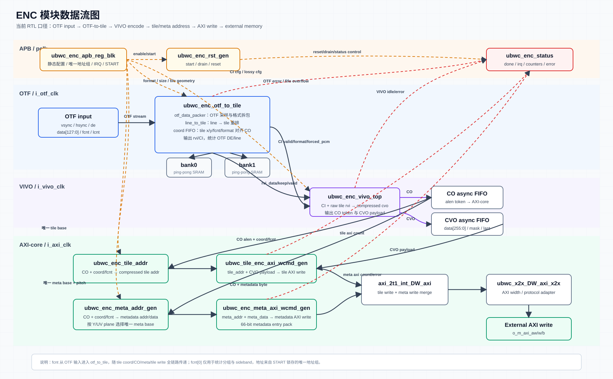
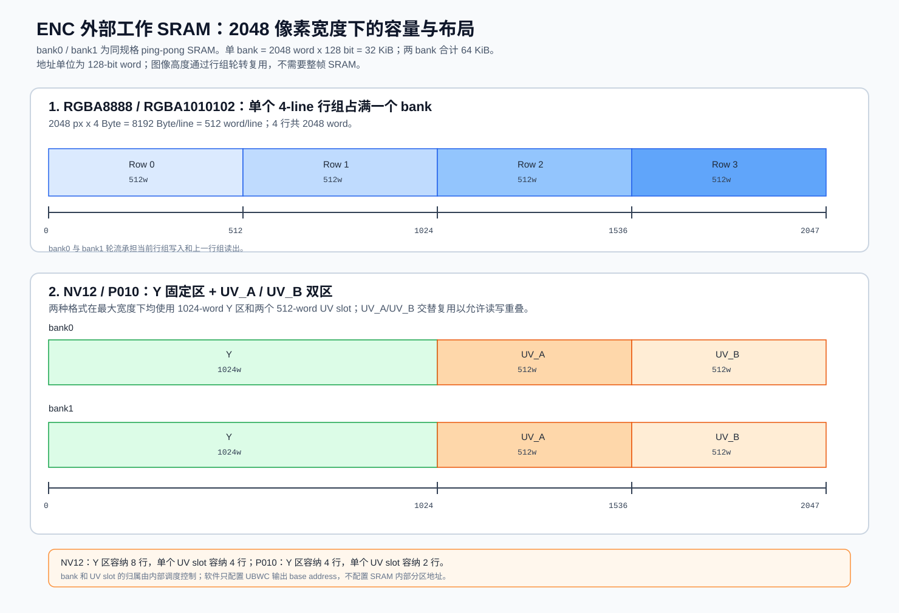
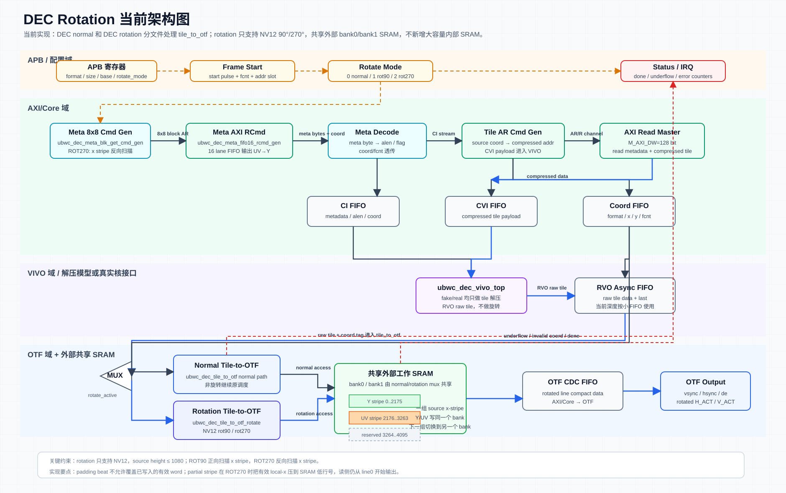
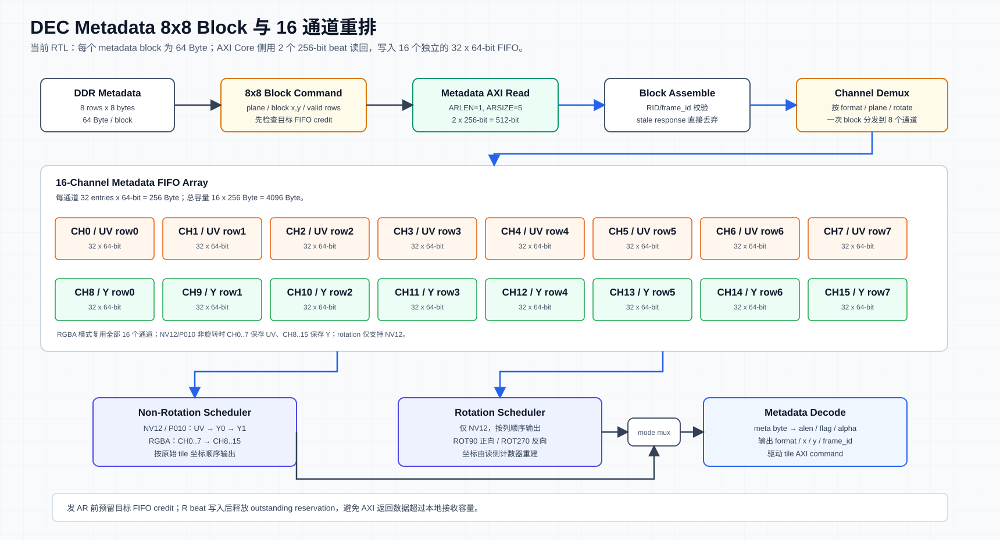
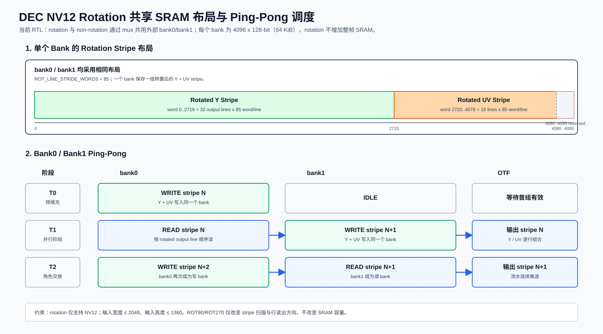
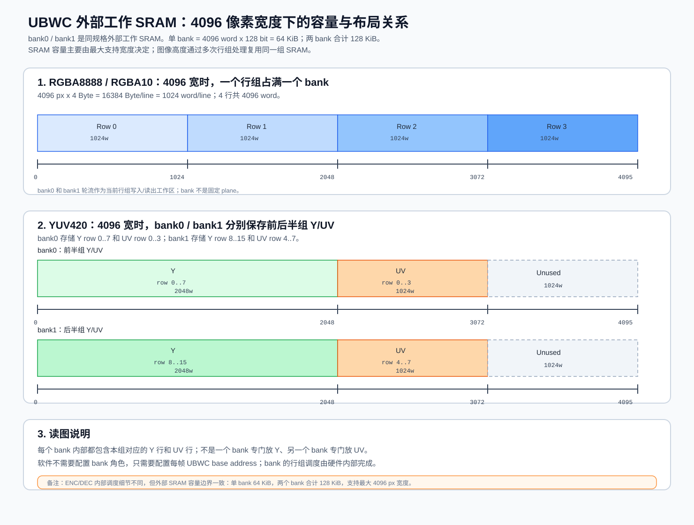

# UBWC ENC/DEC 系统级 Spec

本文整理当前 UBWC ENC/DEC wrapper、APB 寄存器、软件配置流程、调试方案和 PPA 约束。ENC 与 DEC 分开描述，每个模块都按 1 Feature、2 Interface、3 Register、4 Diagram、5 Work Mode、6 Debug、7 PPA 的结构组织。

## 版本变更记录

后续每次迭代都需要在本表追加一行，记录版本号、日期、影响范围和修改摘要；已有版本记录只追加、不覆盖。若同一轮迭代同时修改 RTL、寄存器、配置工具和文档，需要在同一行中明确列出影响范围。

| 版本 | 日期 | 影响范围 | 修改内容 | 文档/验证状态 |
| --- | --- | --- | --- | --- |
| R0.13-dev | 2026-07-29 | ENC、DEC rotation 当前 RTL、寄存器、SRAM、工作模式和调试规格 | 以 `src/enc` 和默认 DEC 实现 `src/dec_rotation` 为唯一 RTL 基准，重新核对 wrapper 参数与端口、APB core/shadow 寄存器、START/VSYNC/复位职责、状态位、AXI ID、metadata 重排和 rotation 尺寸关系。ENC 更新为 128-bit AXI、8-bit LEN、`COM_BUF_AW=11` 和最大 2048 px 宽；DEC 更新为 128-bit AXI、8-bit LEN、`SB_WIDTH=26`、16-channel metadata SRAM FIFO，并补充 NV12 90/270 度旋转配置及限制。删除对外规格中的测试模型参数和旧回归路径。 | Markdown 与 HTML 按当前 RTL 同步；接口、寄存器地址、字段、复位值和图片链接完成静态复核。 |
| R0.12-dev | 2026-07-27 | ENC/DEC rotation APB 寄存器架构、filelist、定向验证、系统 spec | ENC 和 DEC rotation 的原单体 APB register block 拆分为三层：`ubwc_*_apb_core.v` 负责 APB decode、软件可见寄存器存储和读回；`ubwc_*_reg_shadow.v` 负责 START 原子提交、active 配置、CDC、派生配置及状态同步；`ubwc_*_apb_reg.v` 只负责实例化和连接 core/shadow。wrapper 外部接口、寄存器地址、bit field、复位值和软件配置顺序保持不变。默认 DEC filelist 统一使用 `src/dec_rotation` 实现。 | ENC/DEC 三层模块 lint、完整 wrapper lint、ENC START 配置合法性定向测试和 DEC APB 读回/START shadow 提交定向测试均 PASS；服务器 VCS 回归待本轮完成后补充。 |
| R0.11-dev | 2026-07-27 | ENC OTF 协议监控、配置合法性、异常帧恢复、AXI drain、状态/中断、系统 spec | 新增原始 OTF 帧协议监控：检测 VSYNC 前出现 HSYNC/DE、VSYNC 后长期无 HSYNC、行像素不足/超出、帧行数超出及上一帧未完成即出现新 VSYNC。错误发生后立即撤销 `o_otf_ready`，停止接收本帧输入；等待 tile/metadata AXI 写事务排空后复位 AXI/OTF/VIVO 全链路，复位释放后锁存错误原因、`frame_done` 和错误中断。下一次有效 VSYNC 建立新的中断周期并清除上一帧 pending。OTF 每拍承载 4 pixel，末拍允许不足 4 个有效像素，监控宽度按 `ceil(active_width/4) * 4` 计算。START 新增配置合法性检查：RGBA8888/RGBA10 要求 16x4 tile 对齐，NV12 要求 32x8 tile 对齐，P010 要求 32x4 tile 对齐；必要字段、tile 形状或完整地址组无效时不启动数据链路，直接进入同一 abort/drain 流程。寄存器地址和 bit field 不变。 | 本地协议监控、reset/drain、status/IRQ、APB commit 四组定向测试均 PASS；APB 用例覆盖零字段、尺寸未对齐、tile 形状错误及地址组未完整提交。ENC 顶层 Verilator 完整展开无错误。服务器 VCS 定向测试 PASS；case 0027 NV12 连续 2 帧及 case 0030 RGBA8888 均 PASS。case 0017 的 970x2134 配置现在会在 START 阶段按非法 tile 对齐配置拒绝并报告错误，不再进入 line-to-tile 后挂起。 |
| R0.10-dev | 2026-07-25 | DEC rotation START/reset、AXI read epoch、状态寄存器、配置工具、系统 spec | 每次有效 START 都锁存 shadow 配置、软复位全部帧处理链路并启动一帧；START 将当前帧号锁存为 `next_id`，随后 `next_id + 1`。当前帧号低 4 bit 作为 metadata/tile AXI ID、VIVO sideband 和 OTF FCNT。处理中再次 START 会中止旧帧并累加异常帧计数；AR 通路不做帧号拦截，RID 不等于当前帧低 4 bit 的返回数据由 metadata/tile R 接收模块直接接收并丢弃。新增 `FRAME_SEQUENCE @ 0x07C` 和 `ABNORMAL_FRAME_COUNT @ 0x080`。 | DEC rotation 顶层 Verilator lint 无错误；服务器 VCS case 0027 NV12 的 ROT=0/90 连续 2 帧、ROT=0 连续 17 帧 ID 回绕均 PASS；AXI read delay=200 的处理中 START 定向回归 PASS，`FRAME_SEQUENCE=1`、`ABNORMAL_FRAME_COUNT=1`、`stale_drop=2`、OTF 0 mismatch。 |
| R0.9-dev | 2026-07-25 | DEC rotation START、状态与帧标签链路、系统 spec | DEC 以有效 START 作为唯一帧事务入口：START 锁存配置并启动一帧，正常完成或错误事件结束当前帧；仅当 `frame_active=0` 且所有 stage idle 时接收下一次 START。FCNT 只作为 AXI ID、sideband、OTF 输出和调试标签随数据传递，不再控制帧切换、地址选择或 tile 接收。每次有效 START 清除上一帧 pending/done/统计状态。 | DEC rotation FAKE/real Verilator lint 无错误；服务器 VCS case 0027 NV12 的 ROT=0 与 ROT=90 均完成连续 2 帧并 PASS。 |
| R0.8-dev | 2026-07-25 | DEC rotation APB、wrapper、metadata/tile 地址链路、配置工具、系统 spec | DEC 改为配置先行的 shadow/active 模型：软件先写完整静态配置和唯一一组 Y/UV metadata、tile base，最后写 `IRQ_CTRL[5] START`。START 原子锁存全部配置并启动一次 decode；运行中 active 配置保持不变。删除地址 FIFO、双 slot 和 `fcnt[0]` 地址选择。 | DEC rotation Verilator lint 无错误；服务器 VCS case 0027 NV12 的 ROT=0/90/270 连续 5 帧、case 0021 RGBA8888 连续 5 帧、case 0055 NV12 4096x600 连续 2 帧全部 PASS。 |
| R0.7-dev | 2026-07-24 | ENC APB、wrapper、tile/meta 地址链路、配置工具、系统 spec | ENC 输出地址从 slot0/slot1 双地址队列改为唯一地址组。四个 64-bit base 写完并以 `REG_TILE_BASE_UV_HI` 收尾后，`START` 锁存唯一地址快照；后续 VSYNC 持续复用，直到下一次 START 替换。`fcnt[0]` 只保留帧标识和统计分组语义，不再选择地址。`REG_STATUS0[10]` 改为单一 `addr_cfg_valid`，`[12:11]` 改为保留位。 | APB 配置提交定向测试通过；ENC wrapper Verilator lint 无错误；服务器 VCS case 0055～0058 均完成连续两帧，`stage_done=0xaa`，CVO、tile/meta AXI 写出及最终 memory compare 全部为 0 mismatch。回归命令仍因既有 RVI tiled-uncompressed reference checker 的独立数据重排失配返回非零。 |
| R0.6-dev | 2026-07-24 | ENC reset、APB config commit、wrapper、配置工具、系统 spec | ENC 帧控制职责拆分：每个输入 VSYNC 上升沿固定触发 AXI drain、全链路帧复位并在复位释放后自动运行；`REG_IRQ_CTRL[5] START` 只校验并锁存工作寄存器和当前地址 slot 快照，不再触发复位或启动帧。配置无效或当前 `fcnt[0]` 对应地址 slot 无效时，`o_otf_ready` 保持为 0；`REG_STATUS0[14] cfg_valid` 反映最近一次 START 的提交结果；原 `IRQ_CTRL[6] vsync_reset_en` 改为保留位。 | START 配置提交定向测试和 VSYNC reset/drain 定向测试通过；ENC 顶层 Verilator lint 无错误；服务器 VCS NV12、RGBA8888、RGBA1010102、P010 均完成连续两帧，CVO、tile/meta AXI 写出及最终 memory compare 全部为 0 mismatch。回归命令仍因既有 RVI tiled-uncompressed reference checker 的独立数据重排失配返回非零。 |
| R0.5-dev | 2026-07-24 | ENC OTF data packer、系统 spec | ENC fcnt 改为 OTF 域内部生成：`rst_n_otf=0` 时 `otf_fcnt_int/locked_fcnt` 清 0；每个 VSYNC 上升沿将递增前的 `otf_fcnt_int` 锁存为本帧 `locked_fcnt`，同时准备下一帧计数；`din_fcnt` 全程使用 `locked_fcnt`。外部 `i_otf_fcnt` 端口暂时保留兼容，但不再参与 packer 帧号生成。 | ENC 顶层和完整 fake TB Verilator elaboration/lint 无错误；VCS 连续帧回归待执行。 |
| R0.4-dev | 2026-07-24 | ENC wrapper、OTF-to-tile、验证环境、系统 spec | 回退 ENC 内部自增 fcnt：恢复外部 `i_otf_fcnt[3:0]`；START CDC FIFO 只传启动 token；`ubwc_enc_otf_data_packer` 在 VSYNC 边界锁存本帧 `locked_fcnt`，并将其随像素、tile、metadata 和 AXI ID 数据链路传递。START/soft reset 不再自行分配帧号。 | ENC 顶层 Verilator elaboration/lint 无错误；VCS 多帧回归待执行。 |
| R0.3-dev | 2026-07-24 | ENC wrapper、验证环境、系统 spec | ENC 内部 4 bit fcnt 纳入 soft reset：进入内部 reset hold 时清 0，复位释放后首个被接受的 START 使用 `fcnt=0`；验证环境分别统计 START 接受总数和 soft reset 后的期望 fcnt，避免跨复位连续递增的旧假设。 | `git diff --check` 通过；ENC 顶层 Verilator elaboration/lint 无错误；VCS 多帧回归待执行。 |
| R0.2-dev | 2026-07-24 | ENC wrapper、OTF-to-tile、验证环境、系统 spec | ENC frame count 改为硬件内部维护：每次有效 `START` 分配一个 4 bit fcnt，首帧为 0，随后模 16 递增；start token 与 fcnt 作为同一 CDC payload 从 AXI 域送到 OTF 域；删除 ENC 外部 `i_otf_fcnt` 接口，内部继续使用 `fcnt[0]` 选择地址 slot，并使用完整 4 bit fcnt 贯穿 tile/metadata/AXI ID 数据链路。 | Verilator elaboration/lint 无错误；服务器 VCS case 0021 RGBA8888 与 case 0027 NV12 均完成连续 4 帧回归，两个 case 均为 `internal_fcnt_starts=4`、`internal_fcnt_mis=0`；case 0021 另完成连续 18 帧回归，`internal_fcnt_starts=18`、`internal_fcnt_mis=0`，覆盖 `4'hf -> 4'h0` 回绕。 |
| R0.1-dev | 2026-05-19 | ENC reset、AXI wrapper、寄存器、配置工具、系统 spec | 增加 ENC `IRQ_CTRL[6] vsync_reset_en`，支持输入 `i_otf_vsync` 上升沿触发 AXI-drain soft reset 并重新 arm frame start；`ubwc_cfg`/`vrf` ENC 配置函数增加 `vsync_reset_en` 参数；ENC/DEC 对外 `AXI_LENW` 默认改为 5 bit，支持最大 32 beat；系统 spec 将对外 `AXI_IDW` 默认值按 5 bit 表达，内部低 4 bit 保留 FCNT/ID 语义。 | 文档已同步；ENC APB 寄存器表已更新；本地 lint/单元检查已完成。 |
| R0 | 2026-05-19 | ENC/DEC wrapper、寄存器、系统 spec、回归基线 | 建立 R0 系统级 spec 结构；整理 ENC/DEC Feature、Interface、Register、Diagram、Work Mode、Debug、PPA；完成连续两帧 RGBA8888、NV12、P010/G016 回归记录。 | R0 release tag：`R0`；回归记录见文末。 |

## ENC

### ENC 1. Feature

ENC 将输入 OTF 像素流编码为 UBWC compressed tile 数据和 metadata，并通过 AXI write master 写入外部 memory。

| 特性 | 说明 |
| --- | --- |
| 输入接口 | OTF input，包含 `vsync/hsync/de/data/fcnt/lcnt/ready`；外部 `i_otf_fcnt[3:0]` 随像素、tile、metadata 和内部 AXI ID 链路传递 |
| 输出接口 | AXI write master，分别写 compressed tile 数据和 metadata |
| 推荐时钟 | APB/PCLK 100 MHz；AXI/i_axi_clk 500 MHz；Core/i_vivo_clk 200 MHz；OTF/i_otf_clk 320 MHz |
| 支持格式 | RGBA8888、RGBA1010102、YUV420_8/NV12、YUV420_10/P010、RGBA8888 lossy 2:1 |
| 支持像素尺寸 | 当前 `COM_BUF_AW=11` 的外部 SRAM 规格支持最大有效宽度 2048 px；高度由 12-bit line count 和系统场景共同约束，不占用额外整帧 SRAM |
| SRAM | bank0/bank1 各为 `2048 x 128-bit = 32 KiB`，两 bank 合计 64 KiB。高度通过行组复用 SRAM，不随图像高度线性增加 |
| AXI | 对外写数据 128 bit，`AWLEN` 8 bit；AWID/BID 为 5 bit，低 4 bit 承载 FCNT/内部 ID |
| 连续帧 | 每个输入 VSYNC 上升沿触发一次 AXI drain 和 ENC 帧级全链路复位；复位释放后，硬件使用最近一次 START 提交的配置处理该帧 |
| 配置提交 | `REG_IRQ_CTRL[5] START` 只校验并锁存完整配置快照；已提交配置在下一次 START 前保持不变 |
| 输出地址 | 仅一组 Y/RGBA metadata、Y/RGBA tile、UV metadata、UV tile base；START 锁存后跨帧复用，`fcnt[0]` 不参与地址选择 |
| 非法 OTF 输入 | 未进入有效帧时 `o_otf_ready` 仍为 1，输入数据被丢弃；VSYNC 前出现 HSYNC/DE、行长或帧高错误会锁存错误并触发 abort/drain |
| 中断 | 正确中断在本帧最终输出及 AXI 写完成后产生；错误中断覆盖配置/地址无效、OTF 行帧协议、FIFO、metadata、VIVO 和 AXI drain 异常 |

### ENC 2. Interface

ENC wrapper 参数：

| 参数 | 默认值 | 说明 |
| --- | --- | --- |
| `SB_WIDTH` | 36 | VIVO sideband width |
| `APB_AW` | 16 | APB byte address width |
| `APB_DW` | 32 | APB data width |
| `APB_BLK_NREG` | 64 | APB register count |
| `AXI_AW` | 64 | AXI address width |
| `AXI_DW` | 128 | 对外 AXI data width |
| `AXI_LENW` | 8 | 对外 AXI burst length width |
| `AXI_IDW` | 4 | 内部 AXI ID/FCNT width；wrapper 对外 AWID/BID 端口为 `AXI_IDW+1=5` bit |
| `COM_BUF_AW` | 11 | SRAM word address width，单 bank 2048 words |
| `COM_BUF_DW` | 128 | SRAM data width |

ENC wrapper port：

| 接口组 | 信号 | 方向 | 位宽 | 说明 |
| --- | --- | --- | --- | --- |
| APB slave | `PCLK` | input | 1 bit | APB clock |
| APB slave | `PRESETn` | input | 1 bit | APB async reset, active low |
| APB slave | `PSEL` | input | 1 bit | APB select |
| APB slave | `PENABLE` | input | 1 bit | APB enable phase |
| APB slave | `PADDR` | input | `APB_AW` | APB byte address |
| APB slave | `PWRITE` | input | 1 bit | APB write/read select |
| APB slave | `PWDATA` | input | `APB_DW` | APB write data |
| APB slave | `PREADY` | output | 1 bit | APB ready |
| APB slave | `PSLVERR` | output | 1 bit | APB slave error |
| APB slave | `PRDATA` | output | `APB_DW` | APB read data |
| AXI clock/reset | `i_axi_clk` | input | 1 bit | AXI/control clock |
| AXI clock/reset | `i_axi_rstn` | input | 1 bit | `i_axi_clk` domain active-low reset；当前 RTL 作为异步复位源使用 |
| OTF clock/reset | `i_otf_clk` | input | 1 bit | OTF input clock |
| OTF clock/reset | `i_otf_rstn` | input | 1 bit | `i_otf_clk` domain active-low reset；当前 RTL 作为异步复位源使用 |
| VIVO clock/reset | `i_vivo_clk` | input | 1 bit | VIVO clock |
| VIVO clock/reset | `i_vivo_rstn` | input | 1 bit | `i_vivo_clk` domain active-low reset；当前 RTL 作为异步复位源使用 |
| OTF input | `i_otf_vsync` | input | 1 bit | Input frame sync |
| OTF input | `i_otf_hsync` | input | 1 bit | Input line sync |
| OTF input | `i_otf_de` | input | 1 bit | Input data enable |
| OTF input | `i_otf_data` | input | 128 bit | Input pixel data |
| OTF input | `i_otf_fcnt` | input | 4 bit | 当前帧编号；随像素进入 packer，并贯穿 tile、metadata 和内部 AXI ID 数据路径；`fcnt[0]` 仅用于统计分组和 sideband，不选择地址 |
| OTF input | `i_otf_lcnt` | input | 12 bit | Input line count |
| OTF input | `o_otf_ready` | output | 1 bit | ENC 对 OTF 输入的反压 |
| SRAM bank0 | `o_bank0_en` | output | 1 bit | Bank0 SRAM enable |
| SRAM bank0 | `o_bank0_wen` | output | 1 bit | Bank0 SRAM write enable |
| SRAM bank0 | `o_bank0_addr` | output | `COM_BUF_AW` | Bank0 SRAM address |
| SRAM bank0 | `o_bank0_din` | output | `COM_BUF_DW` | Bank0 SRAM write data |
| SRAM bank0 | `i_bank0_dout` | input | `COM_BUF_DW` | Bank0 SRAM read data |
| SRAM bank0 | `i_bank0_dout_vld` | input | 1 bit | Bank0 SRAM read data valid |
| SRAM bank1 | `o_bank1_en` | output | 1 bit | Bank1 SRAM enable |
| SRAM bank1 | `o_bank1_wen` | output | 1 bit | Bank1 SRAM write enable |
| SRAM bank1 | `o_bank1_addr` | output | `COM_BUF_AW` | Bank1 SRAM address |
| SRAM bank1 | `o_bank1_din` | output | `COM_BUF_DW` | Bank1 SRAM write data |
| SRAM bank1 | `i_bank1_dout` | input | `COM_BUF_DW` | Bank1 SRAM read data |
| SRAM bank1 | `i_bank1_dout_vld` | input | 1 bit | Bank1 SRAM read data valid |
| AXI AW | `o_m_axi_awid` | output | 5 bit | 对外 AXI AW ID；内部有效 FCNT/ID 语义为低 4 bit |
| AXI AW | `o_m_axi_awaddr` | output | `AXI_AW` | AXI AW address |
| AXI AW | `o_m_axi_awlen` | output | `AXI_LENW` | AXI AW burst length |
| AXI AW | `o_m_axi_awsize` | output | 3 bit | AXI AW beat size |
| AXI AW | `o_m_axi_awburst` | output | 2 bit | AXI AW burst type |
| AXI AW | `o_m_axi_awlock` | output | 2 bit | AXI AW lock |
| AXI AW | `o_m_axi_awcache` | output | 4 bit | AXI AW cache attribute |
| AXI AW | `o_m_axi_awprot` | output | 3 bit | AXI AW protection attribute |
| AXI AW | `o_m_axi_awvalid` | output | 1 bit | AXI AW valid |
| AXI AW | `i_m_axi_awready` | input | 1 bit | AXI AW ready |
| AXI W | `o_m_axi_wdata` | output | `AXI_DW` | AXI W data |
| AXI W | `o_m_axi_wstrb` | output | `AXI_DW/8` | AXI W byte strobe |
| AXI W | `o_m_axi_wvalid` | output | 1 bit | AXI W valid |
| AXI W | `o_m_axi_wlast` | output | 1 bit | AXI W last beat |
| AXI W | `i_m_axi_wready` | input | 1 bit | AXI W ready |
| AXI B | `i_m_axi_bid` | input | 5 bit | 对外 AXI B ID；低 4 bit 对应内部 FCNT/ID 语义 |
| AXI B | `i_m_axi_bresp` | input | 2 bit | AXI B response |
| AXI B | `i_m_axi_bvalid` | input | 1 bit | AXI B valid |
| AXI B | `o_m_axi_bready` | output | 1 bit | AXI B ready |
| Done/IRQ | `o_stage_done` | output | 8 bit | Stage done bitmap |
| Done/IRQ | `o_frame_done` | output | 1 bit | Frame done flag |
| Done/IRQ | `o_irq` | output | 1 bit | Interrupt output |

### ENC 3. Register

<!-- md-only:start -->
ENC 寄存器实现采用三层结构：

| 模块 | 职责 |
| --- | --- |
| `ubwc_enc_apb_core.v` | APB 地址译码、软件可见 raw register 写入与读回、W1P 事件生成。 |
| `ubwc_enc_reg_shadow.v` | START 时原子锁存 raw 配置，维护 active 配置，完成 PCLK/AXI CDC、配置合法性检查和状态同步。 |
| `ubwc_enc_apb_reg.v` | 集成 `apb_core` 与 `reg_shadow`，保持 wrapper 对外接口稳定。 |
<!-- md-only:end -->

ENC register 总表：

以下总表按 field 逐行展开，`说明` 列给出每个 field 的用途和软件配置注意事项。

| Offset | Register | Access | Reset | Bit | Field | 说明 |
| --- | --- | --- | --- | --- | --- | --- |
| `0x0000` | `REG_VERSION` | RO | `0x00010000` | `[31:0]` | `version` | IP version，上电后读一次确认软件/RTL 兼容性。 |
| `0x0004` | `REG_DATE` | RO | `0x20260406` | `[31:0]` | `date` | RTL date，上电后读一次。 |
| `0x0008` | `REG_TILE_CFG0` | RW | `0` | `[0]` | `enc_ubwc_en` | ENC UBWC enable；格式/尺寸/layout 变化时配置。 |
| `0x0008` | `REG_TILE_CFG0` | RW | `0` | `[1]` | `lvl1_bank_swizzle_en` | Level-1 bank swizzle 配置和 AP 配置同步。 |
| `0x0008` | `REG_TILE_CFG0` | RW | `0` | `[2]` | `lvl2_bank_swizzle_en` | Level-2 bank swizzle 配置和 AP 配置同步。 |
| `0x0008` | `REG_TILE_CFG0` | RW | `0` | `[3]` | `lvl3_bank_swizzle_en` | Level-3 bank swizzle 配置和 AP 配置同步。 |
| `0x0008` | `REG_TILE_CFG0` | RW | `0` | `[12:8]` | `highest_bank_bit` | highest bank bit 配置和 AP 配置同步。 |
| `0x0008` | `REG_TILE_CFG0` | RW | `0` | `[16]` | `bank_spread_en` | bank spread 配置和 AP 配置同步。 |
| `0x000c` | `REG_TILE_CFG1` | RW | `0` | `[0]` | `four_line_format` | 不同图像格式配置：RGBA/RGBA10 写 1；YUV420/NV12/P010 写 0。 |
| `0x000c` | `REG_TILE_CFG1` | RW | `0` | `[1]` | `is_lossy_rgba_2_1_format` | RGBA 2:1 lossy format select。 |
| `0x000c` | `REG_TILE_CFG1` | RW | `0` | `[26:16]` | `tile_pitch` | Compressed tile pitch，单位为 16 bytes。 |
| `0x0010` | `REG_ENC_CI_CFG0` | RW | `0` | `[0]` | `enc_ci_input_type` | CI input type 配置；1=tiled data，0=linear data；寄存器复位值为 0，普通 tiled UBWC 路径软件应配置为 1。 |
| `0x0010` | `REG_ENC_CI_CFG0` | RW | `0` | `[10:8]` | `enc_ci_alen` | CI alen 配置；寄存器复位值为 0，普通 VIVO_ENC 配置软件应写 7。 |
| `0x0014` | `REG_ENC_CI_CFG1` | RW | `0` | `[16]` | `enc_ci_lossy` | lossy 模式使能。 |
| `0x0018` | `REG_ENC_CI_CFG2` | RW | `0` | `[2:0]` | `cfg0` | VIVO_ENC 模块使用，默认写 0；除非 VIVO_ENC 集成规格明确要求，否则软件保持 0。 |
| `0x0018` | `REG_ENC_CI_CFG2` | RW | `0` | `[5:3]` | `cfg1` | VIVO_ENC 模块使用，默认写 0；除非 VIVO_ENC 集成规格明确要求，否则软件保持 0。 |
| `0x0018` | `REG_ENC_CI_CFG2` | RW | `0` | `[9:6]` | `cfg2` | VIVO_ENC 模块使用，默认写 0；除非 VIVO_ENC 集成规格明确要求，否则软件保持 0。 |
| `0x0018` | `REG_ENC_CI_CFG2` | RW | `0` | `[13:10]` | `cfg3` | VIVO_ENC 模块使用，默认写 0；除非 VIVO_ENC 集成规格明确要求，否则软件保持 0。 |
| `0x0018` | `REG_ENC_CI_CFG2` | RW | `0` | `[17:14]` | `cfg4` | VIVO_ENC 模块使用，默认写 0；除非 VIVO_ENC 集成规格明确要求，否则软件保持 0。 |
| `0x0018` | `REG_ENC_CI_CFG2` | RW | `0` | `[21:18]` | `cfg5` | VIVO_ENC 模块使用，默认写 0；除非 VIVO_ENC 集成规格明确要求，否则软件保持 0。 |
| `0x0018` | `REG_ENC_CI_CFG2` | RW | `0` | `[23:22]` | `cfg6` | VIVO_ENC 模块使用，默认写 0；除非 VIVO_ENC 集成规格明确要求，否则软件保持 0。 |
| `0x0018` | `REG_ENC_CI_CFG2` | RW | `0` | `[25:24]` | `cfg7` | VIVO_ENC 模块使用，默认写 0；除非 VIVO_ENC 集成规格明确要求，否则软件保持 0。 |
| `0x0018` | `REG_ENC_CI_CFG2` | RW | `0` | `[27:26]` | `cfg8` | VIVO_ENC 模块使用，默认写 0；除非 VIVO_ENC 集成规格明确要求，否则软件保持 0。 |
| `0x0018` | `REG_ENC_CI_CFG2` | RW | `0` | `[30:28]` | `cfg9` | VIVO_ENC 模块使用，默认写 0；除非 VIVO_ENC 集成规格明确要求，否则软件保持 0。 |
| `0x001c` | `REG_ENC_CI_CFG3` | RW | `0` | `[5:0]` | `cfg10` | VIVO_ENC 模块使用，默认写 0；除非 VIVO_ENC 集成规格明确要求，否则软件保持 0。 |
| `0x001c` | `REG_ENC_CI_CFG3` | RW | `0` | `[13:8]` | `cfg11` | VIVO_ENC 模块使用，默认写 0；除非 VIVO_ENC 集成规格明确要求，否则软件保持 0。 |
| `0x001c` | `REG_ENC_CI_CFG3` | RW | `7` | `[19:16]` | `enc_ci_ubwc_ver` | 送入 VIVO_ENC 的 UBWC version；当前 RTL 默认 7。 |
| `0x0020` | `REG_OTF_CFG0` | RW | `0` | `[2:0]` | `otf_cfg_format` | 输入格式：0 RGBA8888，1 RGBA1010102，2 NV12，3 P010。 |
| `0x0024` | `REG_OTF_CFG1` | RW | `0` | `[15:0]` | `otf_cfg_width` | 输入 active width。 |
| `0x0024` | `REG_OTF_CFG1` | RW | `0` | `[31:16]` | `otf_cfg_height` | 输入 active height。 |
| `0x0028` | `REG_OTF_CFG2` | RW | `0` | `[15:0]` | `otf_cfg_tile_w` | Tile width。 |
| `0x0028` | `REG_OTF_CFG2` | RW | `0` | `[19:16]` | `otf_cfg_tile_h` | Tile height。 |
| `0x002c` | `REG_OTF_CFG3` | RW | `0` | `[15:0]` | `otf_cfg_y_tile_cols` | Y/RGBA plane tile column count。 |
| `0x002c` | `REG_OTF_CFG3` | RW | `0` | `[31:16]` | `otf_cfg_uv_tile_cols` | UV plane tile column count；RGBA 写 0。 |
| `0x0030` | `REG_META_BASE_Y_LO` | RW | `0` | `[31:0]` | `meta_y_base_offset_addr[31:0]` | 唯一 Y/RGBA metadata 存储基地址低 32 bit；首次或输出 buffer 地址变化时配置。 |
| `0x0034` | `REG_META_BASE_Y_HI` | RW | `0` | `[31:0]` | `meta_y_base_offset_addr[63:32]` | 唯一 Y/RGBA metadata 存储基地址高 32 bit；首次或输出 buffer 地址变化时配置。 |
| `0x0038` | `REG_TILE_BASE_Y_LO` | RW | `0` | `[31:0]` | `y_base_offset_addr[31:0]` | 唯一 Y/RGBA compressed tile 存储基地址低 32 bit；首次或输出 buffer 地址变化时配置。 |
| `0x003c` | `REG_TILE_BASE_Y_HI` | RW | `0` | `[31:0]` | `y_base_offset_addr[63:32]` | 唯一 Y/RGBA compressed tile 存储基地址高 32 bit；首次或输出 buffer 地址变化时配置。 |
| `0x0040` | `REG_META_BASE_UV_LO` | RW | `0` | `[31:0]` | `meta_uv_base_offset_addr[31:0]` | UV metadata 存储基地址低 32 bit；RGBA 写 0。 |
| `0x0044` | `REG_META_BASE_UV_HI` | RW | `0` | `[31:0]` | `meta_uv_base_offset_addr[63:32]` | UV metadata 存储基地址高 32 bit；RGBA 写 0。 |
| `0x0048` | `REG_TILE_BASE_UV_LO` | RW | `0` | `[31:0]` | `uv_base_offset_addr[31:0]` | UV compressed tile 存储基地址低 32 bit；RGBA 写 0。 |
| `0x004c` | `REG_TILE_BASE_UV_HI` | RW | `0` | `[31:0]` | `uv_base_offset_addr[63:32]` | UV compressed tile 存储基地址高 32 bit；必须作为八个地址 word 的最后一笔写入，用于标记唯一工作地址组完整，随后写 START 锁存。 |
| `0x0050` | `REG_META_ACTIVE_SIZE` | RW | `0` | `[15:0]` | `meta_active_width_px` | Metadata 有效图像宽度。 |
| `0x0050` | `REG_META_ACTIVE_SIZE` | RW | `0` | `[31:16]` | `meta_active_height_px` | Metadata 有效图像高度。 |
| `0x0054` | `REG_META_PITCH` | RW | `0` | `[31:0]` | `meta_data_plane_pitch` | Metadata plane pitch。 |
| `0x0058` | `REG_STATUS0` | RO | dynamic | `[0]` | `enc_idle` | ENC idle。 |
| `0x0058` | `REG_STATUS0` | RO | dynamic | `[1]` | `enc_error` | ENC error。 |
| `0x0058` | `REG_STATUS0` | RO | dynamic | `[2]` | `otf_to_tile_busy` | OTF-to-tile busy。 |
| `0x0058` | `REG_STATUS0` | RO | dynamic | `[3]` | `otf_to_tile_overflow` | OTF-to-tile overflow。 |
| `0x0058` | `REG_STATUS0` | RO | dynamic | `[4]` | `otf_err_bline` | OTF bad line。 |
| `0x0058` | `REG_STATUS0` | RO | dynamic | `[5]` | `otf_err_bframe` | OTF bad frame。 |
| `0x0058` | `REG_STATUS0` | RO | dynamic | `[6]` | `meta_err_0` | Metadata co-buffer overflow。 |
| `0x0058` | `REG_STATUS0` | RO | dynamic | `[7]` | `meta_err_1` | Metadata tile order error。 |
| `0x0058` | `REG_STATUS0` | RO | dynamic | `[8]` | `frame_done` | Frame done。 |
| `0x0058` | `REG_STATUS0` | RO | dynamic | `[9]` | `addr_cfg_invalid` | 唯一地址组无效 sticky 状态；数据链路检查地址时，如果最近一次 START 锁存的 META Y、TILE Y、META UV、TILE UV 地址组无效，该 bit 置 1 并保持并参与 error IRQ。 |
| `0x0058` | `REG_STATUS0` | RO | dynamic | `[10]` | `addr_cfg_valid` | 最近一次 START 已锁存完整有效的唯一地址组；后续帧持续复用。 |
| `0x0058` | `REG_STATUS0` | - | `0` | `[12:11]` | `reserved` | 保留，读回 0。 |
| `0x0058` | `REG_STATUS0` | RO | dynamic | `[13]` | `rst_drain_timeout` | 软复位等待 AXI drain 超时 sticky 状态；ENC 进入 soft reset 前会停止发起新的 AXI 写事务，并等待 tile/meta AXI 写通路 outstanding 清空。如果等待超过 `16'hffff` 个 `i_axi_clk` 周期仍未进入 idle，则该 bit 置 1 并保持；软件写 `REG_IRQ_CTRL[1] irq_clear` 或硬复位后清零。 |
| `0x0058` | `REG_STATUS0` | RO | dynamic | `[14]` | `cfg_valid` | 最近一次 `START` 配置提交结果。格式、尺寸、tile 参数、metadata 参数及唯一地址组均有效时置 1；否则清 0。配置无效时 OTF 端仍被 ready 接收，但数据不会进入编码链路。 |
| `0x005c` | `REG_STATUS1` | RO | dynamic | `[0]` | `output_done_seen0` | `fcnt[0]=0` 的最终输出完成事件已出现。 |
| `0x005c` | `REG_STATUS1` | RO | dynamic | `[1]` | `output_done_seen1` | `fcnt[0]=1` 的最终输出完成事件已出现。 |
| `0x005c` | `REG_STATUS1` | RO | dynamic | `[2]` | `tile_addr_seen0` | `fcnt[0]=0` 的 tile address 活动已出现。 |
| `0x005c` | `REG_STATUS1` | RO | dynamic | `[3]` | `tile_addr_seen1` | `fcnt[0]=1` 的 tile address 活动已出现。 |
| `0x005c` | `REG_STATUS1` | RO | dynamic | `[4]` | `meta_seen0` | `fcnt[0]=0` 的 metadata 活动已出现。 |
| `0x005c` | `REG_STATUS1` | RO | dynamic | `[5]` | `meta_seen1` | `fcnt[0]=1` 的 metadata 活动已出现。 |
| `0x005c` | `REG_STATUS1` | RO | dynamic | `[6]` | `axi_w_done_seen0` | `fcnt[0]=0` 的 tile 与 metadata AXI WLAST 均已出现。 |
| `0x005c` | `REG_STATUS1` | RO | dynamic | `[7]` | `axi_w_done_seen1` | `fcnt[0]=1` 的 tile 与 metadata AXI WLAST 均已出现。 |
| `0x0060` | `REG_IRQ_CTRL` | RW | `1` | `[0]` | `irq_enable` | 中断使能；当前 RTL 复位值为 1。 |
| `0x0060` | `REG_IRQ_CTRL` | W1P | `0` | `[1]` | `irq_clear` | 写 1 清 pending/status sticky。 |
| `0x0060` | `REG_IRQ_CTRL` | RO | dynamic | `[2]` | `irq_pending` | Any IRQ pending。 |
| `0x0060` | `REG_IRQ_CTRL` | RO | dynamic | `[3]` | `irq_correct_pending` | Correct IRQ pending。 |
| `0x0060` | `REG_IRQ_CTRL` | RO | dynamic | `[4]` | `irq_error_pending` | Error IRQ pending。 |
| `0x0060` | `REG_IRQ_CTRL` | W1P | `0` | `[5]` | `start` | 写 1 校验并锁存完整 ENC 配置快照；不触发帧复位，也不启动 OTF 数据处理。 |
| `0x0060` | `REG_IRQ_CTRL` | - | `0` | `[6]` | `reserved` | 保留，写入无效，读回 0。 |
| `0x0064` | `REG_STATUS2` | RO | dynamic | `[0]` | `irq_status_any` | Any IRQ mirror。 |
| `0x0064` | `REG_STATUS2` | RO | dynamic | `[1]` | `irq_status_correct` | Correct IRQ mirror。 |
| `0x0064` | `REG_STATUS2` | RO | dynamic | `[2]` | `irq_status_error` | Error IRQ mirror。 |
| `0x0068` | `REG_META_COUNT0` | RO | dynamic | `[31:0]` | `meta_count0` | `fcnt[0]=0` 的 metadata 统计计数，与地址选择无关。 |
| `0x006c` | `REG_META_COUNT1` | RO | dynamic | `[31:0]` | `meta_count1` | `fcnt[0]=1` 的 metadata 统计计数，与地址选择无关。 |
| `0x0070` | `REG_TILEADDR_COUNT0` | RO | dynamic | `[31:0]` | `tileaddr_count0` | `fcnt[0]=0` 的 tile address 统计计数。 |
| `0x0074` | `REG_TILEADDR_COUNT1` | RO | dynamic | `[31:0]` | `tileaddr_count1` | `fcnt[0]=1` 的 tile address 统计计数。 |
| `0x0078` | `REG_OTF_TILE_COUNT0` | RO | dynamic | `[31:0]` | `otf_tile_count0` | `fcnt[0]=0` 的 OTF-to-tile tile 统计计数。 |
| `0x007c` | `REG_OTF_TILE_COUNT1` | RO | dynamic | `[31:0]` | `otf_tile_count1` | `fcnt[0]=1` 的 OTF-to-tile tile 统计计数。 |
| `0x0080` | `REG_OTF_DE_COUNT0` | RO | dynamic | `[31:0]` | `otf_de_count0` | `fcnt[0]=0` 的 `de && ready` 统计计数。 |
| `0x0084` | `REG_OTF_DE_COUNT1` | RO | dynamic | `[31:0]` | `otf_de_count1` | `fcnt[0]=1` 的 `de && ready` 统计计数。 |
| `0x0088` | `REG_OTF_LINE_COUNT0` | RO | dynamic | `[31:0]` | `otf_line_count0` | `fcnt[0]=0` 的 OTF line 统计计数。 |
| `0x008c` | `REG_OTF_LINE_COUNT1` | RO | dynamic | `[31:0]` | `otf_line_count1` | `fcnt[0]=1` 的 OTF line 统计计数。 |
| `0x0090` | `REG_TILE_AXI_W_CNT0` | RO | dynamic | `[31:0]` | `tile_axi_w_cnt0` | `fcnt[0]=0` 的 tile AXI W 统计计数。 |
| `0x0094` | `REG_TILE_AXI_W_CNT1` | RO | dynamic | `[31:0]` | `tile_axi_w_cnt1` | `fcnt[0]=1` 的 tile AXI W 统计计数。 |
| `0x0098` | `REG_META_AXI_W_CNT0` | RO | dynamic | `[31:0]` | `meta_axi_w_cnt0` | `fcnt[0]=0` 的 metadata AXI W 统计计数。 |
| `0x009c` | `REG_META_AXI_W_CNT1` | RO | dynamic | `[31:0]` | `meta_axi_w_cnt1` | `fcnt[0]=1` 的 metadata AXI W 统计计数。 |

APB 访问规则：

| 项目 | 规则 |
| --- | --- |
| 寄存器宽度 | 32 bit |
| 地址单位 | Byte offset，4 byte 对齐 |
| 64 bit base address | 先写 low 32 bit，再写 high 32 bit |
| `PREADY/PSLVERR` | 当前 RTL 固定 `PREADY=1`，`PSLVERR=0` |
| `W1P` | 写 1 产生 pulse，读回值不表示该 bit 保持为 1 |

ENC Register 逐项说明：

#### 3.1 Version

寄存器：`REG_VERSION`；地址：`0x0000`

| Bit | Field | Access | Reset | 说明 |
| --- | --- | --- | --- | --- |
| `[31:0]` | `version` | RO | `0x00010000` | IP version。 |

计算说明：只读识别寄存器，无软件计算；上电后读取一次用于版本匹配。

#### 3.2 Date

寄存器：`REG_DATE`；地址：`0x0004`

| Bit | Field | Access | Reset | 说明 |
| --- | --- | --- | --- | --- |
| `[31:0]` | `date` | RO | `0x20260406` | RTL date。 |

计算说明：只读识别寄存器，无软件计算；用于定位当前 RTL 交付版本。

#### 3.3 Tile CFG0

寄存器：`REG_TILE_CFG0`；地址：`0x0008`

| Bit | Field | Access | Reset | 说明 |
| --- | --- | --- | --- | --- |
| `[0]` | `enc_ubwc_en` | RW | 0 | ENC UBWC enable。 |
| `[1]` | `lvl1_bank_swizzle_en` | RW | 0 | Level-1 bank swizzle 配置和 AP 配置同步。 |
| `[2]` | `lvl2_bank_swizzle_en` | RW | 0 | Level-2 bank swizzle 配置和 AP 配置同步。 |
| `[3]` | `lvl3_bank_swizzle_en` | RW | 0 | Level-3 bank swizzle 配置和 AP 配置同步。 |
| `[12:8]` | `highest_bank_bit` | RW | 0 | highest bank bit 配置和 AP 配置同步。 |
| `[16]` | `bank_spread_en` | RW | 0 | bank spread 配置和 AP 配置同步。 |

计算说明：这些字段来自系统 memory layout/bank swizzle 策略，不随每帧地址变化；图像格式、尺寸或 layout 策略变化时重新配置。

#### 3.4 Tile CFG1

寄存器：`REG_TILE_CFG1`；地址：`0x000c`

| Bit | Field | Access | Reset | 说明 |
| --- | --- | --- | --- | --- |
| `[0]` | `four_line_format` | RW | 0 | 不同图像格式配置：RGBA/RGBA10 写 1；YUV420/NV12/P010 写 0。 |
| `[1]` | `is_lossy_rgba_2_1_format` | RW | 0 | RGBA 2:1 lossy format select。 |
| `[26:16]` | `tile_pitch` | RW | 0 | Compressed tile pitch，单位为 16 bytes。 |

计算说明：`tile_pitch = tile_pitch_bytes / 16`。`tile_pitch_bytes` 由格式和有效宽度对齐得到：RGBA 按 4 bytes/pixel 计算，NV12/P010 按 plane pitch 计算，并按 UBWC layout 要求对齐。

#### 3.5 ENC CI CFG0

寄存器：`REG_ENC_CI_CFG0`；地址：`0x0010`

| Bit | Field | Access | Reset | 说明 |
| --- | --- | --- | --- | --- |
| `[0]` | `enc_ci_input_type` | RW | 0 | CI input type 配置；1=tiled data，0=linear data；寄存器复位值为 0，普通 tiled UBWC 路径软件应配置为 1。 |
| `[10:8]` | `enc_ci_alen` | RW | 0 | CI alen 配置；寄存器复位值为 0，普通 VIVO_ENC 配置软件应写 7。 |

计算说明：`REG_ENC_CI_CFG0` 复位值为 `0x0000_0000`；普通 tiled UBWC 场景软件应写 `input_type=1`、`alen=7`。

#### 3.6 ENC CI CFG1

寄存器：`REG_ENC_CI_CFG1`；地址：`0x0014`

| Bit | Field | Access | Reset | 说明 |
| --- | --- | --- | --- | --- |
| `[16]` | `enc_ci_lossy` | RW | 0 | lossy 模式使能。 |

计算说明：与压缩策略一致；lossless 场景写 0，启用对应 lossy 策略时写 1。

#### 3.7 ENC CI CFG2

寄存器：`REG_ENC_CI_CFG2`；地址：`0x0018`

| Bit | Field | Access | Reset | 说明 |
| --- | --- | --- | --- | --- |
| `[2:0]` | `cfg0` | RW | 0 | UBWC CI configuration。 |
| `[5:3]` | `cfg1` | RW | 0 | UBWC CI configuration。 |
| `[9:6]` | `cfg2` | RW | 0 | UBWC CI configuration。 |
| `[13:10]` | `cfg3` | RW | 0 | UBWC CI configuration。 |
| `[17:14]` | `cfg4` | RW | 0 | UBWC CI configuration。 |
| `[21:18]` | `cfg5` | RW | 0 | UBWC CI configuration。 |
| `[23:22]` | `cfg6` | RW | 0 | UBWC CI configuration。 |
| `[25:24]` | `cfg7` | RW | 0 | UBWC CI configuration。 |
| `[27:26]` | `cfg8` | RW | 0 | UBWC CI configuration。 |
| `[30:28]` | `cfg9` | RW | 0 | UBWC CI configuration。 |

计算说明：当前软件模板写 0；若后续 CI 算法参数开放，应由压缩策略表生成。

#### 3.8 ENC CI CFG3

寄存器：`REG_ENC_CI_CFG3`；地址：`0x001c`

| Bit | Field | Access | Reset | 说明 |
| --- | --- | --- | --- | --- |
| `[5:0]` | `cfg10` | RW | 0 | UBWC CI configuration。 |
| `[13:8]` | `cfg11` | RW | 0 | UBWC CI configuration。 |
| `[19:16]` | `enc_ci_ubwc_ver` | RW | 7 | 送入 VIVO_ENC 的 UBWC version。 |

计算说明：`cfg10/cfg11` 当前软件模板写 0；`enc_ci_ubwc_ver` 默认 7，只有系统 UBWC 版本变化时才修改。

#### 3.9 OTF CFG0

寄存器：`REG_OTF_CFG0`；地址：`0x0020`

| Bit | Field | Access | Reset | 说明 |
| --- | --- | --- | --- | --- |
| `[2:0]` | `otf_cfg_format` | RW | 0 | 0 RGBA8888，1 RGBA1010102，2 NV12/YUV420_8，3 P010/YUV420_10。 |

计算说明：由输入像素格式直接映射；格式变化时，tile size、pitch、metadata 尺寸和地址 layout 必须同步重算。

#### 3.10 OTF CFG1

寄存器：`REG_OTF_CFG1`；地址：`0x0024`

| Bit | Field | Access | Reset | 说明 |
| --- | --- | --- | --- | --- |
| `[15:0]` | `otf_cfg_width` | RW | 0 | 输入 active width。 |
| `[31:16]` | `otf_cfg_height` | RW | 0 | 输入 active height。 |

计算说明：写入原始有效像素尺寸；内部 layout 需要的 padded/stored size 由后续 tile、pitch、metadata 配置描述。

#### 3.11 OTF CFG2

寄存器：`REG_OTF_CFG2`；地址：`0x0028`

| Bit | Field | Access | Reset | 说明 |
| --- | --- | --- | --- | --- |
| `[15:0]` | `otf_cfg_tile_w` | RW | 0 | Tile width。 |
| `[19:16]` | `otf_cfg_tile_h` | RW | 0 | Tile height。 |

计算说明：RGBA8888/RGBA1010102 使用 `16x4`，NV12 使用 `32x8`，P010 使用 `32x4`。这些值随格式变化配置。

#### 3.12 OTF CFG3

寄存器：`REG_OTF_CFG3`；地址：`0x002c`

| Bit | Field | Access | Reset | 说明 |
| --- | --- | --- | --- | --- |
| `[15:0]` | `otf_cfg_y_tile_cols` | RW | 0 | Y/RGBA plane tile column count。 |
| `[31:16]` | `otf_cfg_uv_tile_cols` | RW | 0 | UV plane tile column count；RGBA 写 0。 |

计算说明：`y_tile_cols = ceil(y_plane_width / tile_w)`，`uv_tile_cols = ceil(uv_plane_width / tile_w)`；RGBA 没有 UV plane，`uv_tile_cols=0`。

#### 3.13 Meta/Tile Base 地址组

寄存器范围：`0x0030` 到 `0x004c`。首次配置或输出 buffer 地址变化时写入；地址不变的连续帧直接复用。

| Register | Address | Bit | Field | Access | Reset | 说明 |
| --- | --- | --- | --- | --- | --- | --- |
| `REG_META_BASE_Y_LO` | `0x0030` | `[31:0]` | `meta_y_base_offset_addr[31:0]` | RW | 0 | Y/RGBA metadata 存储基地址低 32 bit。 |
| `REG_META_BASE_Y_HI` | `0x0034` | `[31:0]` | `meta_y_base_offset_addr[63:32]` | RW | 0 | Y/RGBA metadata 存储基地址高 32 bit。 |
| `REG_TILE_BASE_Y_LO` | `0x0038` | `[31:0]` | `y_base_offset_addr[31:0]` | RW | 0 | Y/RGBA compressed tile 存储基地址低 32 bit。 |
| `REG_TILE_BASE_Y_HI` | `0x003c` | `[31:0]` | `y_base_offset_addr[63:32]` | RW | 0 | Y/RGBA compressed tile 存储基地址高 32 bit。 |
| `REG_META_BASE_UV_LO` | `0x0040` | `[31:0]` | `meta_uv_base_offset_addr[31:0]` | RW | 0 | UV metadata 存储基地址低 32 bit；RGBA 写 0。 |
| `REG_META_BASE_UV_HI` | `0x0044` | `[31:0]` | `meta_uv_base_offset_addr[63:32]` | RW | 0 | UV metadata 存储基地址高 32 bit；RGBA 写 0。 |
| `REG_TILE_BASE_UV_LO` | `0x0048` | `[31:0]` | `uv_base_offset_addr[31:0]` | RW | 0 | UV compressed tile 存储基地址低 32 bit；RGBA 写 0。 |
| `REG_TILE_BASE_UV_HI` | `0x004c` | `[31:0]` | `uv_base_offset_addr[63:32]` | RW | 0 | UV compressed tile 存储基地址高 32 bit；RGBA 写 0。 |

地址 layout 计算公式：

```text
align(x, a) = round_up(x, a)
y_tile_cols = ceil(y_plane_width / tile_w)
y_tile_rows = ceil(y_plane_height / tile_h)
uv_tile_cols = has_uv ? ceil(uv_plane_width / tile_w) : 0
uv_tile_rows = has_uv ? ceil(uv_plane_height / tile_h) : 0

meta_y_pitch = align(y_tile_cols, 64)
meta_y_size  = align(meta_y_pitch * align(y_tile_rows, 16), 4096)
tile_y_size  = align(tile_y_pitch_bytes * stored_y_height, 4096)

meta_uv_pitch = has_uv ? align(uv_tile_cols, 64) : 0
meta_uv_size  = has_uv ? align(meta_uv_pitch * align(uv_tile_rows, 16), 4096) : 0
tile_uv_size  = has_uv ? align(tile_uv_pitch_bytes * stored_uv_height, 4096) : 0

meta_y_base = frame_base
tile_y_base = meta_y_base + meta_y_size
meta_uv_base = has_uv ? tile_y_base + tile_y_size : 0
tile_uv_base = has_uv ? meta_uv_base + meta_uv_size : 0

REG_META_BASE_Y_LO  = meta_y_base[31:0]
REG_META_BASE_Y_HI  = meta_y_base[63:32]
REG_TILE_BASE_Y_LO  = tile_y_base[31:0]
REG_TILE_BASE_Y_HI  = tile_y_base[63:32]
REG_META_BASE_UV_LO = meta_uv_base[31:0]
REG_META_BASE_UV_HI = meta_uv_base[63:32]
REG_TILE_BASE_UV_LO = tile_uv_base[31:0]
REG_TILE_BASE_UV_HI = tile_uv_base[63:32]
```

说明：`tile_y_pitch_bytes`、`tile_uv_pitch_bytes`、`stored_y_height`、`stored_uv_height` 由格式、pitch 和 UBWC layout 对齐规则计算，必须和 `REG_TILE_CFG1`、`REG_META_ACTIVE_SIZE`、`REG_META_PITCH` 保持一致。地址组写完后，软件写 `REG_IRQ_CTRL[5]=1` 校验并锁存完整配置，再读取 `REG_STATUS0[14]` 确认提交有效。

#### 3.14 Meta Active Size

寄存器：`REG_META_ACTIVE_SIZE`；地址：`0x0050`

| Bit | Field | Access | Reset | 说明 |
| --- | --- | --- | --- | --- |
| `[15:0]` | `meta_active_width_px` | RW | 0 | UBWC metadata 覆盖的有效图像宽度。 |
| `[31:16]` | `meta_active_height_px` | RW | 0 | UBWC metadata 覆盖的有效图像高度。 |

计算说明：

`REG_OTF_CFG1` 描述 OTF 输入流的 active width/height，也就是硬件在 OTF 接口上接收的图像/画布尺寸。

`REG_META_ACTIVE_SIZE` 描述 UBWC metadata 和边界 tile 需要覆盖的有效图像区域。当前 RTL 直接使用该寄存器，不提供写 0 后回退到 `REG_OTF_CFG1` 的逻辑；START 合法性检查要求宽、高均非 0，并满足对应格式的 tile 对齐。

通常没有 padding/crop 时，两者配置一致。例如 544x1200 RGBA8888：

```text
REG_OTF_CFG1.width         = 544
REG_OTF_CFG1.height        = 1200
REG_META_ACTIVE_SIZE.width = 544
REG_META_ACTIVE_SIZE.height= 1200
```

只有当 OTF 输入画布尺寸和真实有效压缩区域不一致时才分开配置。例如 OTF 实际输入 544x1216，但只有 544x1200 是有效图像：

```text
REG_OTF_CFG1.height        = 1216
REG_META_ACTIVE_SIZE.height= 1200
```

这种配置表示 OTF 接口按 1216 行接收数据，但 UBWC metadata、有效 tile 覆盖和右/下边界处理按 1200 行有效图像生成。

#### 3.15 Meta Pitch

寄存器：`REG_META_PITCH`；地址：`0x0054`

| Bit | Field | Access | Reset | 说明 |
| --- | --- | --- | --- | --- |
| `[31:0]` | `meta_data_plane_pitch` | RW | 0 | Metadata plane pitch，单位 byte。 |

计算说明：`meta_data_plane_pitch = align(y_tile_cols, 64)`，即按 tile columns 生成 metadata 行 pitch 并 64-byte 对齐。

#### 3.16 Status0

寄存器：`REG_STATUS0`；地址：`0x0058`

| Bit | Field | Access | Reset | 说明 |
| --- | --- | --- | --- | --- |
| `[0]` | `enc_idle` | RO | dynamic | ENC idle。 |
| `[1]` | `enc_error` | RO | dynamic | ENC error。 |
| `[2]` | `otf_to_tile_busy` | RO | dynamic | OTF-to-tile busy。 |
| `[3]` | `otf_to_tile_overflow` | RO | dynamic | OTF-to-tile overflow。 |
| `[4]` | `otf_err_bline` | RO | dynamic | OTF bad line。 |
| `[5]` | `otf_err_bframe` | RO | dynamic | OTF bad frame。 |
| `[6]` | `meta_err_0` | RO | dynamic | Metadata co-buffer overflow。 |
| `[7]` | `meta_err_1` | RO | dynamic | Metadata tile order error。 |
| `[8]` | `frame_done` | RO | dynamic | Frame done。 |
| `[9]` | `addr_cfg_invalid` | RO | dynamic | 唯一地址组无效 sticky 状态；数据链路检查地址时，如果最近一次 START 锁存的四个 64-bit base 不完整，该 bit 置 1 并保持并参与 error IRQ。 |
| `[10]` | `addr_cfg_valid` | RO | dynamic | 最近一次 START 已锁存完整有效的唯一地址组；后续帧持续复用。 |
| `[12:11]` | `reserved` | - | 0 | 保留，读回 0。 |
| `[13]` | `rst_drain_timeout` | RO | dynamic | 软复位等待 AXI drain 超时 sticky 状态；ENC 进入 soft reset 前会停止发起新的 AXI 写事务，并等待 tile/meta AXI 写通路 outstanding 清空。如果等待超过 `16'hffff` 个 `i_axi_clk` 周期仍未进入 idle，则该 bit 置 1 并保持；软件写 `REG_IRQ_CTRL[1] irq_clear` 或硬复位后清零。 |
| `[14]` | `cfg_valid` | RO | dynamic | 最近一次 START 提交的配置有效标志；为 0 时输入不会进入编码链路。 |

计算说明：只读状态由硬件实时或 sticky 产生；软件无需计算，可用于判断配置提交、地址配置、中断来源、OTF 输入异常和复位 drain 是否异常。`cfg_valid=0` 表示最近一次 START 提交未通过完整性检查；`o_otf_ready` 在未运行状态仍保持 1 以吞掉异常输入，但数据被门控丢弃。软件应补齐工作寄存器和唯一地址组后重新写 START。`addr_cfg_valid=1` 表示该地址组已锁存并可跨帧复用。`addr_cfg_invalid=1` 表示数据链路曾尝试使用无效地址组；软件应按顺序重写全部地址、重新 START，再清错误。`rst_drain_timeout=1` 表示等待 AXI 写通路排空已超过 `16'hffff` 个 AXI 周期；该状态只告警，当前状态机仍继续等待 `i_axi_idle`，不会因超时强制复位。

#### 3.17 Status1

寄存器：`REG_STATUS1`；地址：`0x005c`

| Bit | Field | Access | Reset | 说明 |
| --- | --- | --- | --- | --- |
| `[0]` | `output_done_seen0` | RO | dynamic | `fcnt[0]=0` 的最终输出完成事件已出现。 |
| `[1]` | `output_done_seen1` | RO | dynamic | `fcnt[0]=1` 的最终输出完成事件已出现。 |
| `[2]` | `tile_addr_seen0` | RO | dynamic | `fcnt[0]=0` 的 tile address 活动已出现。 |
| `[3]` | `tile_addr_seen1` | RO | dynamic | `fcnt[0]=1` 的 tile address 活动已出现。 |
| `[4]` | `meta_seen0` | RO | dynamic | `fcnt[0]=0` 的 metadata 活动已出现。 |
| `[5]` | `meta_seen1` | RO | dynamic | `fcnt[0]=1` 的 metadata 活动已出现。 |
| `[6]` | `axi_w_done_seen0` | RO | dynamic | `fcnt[0]=0` 的 tile 与 metadata AXI WLAST 均已出现。 |
| `[7]` | `axi_w_done_seen1` | RO | dynamic | `fcnt[0]=1` 的 tile 与 metadata AXI WLAST 均已出现。 |

计算说明：名称沿用 `stage_done`，但 bit 2～5 是“活动已观察到”而不是 stage 完成。真正的 `o_frame_done` 由最终输出完成事件与 `i_axi_idle` 同时满足后锁存，软件不得仅凭 bit 2～5 判断帧完成。

#### 3.18 IRQ Control

寄存器：`REG_IRQ_CTRL`；地址：`0x0060`

| Bit | Field | Access | Reset | 说明 |
| --- | --- | --- | --- | --- |
| `[0]` | `irq_enable` | RW | 1 | 中断使能；当前 RTL 复位值为 1。 |
| `[1]` | `irq_clear` | W1P | 0 | 写 1 清 pending/status sticky。 |
| `[2]` | `irq_pending` | RO | dynamic | Any IRQ pending。 |
| `[3]` | `irq_correct_pending` | RO | dynamic | Correct IRQ pending。 |
| `[4]` | `irq_error_pending` | RO | dynamic | Error IRQ pending。 |
| `[5]` | `start` | W1P | 0 | 写 1 校验并锁存 TILE/CI/OTF/META 配置及唯一地址组；不复位、不启动帧。 |
| `[6]` | `reserved` | - | 0 | 保留，写入无效，读回 0。 |

计算说明：静态配置或地址组更新后写 `REG_IRQ_CTRL[5]=1` 提交配置，并轮询 `REG_STATUS0[14] cfg_valid`。输入 VSYNC 到来时硬件自动执行 AXI drain、帧级全链路复位并在释放后开始接收该帧；START 不参与这一时序。中断处理完成后写 `REG_IRQ_CTRL[1]=1` 清除。

#### 3.19 Status2

寄存器：`REG_STATUS2`；地址：`0x0064`

| Bit | Field | Access | Reset | 说明 |
| --- | --- | --- | --- | --- |
| `[0]` | `irq_status_any` | RO | dynamic | Any IRQ。 |
| `[1]` | `irq_status_correct` | RO | dynamic | Correct IRQ。 |
| `[2]` | `irq_status_error` | RO | dynamic | Error IRQ。 |

计算说明：IRQ mirror 由硬件锁存；软件用于区分正常完成和错误中断。

#### 3.20 Meta Count0

寄存器：`REG_META_COUNT0`；地址：`0x0068`

| Bit | Field | Access | Reset | 说明 |
| --- | --- | --- | --- | --- |
| `[31:0]` | `meta_count0` | RO | dynamic | `fcnt[0]=0` 的 metadata count，与地址选择无关。 |

计算说明：硬件统计计数，只用于 debug 和吞吐量核对。

#### 3.21 Meta Count1

寄存器：`REG_META_COUNT1`；地址：`0x006c`

| Bit | Field | Access | Reset | 说明 |
| --- | --- | --- | --- | --- |
| `[31:0]` | `meta_count1` | RO | dynamic | `fcnt[0]=1` 的 metadata count，与地址选择无关。 |

计算说明：硬件统计计数，只用于 debug 和吞吐量核对。

#### 3.22 Tile Address Count0

寄存器：`REG_TILEADDR_COUNT0`；地址：`0x0070`

| Bit | Field | Access | Reset | 说明 |
| --- | --- | --- | --- | --- |
| `[31:0]` | `tileaddr_count0` | RO | dynamic | `fcnt[0]=0` 的 tile address count。 |

计算说明：硬件统计计数，只用于 debug，不作为 frame done 判断依据。

#### 3.23 Tile Address Count1

寄存器：`REG_TILEADDR_COUNT1`；地址：`0x0074`

| Bit | Field | Access | Reset | 说明 |
| --- | --- | --- | --- | --- |
| `[31:0]` | `tileaddr_count1` | RO | dynamic | `fcnt[0]=1` 的 tile address count。 |

计算说明：硬件统计计数，只用于 debug，不作为 frame done 判断依据。

#### 3.24 OTF Tile Count0

寄存器：`REG_OTF_TILE_COUNT0`；地址：`0x0078`

| Bit | Field | Access | Reset | 说明 |
| --- | --- | --- | --- | --- |
| `[31:0]` | `otf_tile_count0` | RO | dynamic | `fcnt[0]=0` 的 OTF-to-tile tile count。 |

计算说明：硬件统计计数，只用于 debug。

#### 3.25 OTF Tile Count1

寄存器：`REG_OTF_TILE_COUNT1`；地址：`0x007c`

| Bit | Field | Access | Reset | 说明 |
| --- | --- | --- | --- | --- |
| `[31:0]` | `otf_tile_count1` | RO | dynamic | `fcnt[0]=1` 的 OTF-to-tile tile count。 |

计算说明：硬件统计计数，只用于 debug。

#### 3.26 OTF DE Count0

寄存器：`REG_OTF_DE_COUNT0`；地址：`0x0080`

| Bit | Field | Access | Reset | 说明 |
| --- | --- | --- | --- | --- |
| `[31:0]` | `otf_de_count0` | RO | dynamic | `fcnt[0]=0` 的 `i_otf_de && o_otf_ready` count。 |

计算说明：硬件统计 OTF 有效输入 beat，只用于 debug。

#### 3.27 OTF DE Count1

寄存器：`REG_OTF_DE_COUNT1`；地址：`0x0084`

| Bit | Field | Access | Reset | 说明 |
| --- | --- | --- | --- | --- |
| `[31:0]` | `otf_de_count1` | RO | dynamic | `fcnt[0]=1` 的 `i_otf_de && o_otf_ready` count。 |

计算说明：硬件统计 OTF 有效输入 beat，只用于 debug。

#### 3.28 OTF Line Count0

寄存器：`REG_OTF_LINE_COUNT0`；地址：`0x0088`

| Bit | Field | Access | Reset | 说明 |
| --- | --- | --- | --- | --- |
| `[31:0]` | `otf_line_count0` | RO | dynamic | `fcnt[0]=0` 的 OTF line count。 |

计算说明：硬件统计 OTF line，只用于 debug。

#### 3.29 OTF Line Count1

寄存器：`REG_OTF_LINE_COUNT1`；地址：`0x008c`

| Bit | Field | Access | Reset | 说明 |
| --- | --- | --- | --- | --- |
| `[31:0]` | `otf_line_count1` | RO | dynamic | `fcnt[0]=1` 的 OTF line count。 |

计算说明：硬件统计 OTF line，只用于 debug。

#### 3.30 Tile AXI W Count0

寄存器：`REG_TILE_AXI_W_CNT0`；地址：`0x0090`

| Bit | Field | Access | Reset | 说明 |
| --- | --- | --- | --- | --- |
| `[31:0]` | `tile_axi_w_cnt0` | RO | dynamic | `fcnt[0]=0` 的 tile AXI W beat count。 |

计算说明：硬件统计 tile AXI W beat，只用于 debug。

#### 3.31 Tile AXI W Count1

寄存器：`REG_TILE_AXI_W_CNT1`；地址：`0x0094`

| Bit | Field | Access | Reset | 说明 |
| --- | --- | --- | --- | --- |
| `[31:0]` | `tile_axi_w_cnt1` | RO | dynamic | `fcnt[0]=1` 的 tile AXI W beat count。 |

计算说明：硬件统计 tile AXI W beat，只用于 debug。

#### 3.32 Meta AXI W Count0

寄存器：`REG_META_AXI_W_CNT0`；地址：`0x0098`

| Bit | Field | Access | Reset | 说明 |
| --- | --- | --- | --- | --- |
| `[31:0]` | `meta_axi_w_cnt0` | RO | dynamic | `fcnt[0]=0` 的 metadata AXI W beat count。 |

计算说明：硬件统计 metadata AXI W beat，只用于 debug。

#### 3.33 Meta AXI W Count1

寄存器：`REG_META_AXI_W_CNT1`；地址：`0x009c`

| Bit | Field | Access | Reset | 说明 |
| --- | --- | --- | --- | --- |
| `[31:0]` | `meta_axi_w_cnt1` | RO | dynamic | `fcnt[0]=1` 的 metadata AXI W beat count。 |

计算说明：硬件统计 metadata AXI W beat，只用于 debug。

### ENC 4. Diagram

ENC 模块数据流图：



ENC SRAM bank 存储示意图：



说明：该图按当前 ENC 最大有效宽度 2048 px 解释 bank0/bank1 的容量边界。每个 bank 深度为 2048 words；RGBA 行组使用全部 2048 words，NV12/P010 将低 1024 words 用作 Y 区，将高 1024 words 分成 `UV_A`、`UV_B` 两个 512-word 区。两个 bank 轮换承担写入和读出，bank 不与 Y/UV plane 固定绑定。

ENC SRAM 使用：

| 项目 | 规格 |
| --- | --- |
| bank 数量 | 2 个外部 SRAM bank，bank0/bank1 |
| 单 bank 数据宽度 | 128 bit = 16 bytes |
| 单 bank 深度 | 2048 words |
| 单 bank 容量 | `2048 * 16 = 32768 bytes = 32 KiB` |
| 两 bank 总容量 | 64 KiB |
| 使用方式 | ping-pong 工作 buffer；bank 不是固定 Y/UV plane |
| SRAM 与图像大小关系 | 当前规格支持最大有效宽度 2048 px；高度通过多次行组处理复用同一 bank，不要求随图像高度线性增加 |

### ENC 5. Work Mode

ENC 软件工作流程：

```text
1. 上电后读取 REG_VERSION / REG_DATE。
2. 图像格式、尺寸或 layout 变化时，配置 TILE_CFG、CI_CFG、OTF_CFG、META_ACTIVE_SIZE、META_PITCH。
3. 首次配置或输出 buffer 地址变化时，按顺序写唯一地址组：
   REG_META_BASE_Y_LO/HI
   REG_TILE_BASE_Y_LO/HI
   REG_META_BASE_UV_LO/HI
   REG_TILE_BASE_UV_LO/HI
4. 写 REG_IRQ_CTRL[5]=1 提交完整配置；读取 REG_STATUS0[14]，只有 cfg_valid=1 才允许上游送帧。
5. 上游送入 VSYNC。硬件在该边界采样 cfg_valid，立即停止将后续像素送入编码链路（接口仍可保持 ready 并丢弃输入），等待 AXI write drain，随后复位 AXI/OTF/VIVO 帧级状态；i_otf_fcnt 不参与地址选择。
6. 复位释放后，仅当 VSYNC 边界采样结果有效时处理像素。若配置无效，`o_otf_ready` 仍保持 1，但输入被丢弃并进入错误处理；帧中途补写 START 不会修复当前帧，新配置从下一次 VSYNC 生效。
7. 下一帧继续使用同一配置快照时无需再次写 START；只有静态配置或地址快照需要切换时才重新提交。START 应在目标 VSYNC 前完成，并确认 cfg_valid=1。
8. 软件处理中断，读 STATUS/COUNT 寄存器定位状态，写 REG_IRQ_CTRL[1]=1 清中断。
```

ENC 地址 layout 推荐使用 `ubwc_cfg` 计算：

```text
meta_y_base = frame_base
tile_y_base = meta_y_base + meta_y_size

RGBA:
  meta_uv_base = 0
  tile_uv_base = 0

YUV420:
  meta_uv_base = tile_y_base + tile_y_size
  tile_uv_base = meta_uv_base + meta_uv_size
```

### ENC 6. Debug

ENC debug 入口：

| 现象 | 建议读取 | 判断方向 |
| --- | --- | --- |
| 没有中断 | `REG_IRQ_CTRL[2]`、`REG_STATUS0[8]` | 判断 IRQ pending 和 frame_done 是否产生 |
| OTF 输入握手存在但没有 AXI 写出 | `REG_STATUS0[14]`、`REG_STATUS0[10]`、`REG_STATUS0[9]` | 当前实现会保持 `o_otf_ready=1`；配置或地址无效时数据被丢弃，因此需检查最近一次 START 的 `cfg_valid`、地址有效位和 sticky error |
| 立即报错 | `REG_STATUS0[9]`、`REG_STATUS0[10]`、`REG_STATUS0[13]` | 检查唯一地址组是否按规定顺序写完整、是否重新 START，以及 VSYNC 帧复位 drain 是否超时 |
| OTF 输入异常 | `REG_STATUS0[4]`、`REG_STATUS0[5]`、`REG_OTF_DE_COUNT0/1`、`REG_OTF_LINE_COUNT0/1` | 检查输入行像素数和帧行数是否匹配配置 |
| AXI 写异常 | `REG_TILE_AXI_W_CNT0/1`、`REG_META_AXI_W_CNT0/1`、AXI B response | 区分 tile 数据与 metadata 写路径 |
| metadata mismatch | `REG_META_COUNT0/1`、`REG_META_AXI_W_CNT0/1` | 检查 metadata 生成和写出数量 |

调试原则：

- `STATUS0/IRQ_CTRL` 用于判断错误和 pending。
- `COUNT0/COUNT1` 只做统计观测，不作为硬件 done 的唯一依据。
- 连续帧问题优先看最近一次 START 提交的唯一地址快照、`cfg_valid` 和 AXI drain 状态；`i_otf_fcnt[0]` 只用于帧统计分组。

### ENC 7. PPA

ENC PPA：

| PPA 方向 | 内容 |
| --- | --- |
| Power | 主数据通路分别工作在 OTF、AXI 和 VIVO 时钟域；两块外部 SRAM 仅在对应 bank 读写时使能。实际动态功耗需以门级网表、SAIF/VCD 活动率和目标工艺库为准。 |
| Performance | 推荐时钟为 APB 100 MHz、AXI 500 MHz、VIVO/Core 200 MHz、OTF 320 MHz。AXI 写通路支持 128-bit data 和 8-bit AWLEN；帧级复位会先等待 AXI 写事务 drain。 |
| Area | 两块外部工作 SRAM 均为 `2048 x 128-bit`，合计 64 KiB；其余主要面积来自 OTF 打包/跨域 FIFO、tile/metadata 地址与 AXI write command/data FIFO。本文不虚构综合门数，最终数值以目标配置综合报告为准。 |

## DEC

### DEC 1. Feature

DEC 从外部 memory 读取 UBWC metadata 和 compressed tile 数据，经 VIVO 解压后输出 OTF 视频流。非旋转与旋转路径共用 APB、AXI read、VIVO 和两块外部工作 SRAM。

| 特性 | 说明 |
| --- | --- |
| 输入接口 | AXI read master 读取 UBWC metadata 和 compressed tile buffer |
| 输出接口 | OTF output：`vsync/hsync/de/data/fcnt/lcnt/ready` |
| 推荐时钟 | APB/PCLK 100 MHz；AXI/i_axi_clk 500 MHz；VIVO/i_vivo_clk 200 MHz；OTF/i_otf_clk 320 MHz |
| 支持格式 | RGBA8888、RGBA1010102、NV12、P010；支持相应 UBWC lossy/fast-clear metadata 语义 |
| 非旋转尺寸 | 两块 `4096 x 128-bit` SRAM 支持最大有效宽度 4096 px；高度通过 stripe/行组复用 SRAM |
| 旋转能力 | 仅 NV12 支持 90/270 度；输入宽度不超过 2048 px，输入高度不超过 1360 px；模式 3 为保留编码，软件禁止配置，当前数据通路不会产生有效旋转输出 |
| 外部 SRAM | bank0/bank1 各 `4096 x 128-bit = 64 KiB`，两 bank 合计 128 KiB；旋转路径复用同一对 SRAM，不增加整帧 buffer |
| Metadata reorder | 16 个 64-bit SRAM FIFO channel，每通道深度 32，总容量 4 KiB；用于 8x8 metadata block 的行/列重排 |
| AXI | 对外读数据 128 bit，`ARLEN` 8 bit；ARID/RID 端口 5 bit，低 4 bit 承载当前 START 帧号 |
| 配置提交 | 软件先写 shadow 配置和唯一地址组，最后写 `IRQ_CTRL[5] START`；START 原子锁存配置、复位帧处理链路并启动一次 decode |
| 连续帧 | 每帧写一次 START。配置和地址不变时无需重写，只需再次 START；处理中 START 会中止旧帧并计入异常帧数 |
| 帧号与旧响应 | 硬件维护 32-bit START 序号，低 4 bit 用作 AXI ID、VIVO sideband 和 OTF FCNT；旧 RID 与当前帧号不符时接收后丢弃 |
| 正确完成 | 最后一个有效 OTF 数据与 `i_otf_ready` 完成握手时产生 correct event、`frame_done` 和正确中断 pending |
| 错误完成 | AXI RRESP、VIVO error 或 OTF underflow 等错误清除 `frame_active` 并锁存错误 pending；错误结束不置 `frame_done` |

### DEC 2. Interface

DEC wrapper 参数：

| 参数 | 默认值 | 说明 |
| --- | --- | --- |
| `APB_AW` | 16 | APB byte address width |
| `APB_DW` | 32 | APB data width |
| `AXI_AW` | 64 | AXI address width |
| `AXI_DW` | 128 | 对外 AXI data width |
| `AXI_IDW` | 4 | 内部 AXI ID/FCNT width；对外 ARID/RID 端口为 `AXI_IDW+1=5` bit |
| `AXI_LENW` | 8 | 对外 AXI burst length width |
| `SB_WIDTH` | 26 | VIVO sideband width |
| `COM_BUF_AW` | 12 | 外部 SRAM word address width，单 bank 4096 words |
| `COM_BUF_DW` | 128 | 外部 SRAM data width |

DEC wrapper port：

| 接口组 | 信号 | 方向 | 位宽 | 说明 |
| --- | --- | --- | --- | --- |
| APB slave | `PCLK` | input | 1 bit | APB clock |
| APB slave | `PRESETn` | input | 1 bit | APB active-low reset；当前 RTL 作为异步复位源使用 |
| APB slave | `PSEL` | input | 1 bit | APB select |
| APB slave | `PENABLE` | input | 1 bit | APB enable phase |
| APB slave | `PADDR` | input | `APB_AW` | APB byte address |
| APB slave | `PWRITE` | input | 1 bit | APB write/read select |
| APB slave | `PWDATA` | input | `APB_DW` | APB write data |
| APB slave | `PREADY` | output | 1 bit | 固定为 1 |
| APB slave | `PSLVERR` | output | 1 bit | 固定为 0 |
| APB slave | `PRDATA` | output | `APB_DW` | APB read data |
| OTF clock/reset | `i_otf_clk` | input | 1 bit | OTF output clock |
| OTF clock/reset | `i_otf_rstn` | input | 1 bit | OTF active-low reset；当前 RTL 作为异步复位源使用 |
| VIVO clock/reset | `i_vivo_clk` | input | 1 bit | VIVO clock |
| VIVO clock/reset | `i_vivo_rstn` | input | 1 bit | VIVO active-low reset；当前 RTL 作为异步复位源使用 |
| OTF output | `o_otf_vsync` | output | 1 bit | Output frame sync |
| OTF output | `o_otf_hsync` | output | 1 bit | Output line sync |
| OTF output | `o_otf_de` | output | 1 bit | Output data enable |
| OTF output | `o_otf_data` | output | 128 bit | Output pixel data |
| OTF output | `o_otf_fcnt` | output | 4 bit | 当前 START 序号低 4 bit |
| OTF output | `o_otf_lcnt` | output | 12 bit | Output line count |
| OTF output | `i_otf_ready` | input | 1 bit | Downstream OTF ready |
| SRAM bank0 | `o_bank0_en` | output | 1 bit | Bank0 SRAM enable |
| SRAM bank0 | `o_bank0_wen` | output | 1 bit | Bank0 SRAM write enable |
| SRAM bank0 | `o_bank0_addr` | output | `COM_BUF_AW` | Bank0 SRAM word address |
| SRAM bank0 | `o_bank0_din` | output | `COM_BUF_DW` | Bank0 SRAM write data |
| SRAM bank0 | `i_bank0_dout` | input | `COM_BUF_DW` | Bank0 SRAM read data |
| SRAM bank0 | `i_bank0_dout_vld` | input | 1 bit | Bank0 SRAM read response valid；允许读延迟变化 |
| SRAM bank1 | `o_bank1_en` | output | 1 bit | Bank1 SRAM enable |
| SRAM bank1 | `o_bank1_wen` | output | 1 bit | Bank1 SRAM write enable |
| SRAM bank1 | `o_bank1_addr` | output | `COM_BUF_AW` | Bank1 SRAM word address |
| SRAM bank1 | `o_bank1_din` | output | `COM_BUF_DW` | Bank1 SRAM write data |
| SRAM bank1 | `i_bank1_dout` | input | `COM_BUF_DW` | Bank1 SRAM read data |
| SRAM bank1 | `i_bank1_dout_vld` | input | 1 bit | Bank1 SRAM read response valid；允许读延迟变化 |
| AXI clock/reset | `i_axi_clk` | input | 1 bit | AXI read/control clock |
| AXI clock/reset | `i_axi_rstn` | input | 1 bit | AXI active-low reset；当前 RTL 作为异步复位源使用 |
| AXI AR | `o_m_axi_arid` | output | 5 bit | 高位补 0，低 4 bit 为当前 START 帧号 |
| AXI AR | `o_m_axi_araddr` | output | `AXI_AW` | AXI AR address |
| AXI AR | `o_m_axi_arlen` | output | `AXI_LENW` | AXI AR burst length |
| AXI AR | `o_m_axi_arsize` | output | 4 bit | AXI AR beat size |
| AXI AR | `o_m_axi_arburst` | output | 2 bit | AXI AR burst type |
| AXI AR | `o_m_axi_arlock` | output | 1 bit | AXI AR lock |
| AXI AR | `o_m_axi_arcache` | output | 4 bit | AXI AR cache attribute |
| AXI AR | `o_m_axi_arprot` | output | 3 bit | AXI AR protection attribute |
| AXI AR | `o_m_axi_arvalid` | output | 1 bit | AXI AR valid |
| AXI AR | `i_m_axi_arready` | input | 1 bit | AXI AR ready |
| AXI R | `i_m_axi_rid` | input | 5 bit | 低 4 bit 与当前 START 帧号比较 |
| AXI R | `i_m_axi_rdata` | input | `AXI_DW` | AXI R data |
| AXI R | `i_m_axi_rvalid` | input | 1 bit | AXI R valid |
| AXI R | `i_m_axi_rresp` | input | 2 bit | AXI R response |
| AXI R | `i_m_axi_rlast` | input | 1 bit | AXI R last beat |
| AXI R | `o_m_axi_rready` | output | 1 bit | AXI R ready |
| Done/IRQ | `o_stage_done` | output | 5 bit | Stage done bitmap |
| Done/IRQ | `o_frame_done` | output | 1 bit | 正常帧完成 sticky flag |
| Done/IRQ | `o_irq` | output | 1 bit | `(correct_pending or error_pending) and irq_enable` |

### DEC 3. Register

<!-- md-only:start -->
DEC APB 内部由 raw register storage、START shadow/active capture 和集成 wrapper 三部分组成。该实现信息用于 RTL 维护；软件只依赖下面的寄存器行为。
<!-- md-only:end -->

APB 访问规则：32-bit 寄存器、4-byte 对齐；`PREADY=1`、`PSLVERR=0`；64-bit 地址先写 low 再写 high；`W1P` 字段写 1 产生单周期事件。

DEC register 总表：

| Offset | Register | Access | Reset | 功能 |
| --- | --- | --- | --- | --- |
| `0x0000` | `REG_VERSION` | RO | `0x00010000` | IP version |
| `0x0004` | `REG_DATE` | RO | `0x20260403` | RTL date |
| `0x0008` | `APB_ADDR_TILE_CFG0` | RW | `0x00070000` | UBWC version、bank swizzle、4-line/lossy format |
| `0x000c` | `APB_ADDR_TILE_CFG1` | RW | `0x00000000` | Tile pitch |
| `0x0010` | `APB_ADDR_TILE_CFG2` | RW | `0x00000000` | CI input type、lossy、alpha mode |
| `0x0014` | `APB_ADDR_VIVO_CFG` | RW | `0x00000001` | VIVO enable/soft reset |
| `0x0018` | `APB_ADDR_OTF_CFG0` | RW | `0x00000000` | 输入宽度、format、rotation mode |
| `0x001c` | `APB_ADDR_OTF_CFG1` | RW | `0x00000000` | H_TOTAL/H_SYNC |
| `0x0020` | `APB_ADDR_OTF_CFG2` | RW | `0x00000000` | H_BP/H_ACT |
| `0x0024` | `APB_ADDR_OTF_CFG3` | RW | `0x00000000` | V_TOTAL/V_SYNC |
| `0x0028` | `APB_ADDR_OTF_CFG4` | RW | `0x00000000` | V_BP/V_ACT |
| `0x002c` | `APB_ADDR_META_CFG0` | RO | derived | Hardware-derived metadata tile grid |
| `0x0030` | `REG_META_BASE_Y_LO` | RW | `0x00000000` | Y/RGBA metadata base low |
| `0x0034` | `REG_META_BASE_Y_HI` | RW | `0x00000000` | Y/RGBA metadata base high |
| `0x0038` | `REG_TILE_BASE_Y_LO` | RW | `0x00000000` | Y/RGBA compressed tile base low |
| `0x003c` | `REG_TILE_BASE_Y_HI` | RW | `0x00000000` | Y/RGBA compressed tile base high |
| `0x0040` | `REG_META_BASE_UV_LO` | RW | `0x00000000` | UV metadata base low |
| `0x0044` | `REG_META_BASE_UV_HI` | RW | `0x00000000` | UV metadata base high |
| `0x0048` | `REG_TILE_BASE_UV_LO` | RW | `0x00000000` | UV compressed tile base low |
| `0x004c` | `REG_TILE_BASE_UV_HI` | RW | `0x00000000` | UV compressed tile base high |
| `0x0050` | `APB_ADDR_STATUS0` | RO | dynamic | Frame/stage real-time busy |
| `0x0054` | `APB_ADDR_STATUS1` | RO | `0x00000000` | Stage seen/done sticky |
| `0x0058` | `APB_ADDR_STATUS2` | RO | dynamic | VIVO idle |
| `0x005c` | `APB_ADDR_STATUS3` | RO | dynamic | VIVO error bitmap |
| `0x0060` | `APB_ADDR_IRQ_CTRL` | RW/W1P/RO | `0x00000001` | IRQ enable/clear/pending and START |
| `0x0064` | `APB_ADDR_STATUS4` | RO | dynamic | IRQ pending mirror |
| `0x0068` | `APB_ADDR_STAT_META` | RO | `0x00000000` | Metadata output count |
| `0x006c` | `APB_ADDR_STAT_TILE` | RO | `0x00000000` | Tile address count |
| `0x0070` | `APB_ADDR_STAT_OTF_TILE` | RO | `0x00000000` | OTF accepted tile count |
| `0x0074` | `APB_ADDR_STAT_OTF_LINE` | RO | `0x00000000` | OTF line count |
| `0x0078` | `APB_ADDR_STAT_OTF_DE` | RO | `0x00000000` | OTF accepted data-beat count |
| `0x007c` | `APB_ADDR_FRAME_SEQUENCE` | RO | `0x00000000` | 32-bit START frame sequence |
| `0x0080` | `APB_ADDR_ABNORMAL_FRAME_COUNT` | RO | `0x00000000` | Processing-time START count |

#### DEC 3.1 Version

寄存器：`REG_VERSION`；地址：`0x0000`

| Bit | Field | Access | Reset | 说明 |
| --- | --- | --- | --- | --- |
| `[31:0]` | `version` | RO | `0x00010000` | IP version，上电后读取。 |

#### DEC 3.2 Date

寄存器：`REG_DATE`；地址：`0x0004`

| Bit | Field | Access | Reset | 说明 |
| --- | --- | --- | --- | --- |
| `[31:0]` | `date` | RO | `0x20260403` | RTL date，BCD 风格 `YYYYMMDD`。 |

#### DEC 3.3 Tile CFG0

寄存器：`APB_ADDR_TILE_CFG0`；地址：`0x0008`

| Bit | Field | Access | Reset | 说明 |
| --- | --- | --- | --- | --- |
| `[31:20]` | `reserved` | - | `0` | 保留。 |
| `[19:16]` | `ubwc_ver` | RW | `7` | 送入 VIVO 的 UBWC version。 |
| `[15:12]` | `reserved` | - | `0` | 保留。 |
| `[11]` | `is_lossy_rgba_2_1_format` | RW | `0` | RGBA 2:1 lossy tile-address mode。 |
| `[10]` | `four_line_format` | RW | `0` | 软件可读写兼容字段；当前 active DEC datapath 未单独消费该 bit。 |
| `[9]` | `bank_spread_en` | RW | `0` | Bank spread enable。 |
| `[8:4]` | `highest_bank_bit` | RW | `0` | Highest bank bit。 |
| `[3]` | `reserved` | - | `0` | 保留。 |
| `[2]` | `lvl3_bank_swizzle_en` | RW | `0` | Level-3 bank swizzle enable。 |
| `[1]` | `lvl2_bank_swizzle_en` | RW | `0` | Level-2 bank swizzle enable。 |
| `[0]` | `lvl1_bank_swizzle_en` | RW | `0` | 软件可读写兼容字段；当前 active DEC datapath 未单独消费该 bit。 |

计算说明：bank swizzle、spread、highest-bank-bit 和 UBWC version 应与生成该 buffer 的 memory layout 完全一致；格式或 layout 改变时重配。

#### DEC 3.4 Tile CFG1

寄存器：`APB_ADDR_TILE_CFG1`；地址：`0x000c`

| Bit | Field | Access | Reset | 说明 |
| --- | --- | --- | --- | --- |
| `[31:12]` | `reserved` | - | `0` | 保留。 |
| `[11:0]` | `tile_cfg_pitch` | RW | `0` | Compressed tile pitch，单位 16 bytes。 |

计算说明：`tile_cfg_pitch = compressed_tile_pitch_bytes / 16`，必须与 buffer layout 保持一致。

#### DEC 3.5 Tile CFG2

寄存器：`APB_ADDR_TILE_CFG2`；地址：`0x0010`

| Bit | Field | Access | Reset | 说明 |
| --- | --- | --- | --- | --- |
| `[31:11]` | `reserved` | - | `0` | 保留。 |
| `[10:9]` | `ci_alpha_mode` | RW | `0` | RGBA alpha decode mode。 |
| `[8]` | `ci_lossy` | RW | `0` | Lossy mode enable。 |
| `[7:1]` | `reserved` | - | `0` | 保留。 |
| `[0]` | `ci_input_type` | RW | `0` | `1=tiled data`，`0=linear data`；普通 UBWC decode 软件配置为 1。 |

#### DEC 3.6 VIVO CFG

寄存器：`APB_ADDR_VIVO_CFG`；地址：`0x0014`

| Bit | Field | Access | Reset | 说明 |
| --- | --- | --- | --- | --- |
| `[31:2]` | `reserved` | - | `0` | 保留。 |
| `[1]` | `vivo_sreset` | RW | `0` | VIVO soft reset request。 |
| `[0]` | `vivo_ubwc_en` | RW | `1` | VIVO UBWC enable。 |

#### DEC 3.7 OTF CFG0

寄存器：`APB_ADDR_OTF_CFG0`；地址：`0x0018`

| Bit | Field | Access | Reset | 说明 |
| --- | --- | --- | --- | --- |
| `[31:23]` | `reserved` | - | `0` | 保留。 |
| `[22:21]` | `rotate_mode` | RW | `0` | `0=不旋转`，`1=90 度`，`2=270 度`，`3=保留/非法`。 |
| `[20:16]` | `format` | RW | `0` | `0=RGBA8888`，`1=RGBA1010102`，`2=NV12`，`3=P010`。 |
| `[15:0]` | `img_width` | RW | `0` | 输入 UBWC 图像有效宽度，单位 pixel。 |

计算说明：

- 非旋转：`img_width = H_ACT`。
- 90/270 度：仅 NV12；`img_width = 输入宽度 = 输出 V_ACT`，`H_ACT = 输入高度 = 输出有效宽度`。
- 当前旋转约束：输入宽度 `<=2048`，输入高度 `<=1360`。

#### DEC 3.8 OTF CFG1

寄存器：`APB_ADDR_OTF_CFG1`；地址：`0x001c`

| Bit | Field | Access | Reset | 说明 |
| --- | --- | --- | --- | --- |
| `[31:16]` | `h_sync` | RW | `0` | Horizontal sync width/HSA。 |
| `[15:0]` | `h_total` | RW | `0` | Output horizontal total。 |

计算说明：`H_TOTAL = H_SYNC + H_BP + H_ACT + H_FP`。

#### DEC 3.9 OTF CFG2

寄存器：`APB_ADDR_OTF_CFG2`；地址：`0x0020`

| Bit | Field | Access | Reset | 说明 |
| --- | --- | --- | --- | --- |
| `[31:16]` | `h_act` | RW | `0` | Output horizontal active pixels。 |
| `[15:0]` | `h_bp` | RW | `0` | Horizontal back porch/HBP。 |

计算说明：非旋转时 `H_ACT=输入宽度`；90/270 度时 `H_ACT=输入高度`。

#### DEC 3.10 OTF CFG3

寄存器：`APB_ADDR_OTF_CFG3`；地址：`0x0024`

| Bit | Field | Access | Reset | 说明 |
| --- | --- | --- | --- | --- |
| `[31:16]` | `v_sync` | RW | `0` | Vertical sync width/VSA，单位 line。 |
| `[15:0]` | `v_total` | RW | `0` | Output vertical total，单位 line。 |

计算说明：`V_TOTAL = V_SYNC + V_BP + V_ACT + V_FP`。

#### DEC 3.11 OTF CFG4

寄存器：`APB_ADDR_OTF_CFG4`；地址：`0x0028`

| Bit | Field | Access | Reset | 说明 |
| --- | --- | --- | --- | --- |
| `[31:16]` | `v_act` | RW | `0` | Output vertical active lines。 |
| `[15:0]` | `v_bp` | RW | `0` | Vertical back porch/VBP。 |

计算说明：非旋转时 `V_ACT=输入高度`；90/270 度时 `V_ACT=输入宽度`。

#### DEC 3.12 Meta CFG0

寄存器：`APB_ADDR_META_CFG0`；地址：`0x002c`

| Bit | Field | Access | Reset | 说明 |
| --- | --- | --- | --- | --- |
| `[31:16]` | `meta_tile_y_numbers` | RO | derived | Y/RGBA metadata tile rows。 |
| `[15:0]` | `meta_tile_x_numbers` | RO | derived | Y/RGBA metadata tile columns，按 4-tile group 对齐。 |

软件写该地址不会改变硬件配置。START 前后均可读回当前 shadow OTF 配置推导出的值：

```text
src_width  = rotate_active ? OTF_CFG0.img_width : OTF_CFG2.h_act
src_height = rotate_active ? OTF_CFG2.h_act     : OTF_CFG4.v_act

RGBA8888/RGBA1010102:
  meta_tile_x_numbers = ceil(src_width / 64) * 4
  meta_tile_y_numbers = ceil(src_height / 4)

NV12:
  meta_tile_x_numbers = ceil(src_width / 128) * 4
  meta_tile_y_numbers = ceil(src_height / 8)

P010:
  meta_tile_x_numbers = ceil(src_width / 128) * 4
  meta_tile_y_numbers = ceil(src_height / 4)
```

RTL 使用加常数、右移和位拼接实现，不含变量乘法、除法或取余。

#### DEC 3.13 Meta/Tile Base 地址组

寄存器地址：`0x0030` 至 `0x004c`

| Register | Bit | Access | Reset | 说明 |
| --- | --- | --- | --- | --- |
| `REG_META_BASE_Y_LO` | `[31:0]` | RW | `0` | Y/RGBA metadata base `[31:0]`。 |
| `REG_META_BASE_Y_HI` | `[31:0]` | RW | `0` | Y/RGBA metadata base `[63:32]`。 |
| `REG_TILE_BASE_Y_LO` | `[31:0]` | RW | `0` | Y/RGBA compressed tile base `[31:0]`。 |
| `REG_TILE_BASE_Y_HI` | `[31:0]` | RW | `0` | Y/RGBA compressed tile base `[63:32]`。 |
| `REG_META_BASE_UV_LO` | `[31:0]` | RW | `0` | UV metadata base `[31:0]`；RGBA 不使用。 |
| `REG_META_BASE_UV_HI` | `[31:0]` | RW | `0` | UV metadata base `[63:32]`；RGBA 不使用。 |
| `REG_TILE_BASE_UV_LO` | `[31:0]` | RW | `0` | UV compressed tile base `[31:0]`；RGBA 不使用。 |
| `REG_TILE_BASE_UV_HI` | `[31:0]` | RW | `0` | UV compressed tile base `[63:32]`；RGBA 不使用。 |

地址 layout：

```text
meta_y_base = frame_base
tile_y_base = meta_y_base + meta_y_size
meta_uv_base = has_uv ? tile_y_base + tile_y_size : 0
tile_uv_base = has_uv ? meta_uv_base + meta_uv_size : 0
```

所有地址寄存器均属于 shadow 配置；写完地址、格式、尺寸和 OTF timing 后，以 `IRQ_CTRL[5]=1` 原子锁存并启动。

#### DEC 3.14 Status0

寄存器：`APB_ADDR_STATUS0`；地址：`0x0050`

| Bit | Field | Access | Reset | 说明 |
| --- | --- | --- | --- | --- |
| `[31:7]` | `reserved` | - | `0` | 保留。 |
| `[6]` | `frame_idle_done` | RO | dynamic | `frame_active=0` 且所有 stage idle。 |
| `[5]` | `all_stage_idle` | RO | dynamic | Meta/tile/VIVO/OTF busy 均为 0。 |
| `[4]` | `otf_busy` | RO | dynamic | OTF output stage busy。 |
| `[3]` | `vivo_busy` | RO | dynamic | VIVO 非 idle。 |
| `[2]` | `tile_busy` | RO | dynamic | Tile read stage busy。 |
| `[1]` | `meta_busy` | RO | dynamic | Metadata read stage busy。 |
| `[0]` | `frame_active` | RO | dynamic | START 后置 1；correct/error event 后清 0。 |

#### DEC 3.15 Status1

寄存器：`APB_ADDR_STATUS1`；地址：`0x0054`

| Bit | Field | Access | Reset | 说明 |
| --- | --- | --- | --- | --- |
| `[31:9]` | `reserved` | - | `0` | 保留。 |
| `[8]` | `otf_seen` | RO | `0` | OTF 曾 busy、接受 tile 或产生 correct event。 |
| `[7]` | `vivo_seen` | RO | `0` | VIVO 曾 busy。 |
| `[6]` | `tile_seen` | RO | `0` | Tile stage 曾 busy或产生 tile address。 |
| `[5]` | `meta_seen` | RO | `0` | Metadata stage 曾 busy或输出 metadata tile。 |
| `[4]` | `frame_done` | RO | `0` | 最后有效 OTF 输出完成后锁存；错误结束不置位。 |
| `[3]` | `otf_done` | RO | `0` | 与 correct final-output event 同时锁存。 |
| `[2]` | `reserved_done` | RO | `0` | 当前 RTL 固定为 0。 |
| `[1]` | `tile_done` | RO | `0` | Tile busy 从 1 下降到 0 时锁存。 |
| `[0]` | `meta_done` | RO | `0` | Metadata busy 从 1 下降到 0 时锁存。 |

START 或 IRQ clear 会开始新的状态统计周期；同周期新事件仍可重新置位。

#### DEC 3.16 Status2

寄存器：`APB_ADDR_STATUS2`；地址：`0x0058`

| Bit | Field | Access | Reset | 说明 |
| --- | --- | --- | --- | --- |
| `[31:1]` | `reserved` | - | `0` | 保留。 |
| `[0]` | `vivo_idle` | RO | dynamic | VIVO idle，1 bit。 |

#### DEC 3.17 Status3

寄存器：`APB_ADDR_STATUS3`；地址：`0x005c`

| Bit | Field | Access | Reset | 说明 |
| --- | --- | --- | --- | --- |
| `[31:7]` | `reserved` | - | `0` | 保留。 |
| `[6:0]` | `vivo_error` | RO | dynamic | VIVO error bitmap。 |

#### DEC 3.18 IRQ Control

寄存器：`APB_ADDR_IRQ_CTRL`；地址：`0x0060`

| Bit | Field | Access | Reset | 说明 |
| --- | --- | --- | --- | --- |
| `[31:6]` | `reserved` | - | `0` | 保留。 |
| `[5]` | `start` | W1P | `0` | 写 1 原子锁存 shadow 配置、复位帧链路并启动一帧。 |
| `[4]` | `irq_correct_pending` | RO | `0` | Correct IRQ pending。 |
| `[3]` | `irq_error_pending` | RO | `0` | Error IRQ pending。 |
| `[2]` | `irq_pending` | RO | `0` | Correct/error pending 的 OR。 |
| `[1]` | `irq_clear` | W1P | `0` | 写 1 清 correct/error pending、done/seen 和本帧统计。 |
| `[0]` | `irq_enable` | RW | `1` | 仅门控 `o_irq`；不影响 pending 状态采集。 |

新 START 也会清除上一帧 pending、done/seen 和本帧统计，因此每个 START 定义一个新的中断周期。

#### DEC 3.19 Status4

寄存器：`APB_ADDR_STATUS4`；地址：`0x0064`

| Bit | Field | Access | Reset | 说明 |
| --- | --- | --- | --- | --- |
| `[31:3]` | `reserved` | - | `0` | 保留。 |
| `[2]` | `irq_correct_pending` | RO | `0` | IRQ correct mirror。 |
| `[1]` | `irq_error_pending` | RO | `0` | IRQ error mirror。 |
| `[0]` | `irq_pending` | RO | `0` | IRQ any mirror。 |

#### DEC 3.20 Stat Meta

寄存器：`APB_ADDR_STAT_META`；地址：`0x0068`

| Bit | Field | Access | Reset | 说明 |
| --- | --- | --- | --- | --- |
| `[31:0]` | `stat_meta_tile_cnt` | RO | `0` | `metadata valid && ready` 的累计次数。 |

#### DEC 3.21 Stat Tile

寄存器：`APB_ADDR_STAT_TILE`；地址：`0x006c`

| Bit | Field | Access | Reset | 说明 |
| --- | --- | --- | --- | --- |
| `[31:0]` | `stat_tile_addr_cnt` | RO | `0` | Tile address/coordinate 有效次数。 |

#### DEC 3.22 Stat OTF Tile

寄存器：`APB_ADDR_STAT_OTF_TILE`；地址：`0x0070`

| Bit | Field | Access | Reset | 说明 |
| --- | --- | --- | --- | --- |
| `[31:0]` | `stat_otf_tile_cnt` | RO | `0` | Tile-to-OTF 接受的 tile 次数。 |

#### DEC 3.23 Stat OTF Line

寄存器：`APB_ADDR_STAT_OTF_LINE`；地址：`0x0074`

| Bit | Field | Access | Reset | 说明 |
| --- | --- | --- | --- | --- |
| `[31:0]` | `stat_otf_line_cnt` | RO | `0` | 当前帧 OTF 输出行数。 |

#### DEC 3.24 Stat OTF DE

寄存器：`APB_ADDR_STAT_OTF_DE`；地址：`0x0078`

| Bit | Field | Access | Reset | 说明 |
| --- | --- | --- | --- | --- |
| `[31:0]` | `stat_otf_de_cnt` | RO | `0` | `o_otf_de && i_otf_ready` 的 128-bit beat 次数。 |

#### DEC 3.25 Frame Sequence

寄存器：`APB_ADDR_FRAME_SEQUENCE`；地址：`0x007c`

| Bit | Field | Access | Reset | 说明 |
| --- | --- | --- | --- | --- |
| `[31:0]` | `frame_sequence` | RO | `0` | 当前已接受 START 的帧序号；低 4 bit 为 AXI ID/OTF FCNT。 |

全局复位后第一帧序号为 0，后续每个 START 递增 1。

#### DEC 3.26 Abnormal Frame Count

寄存器：`APB_ADDR_ABNORMAL_FRAME_COUNT`；地址：`0x0080`

| Bit | Field | Access | Reset | 说明 |
| --- | --- | --- | --- | --- |
| `[31:0]` | `abnormal_frame_count` | RO | `0` | 旧帧 active、任一 stage busy 或 restart 未结束时再次收到 START 的累计次数。 |

该计数仅由全局 reset 清零，不随 START 或 IRQ clear 清零。

### DEC 4. Diagram

#### DEC 4.1 当前总体架构



#### DEC 4.2 Metadata 8x8 Block 与 16 通道重排



#### DEC 4.3 Rotation 共享 SRAM



#### DEC 4.4 非旋转 SRAM



#### DEC 4.5 Memory 使用

| 项目 | 规格 |
| --- | --- |
| 外部 bank 数量 | 2 个，bank0/bank1 |
| 外部单 bank | `4096 x 128-bit = 64 KiB` |
| 外部 SRAM 总容量 | 128 KiB |
| Metadata reorder | `16 x 32 x 64-bit = 4096 bytes = 4 KiB` |
| Rotation frame buffer | 无；90/270 度路径复用 bank0/bank1 |
| 容量与图像关系 | 非旋转最大宽度 4096 px；rotation NV12 输入最大 2048 x 1360；高度通过 stripe 循环复用 |

### DEC 5. Work Mode

#### 非旋转

```text
1. 上电后读取 REG_VERSION 和 REG_DATE。
2. 格式、layout 或 OTF timing 变化时配置 TILE_CFG0..2、VIVO_CFG、OTF_CFG0..4。
3. 配置唯一地址组：META Y、TILE Y、META UV、TILE UV；RGBA 的 UV 地址写 0。
4. 确认 META_CFG0 的硬件推导值符合输入图像。
5. 最后写 IRQ_CTRL[5]=1。START 锁存整个 shadow 快照，执行帧级 reset/release，然后启动 metadata read。
6. Metadata -> tile AXI read -> VIVO -> tile-to-OTF 依次推进。
7. 最后有效 OTF beat 握手后置 correct pending 和 frame_done；错误事件置 error pending。
8. 软件读取 STATUS/STAT，写 IRQ_CTRL[1]=1 清中断；下一帧重复 START。
```

#### 90/270 度 NV12

输入图像为 `W_in x H_in` 时：

```text
OTF_CFG0.img_width = W_in
OTF_CFG0.format    = 2
OTF_CFG0.rotate    = 1 (90 degree) or 2 (270 degree)
OTF_CFG2.h_act     = H_in
OTF_CFG4.v_act     = W_in
```

`H_TOTAL/H_SYNC/H_BP` 描述旋转后的输出行时序，`V_TOTAL/V_SYNC/V_BP` 描述旋转后的输出帧时序。软件必须满足 `W_in<=2048`、`H_in<=1360`。

#### OTF timing

```text
OTF_CFG1 = {H_SYNC, H_TOTAL}
OTF_CFG2 = {H_ACT,  H_BP}
OTF_CFG3 = {V_SYNC, V_TOTAL}
OTF_CFG4 = {V_ACT,  V_BP}

H_FP = H_TOTAL - H_SYNC - H_BP - H_ACT
V_FP = V_TOTAL - V_SYNC - V_BP - V_ACT
```

#### START/restart

- 每个 START 都会锁存当前 shadow 配置，帧级 reset 保持 16 个 AXI clock，再等待 16 个 AXI clock 后产生内部 frame-start pulse。
- 处理中 START 会中止旧帧并启动新帧，`ABNORMAL_FRAME_COUNT` 增加。
- 共享 AXI read interconnect不因 START 清空。旧帧响应仍被 `RREADY` 接收，但 RID 低 4 bit 与当前帧不同的数据不会进入 metadata/tile pipeline。
- 由于帧号仅有低 4 bit 穿透 AXI，系统必须保证旧响应不会延迟到 16 次 START 之后造成 ID alias。

### DEC 6. Debug

DEC 调试按故障分类进行：

| 故障分类 | 建议读取 | 定位方法 |
| --- | --- | --- |
| START 未生效 | `FRAME_SEQUENCE`、`STATUS0[0]`、`ABNORMAL_FRAME_COUNT` | `FRAME_SEQUENCE` 应在 START 后更新；处理中 START 会增加异常帧计数 |
| Metadata 不推进 | `STATUS0[1]`、`STATUS1[5:0]`、`STAT_META` | `meta_seen` 应置位；`meta_done` 在 busy 下降沿置位；结合 metadata AR/R、base 和 `META_CFG0` 判断 |
| Tile read 不推进 | `STATUS0[2]`、`STATUS1[6:1]`、`STAT_TILE` | 检查 tile base、AR command、RRESP、payload FIFO credit 与 CI/CVI 消费 |
| AXI 返回错误 | `IRQ_CTRL[3]`、metadata/tile command fail counter 波形 | `SLVERR/DECERR` 会触发 error pending；OKAY/EXOKAY 视为成功 |
| 旧帧响应干扰 | `FRAME_SEQUENCE[3:0]`、ARID/RID、stale-R fire | RID 不等于当前帧时应被接收并丢弃，不能增加 `STAT_META/STAT_TILE` |
| VIVO 不推进 | `STATUS0[3]`、`STATUS2[0]`、`STATUS3[6:0]` | 检查 CI/CVI 是否具备完整 payload、VIVO ready/valid 和 error bitmap |
| OTF 无输出 | `STATUS0[4]`、`STATUS1[8:3]`、`STAT_OTF_TILE` | 先看 VIVO RVO，再看 SRAM writer/fetcher 和 OTF downstream ready |
| OTF 断流/underflow | `IRQ_CTRL[3]`、`STAT_OTF_LINE`、`STAT_OTF_DE` | 对比期望 active 行数和每行 128-bit beat 数；检查 AXI latency、SRAM rvalid 和 OTF backpressure |
| 正确中断不来 | `STATUS1[4:3]`、`IRQ_CTRL[4:2]` | correct event 只在最后有效 OTF beat 完成握手后产生 |
| 错误结束被当作完成 | `STATUS1[4]`、`IRQ_CTRL[3]` | 错误会清 frame_active，但不会置 frame_done；软件应以 pending 类型区分 |
| 中断清不掉 | `IRQ_CTRL[4:2]`、`STATUS4[2:0]` | 写 `IRQ_CTRL[1]=1`；新 START 也开始新的中断周期并清上一帧 pending |
| Rotation 尺寸错误 | `OTF_CFG0`、`OTF_CFG2`、`OTF_CFG4`、`META_CFG0` | 检查输入/输出尺寸交换关系、NV12 format 和 2048x1360 限制 |

状态寄存器使用原则：

- `STATUS0` 是实时状态；不表示历史完成。
- `STATUS1[8:5]` 表示 stage 曾经活动，`STATUS1[4:0]` 表示明确完成事件。
- `STAT_*` 只用于数量定位，不参与硬件 done 判定。
- `STATUS2/3` 分别是 1-bit VIVO idle 和 7-bit VIVO error。
- `IRQ_CTRL[2:4]` 与 `STATUS4[0:2]` 是同一组 pending 的两处读回。
- 正常帧以 `frame_done=1 && irq_correct_pending=1` 结束；异常帧以 `irq_error_pending=1` 结束。

### DEC 7. PPA

| PPA 方向 | 内容 |
| --- | --- |
| Power | Metadata reorder、外部 bank 和跨域 FIFO 均按 valid/enable 活动；rotation 增加地址/顺序控制切换。实际功耗须用目标工艺库及门级活动率评估。 |
| Performance | 推荐 AXI 500 MHz、VIVO 200 MHz、OTF 320 MHz。AR 发起受 response/payload FIFO credit 约束，R 通路可承受后级反压；外部 SRAM 返回以 `dout_vld` 握手，不假定固定延迟。 |
| Area | 外部工作 SRAM 128 KiB；metadata reorder SRAM 4 KiB；另有 VIVO CDC FIFO（深度 16）。非旋转 OTF CDC FIFO 深度为 4，旋转 OTF CDC FIFO 深度为 32。Rotation 不增加整帧 SRAM，只增加控制、地址变换和行调度逻辑。最终门数以目标配置综合报告为准。 |
