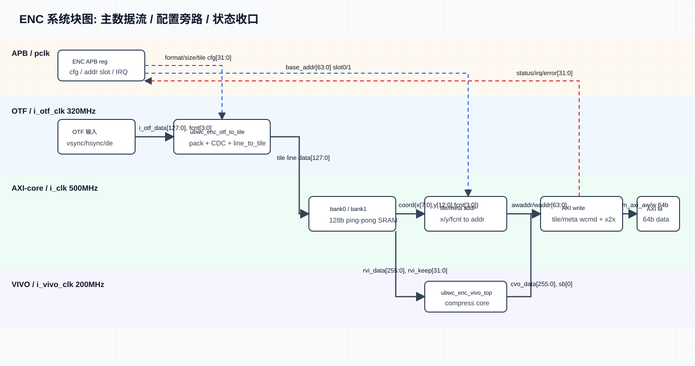
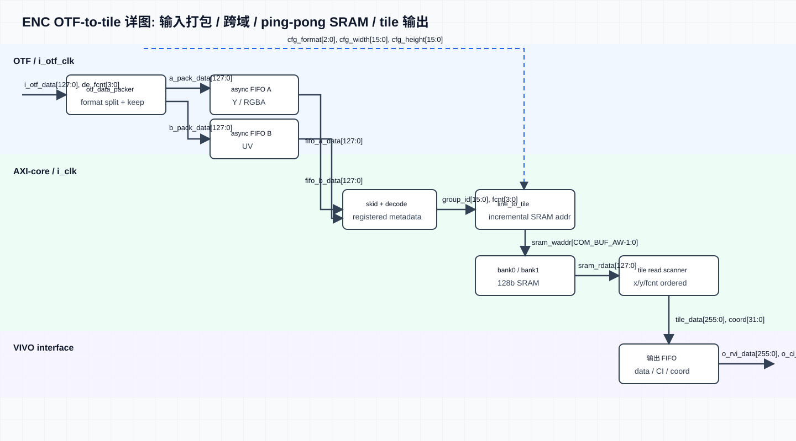
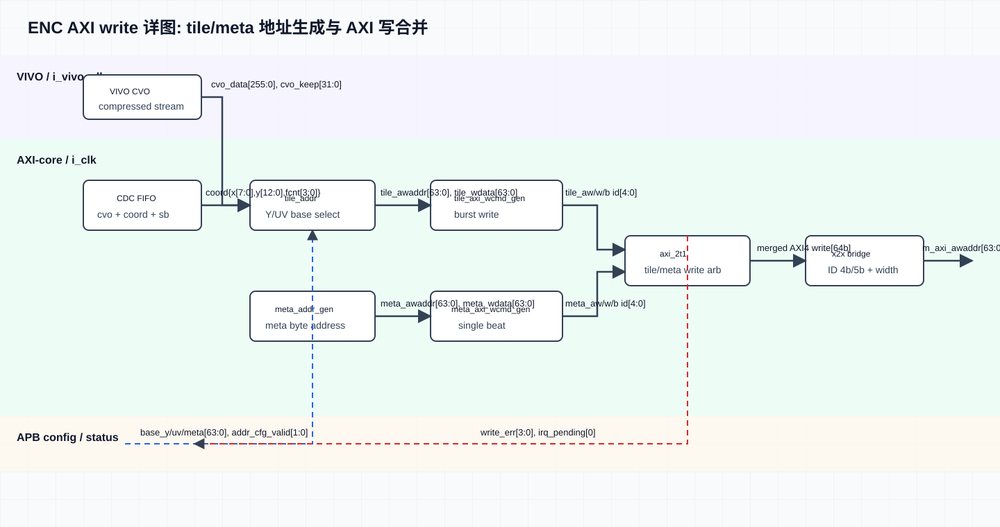
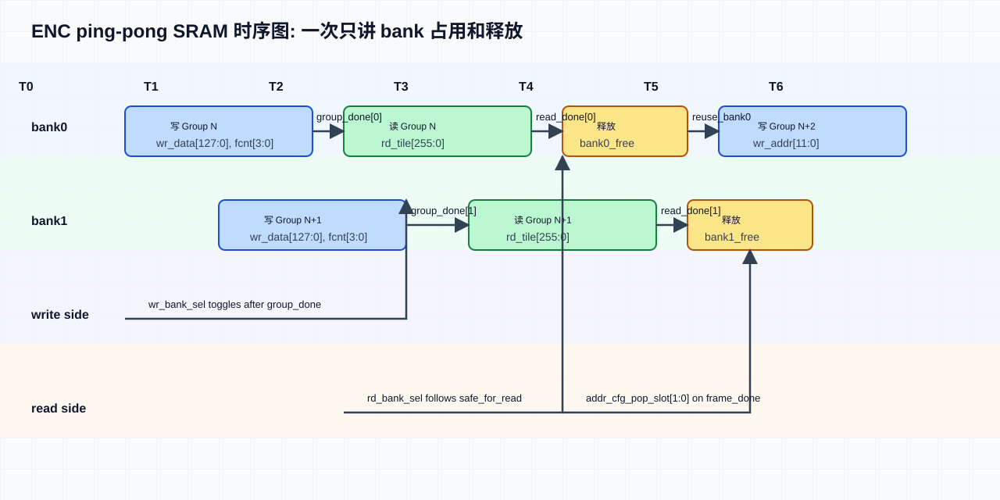
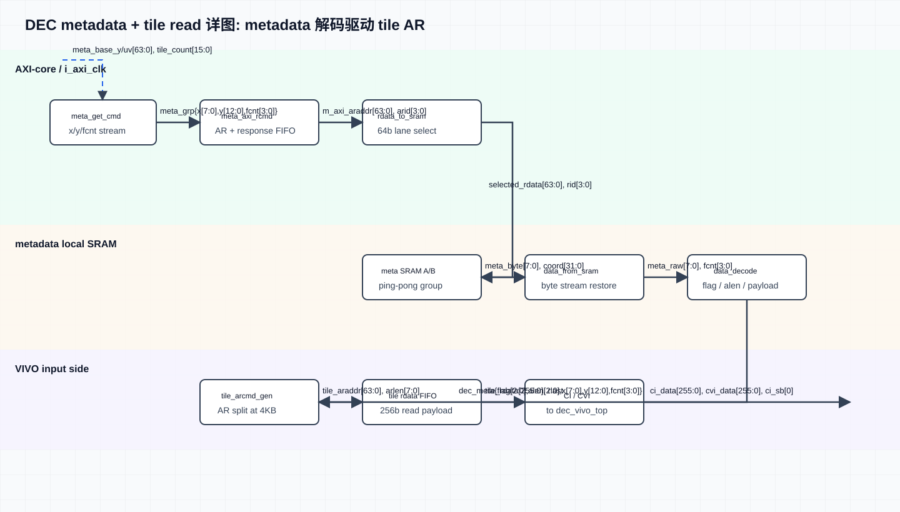
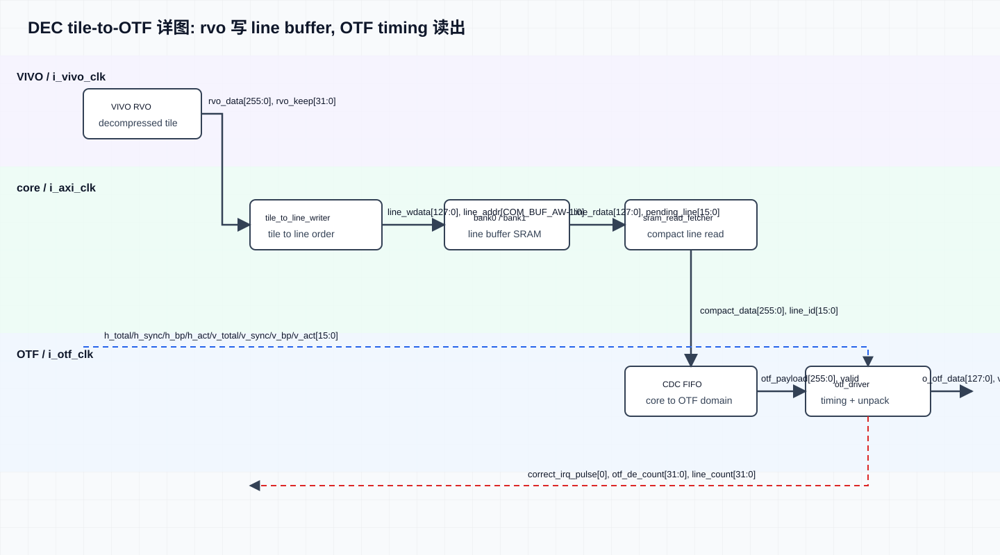

# UBWC ENC/DEC 系统级 Spec

本文整理当前 RTL、APB 配置和 wrapper 级回归的统一规格。更细的寄存器 bit field 以 `docs/ubwc_register_spec.md`、`docs/ubwc_enc_reg_table.xlsx` 和 `docs/ubwc_dec_reg_table.xlsx` 为准。

## 1. 当前基线

| 项目 | 当前规格 |
| --- | --- |
| RTL 顶层 | `src/enc/ubwc_enc_wrapper_top.sv`，`src/dec/ubwc_dec_wrapper_top.v` |
| 支持格式 | `0=RGBA8888`，`1=RGBA1010102`，`2=YUV420_8/NV12`，`3=YUV420_10/P010` |
| 不支持格式 | YUV422_8、YUV422_10 |
| AXI ID / FCNT | 内部按 4 bit 使用，`fcnt[0]` 选择地址 slot0/slot1 |
| 连续帧模型 | 静态配置不变时，软件每帧只补充一组 base address；硬件按 fcnt/slot 连续处理 |
| 回归基线 | 2026-05-11，在服务器 `10.168.1.199:/home/eda/work/ubwc/trunk` 完成 8 个多帧 fake case，`pass=8 fail=0` |

## 2. 时钟域规格

当前推荐集成和回归时钟如下。

| 时钟域 | 频率 | 周期 | ENC 端口 | DEC 端口 | 主要逻辑 |
| --- | --- | --- | --- | --- | --- |
| APB clock | 100 MHz | 10.000 ns | `PCLK` | `PCLK` | APB 寄存器访问 |
| AXI clock | 500 MHz | 2.000 ns | `i_clk` | `i_axi_clk` | AXI 读写、APB 配置同步后的控制逻辑、地址/统计状态 |
| core/VIVO clock | 200 MHz | 5.000 ns | `i_vivo_clk` | `i_vivo_clk` | `ubwc_enc_vivo_top` / `ubwc_dec_vivo_top` |
| OTF clock | 320 MHz | 3.125 ns | `i_otf_clk` | `i_otf_clk` | OTF 输入或输出视频接口 |

集成约束：

- APB 只负责寄存器配置，不作为视频数据通路时钟。
- AXI 域与 VIVO/core 域之间使用异步 FIFO 隔离。
- OTF 域与 AXI/core 域之间不允许直接用多 bit 信号打两拍跨域；数据流必须通过 FIFO 或明确的握手同步。
- 异步复位释放必须在目标时钟域同步后再进入本域逻辑。

## 3. 寄存器访问规格

### 3.1 APB 访问规则

| 项目 | 规格 |
| --- | --- |
| 寄存器宽度 | 32 bit |
| 地址对齐 | 4 byte 对齐，本文 offset 均为 wrapper APB base 下的 byte offset |
| 64 bit base address 写法 | 先写 low 32 bit，再写 high 32 bit |
| APB ready/error | `PREADY=1`，`PSLVERR=0` |
| 访问类型 | `RO` 只读；`RW` 可读写；`W1P` 写 1 产生脉冲 |

### 3.2 ENC Register Summary

| Offset | Register | Access | 功能 | 配置频率 |
| --- | --- | --- | --- | --- |
| `0x000` | `REG_VERSION` | RO | IP version | 上电后读取一次 |
| `0x004` | `REG_DATE` | RO | RTL date | 上电后读取一次 |
| `0x008` | `REG_TILE_CFG0` | RW | UBWC enable、bank swizzle、highest bank bit、bank spread | 格式/尺寸/layout 变化时配置 |
| `0x00C` | `REG_TILE_CFG1` | RW | 4-line format、RGBA lossy 2:1、tile pitch | 格式/尺寸/layout 变化时配置 |
| `0x010` | `REG_ENC_CI_CFG0` | RW | CI input type、ALEN | 格式变化时配置 |
| `0x014` | `REG_ENC_CI_CFG1` | RW | CI lossy，sideband 保留 | 格式变化时配置 |
| `0x018` | `REG_ENC_CI_CFG2` | RW | 保留 UBWC CI cfg，软件写 0 | 格式变化时配置 |
| `0x01C` | `REG_ENC_CI_CFG3` | RW | 保留 UBWC CI cfg，软件写 0 | 格式变化时配置 |
| `0x020` | `REG_OTF_CFG0` | RW | 输入 OTF format | 格式变化时配置 |
| `0x024` | `REG_OTF_CFG1` | RW | 输入 width/height | 格式/尺寸变化时配置 |
| `0x028` | `REG_OTF_CFG2` | RW | tile_w/tile_h | 格式/尺寸变化时配置 |
| `0x02C` | `REG_OTF_CFG3` | RW | Y tile columns、UV tile columns | 格式/尺寸变化时配置 |
| `0x030/0x034` | `REG_META_BASE_Y_LO/HI` | RW | Y/RGBA metadata 写入基地址 | 每帧配置 |
| `0x038/0x03C` | `REG_TILE_BASE_Y_LO/HI` | RW | Y/RGBA compressed tile 写入基地址 | 每帧配置 |
| `0x040/0x044` | `REG_META_BASE_UV_LO/HI` | RW | UV metadata 写入基地址；RGBA 不关心 | 每帧配置 |
| `0x048/0x04C` | `REG_TILE_BASE_UV_LO/HI` | RW | UV compressed tile 写入基地址；写完地址后由 `IRQ_CTRL[5]` 启动本帧 | 每帧配置 |
| `0x050` | `REG_META_ACTIVE_SIZE` | RW | metadata active width/height | 格式/尺寸变化时配置 |
| `0x054` | `REG_META_PITCH` | RW | metadata plane pitch | 格式/尺寸变化时配置 |
| `0x058` | `REG_STATUS0` | RO | idle/error/busy/frame_done/address slot status | 运行中读取 |
| `0x05C` | `REG_STATUS1` | RO | stage_done bitmap | 运行中读取 |
| `0x060` | `REG_IRQ_CTRL` | RW/W1P/RO | irq_enable、irq_clear、start、irq_pending、correct/error pending | 初始化/中断处理 |
| `0x064` | `REG_STATUS2` | RO | IRQ status mirror | 运行中读取 |
| `0x068..0x09C` | `REG_*_COUNT0/1` | RO | metadata、tileaddr、OTF、AXI W 计数，后缀 0/1 对应 `fcnt[0]` | 调试读取 |

### 3.3 DEC Register Summary

| Offset | Register | Access | 功能 | 配置频率 |
| --- | --- | --- | --- | --- |
| `0x000` | `REG_VERSION` | RO | IP version | 上电后读取一次 |
| `0x004` | `REG_DATE` | RO | RTL date | 上电后读取一次 |
| `0x008` | `APB_ADDR_TILE_CFG0` | RW | bank swizzle、highest bank bit、bank spread、4-line、RGBA lossy 2:1 | 格式/尺寸/layout 变化时配置 |
| `0x00C` | `APB_ADDR_TILE_CFG1` | RW | tile pitch | 格式/尺寸/layout 变化时配置 |
| `0x010` | `APB_ADDR_TILE_CFG2` | RW | CI input type、lossy、alpha mode | 格式变化时配置 |
| `0x014` | `APB_ADDR_VIVO_CFG` | RW | VIVO enable、soft reset | 初始化或策略变化时配置 |
| `0x018` | `APB_ADDR_OTF_CFG0` | RW | 输出 image width、format | 格式/尺寸/timing 变化时配置 |
| `0x01C` | `APB_ADDR_OTF_CFG1` | RW | h_total、h_sync/HSA | timing 变化时配置 |
| `0x020` | `APB_ADDR_OTF_CFG2` | RW | h_bp/HBP、h_act/HACT | timing 变化时配置 |
| `0x024` | `APB_ADDR_OTF_CFG3` | RW | v_total、v_sync/VSA | timing 变化时配置 |
| `0x028` | `APB_ADDR_OTF_CFG4` | RW | v_bp/VBP、v_act/VACT | timing 变化时配置 |
| `0x02C` | `APB_ADDR_META_CFG0` | RW | Y/RGBA metadata tile_x/tile_y，YUV420 UV tile 数内部推导 | 格式/尺寸变化时配置 |
| `0x030/0x034` | `REG_META_BASE_Y_LO/HI` | RW | RGBA/Y metadata 读取基地址 | 每帧配置 |
| `0x038/0x03C` | `REG_TILE_BASE_Y_LO/HI` | RW | RGBA/Y compressed tile 读取基地址 | 每帧配置 |
| `0x040/0x044` | `REG_META_BASE_UV_LO/HI` | RW | UV metadata 读取基地址 | 每帧配置 |
| `0x048/0x04C` | `REG_TILE_BASE_UV_LO/HI` | RW | UV compressed tile 读取基地址；RGBA 不关心 | 每帧配置 |
| `0x050` | `APB_ADDR_STATUS0` | RO | frame_active、meta/tile/vivo/otf busy、idle status | 运行中读取 |
| `0x054` | `APB_ADDR_STATUS1` | RO | stage_done、frame_done、stage_seen | 运行中读取 |
| `0x058` | `APB_ADDR_STATUS2` | RO | VIVO idle bitmap | 运行中读取 |
| `0x05C` | `APB_ADDR_STATUS3` | RO | VIVO error bitmap | 运行中读取 |
| `0x060` | `APB_ADDR_IRQ_CTRL` | RW/W1P/RO | irq_enable、irq_clear、start、irq_pending、correct/error pending | 初始化/中断处理 |
| `0x064` | `APB_ADDR_STATUS4` | RO | IRQ status mirror | 运行中读取 |
| `0x068` | `APB_ADDR_STAT_META` | RO | metadata valid tile count | 调试读取 |
| `0x06C` | `APB_ADDR_STAT_TILE` | RO | tile address valid tile count | 调试读取 |
| `0x070` | `APB_ADDR_STAT_OTF_TILE` | RO | tile-to-OTF accepted tile count | 调试读取 |
| `0x074` | `APB_ADDR_STAT_OTF_LINE` | RO | OTF output line count | 调试读取 |
| `0x078` | `APB_ADDR_STAT_OTF_DE` | RO | OTF output `de && ready` beat count | 调试读取 |

### 3.4 软件访问顺序摘要

```text
ENC:
  read VERSION/DATE
  write static TILE/CI/OTF/META config
  for each frame:
    write META_BASE_Y low/high
    write TILE_BASE_Y low/high
    write META_BASE_UV low/high
    write TILE_BASE_UV low/high
    write IRQ_CTRL[5]=1
    start OTF input stream
  poll/handle IRQ and STATUS

DEC:
  read VERSION/DATE
  write static TILE/VIVO/META/OTF config
  for each frame:
    write META_BASE_Y low/high
    write TILE_BASE_Y low/high
    write META_BASE_UV low/high
    write TILE_BASE_UV low/high
  software writes IRQ_CTRL[5]=1 when address set is valid
  poll/handle IRQ and STATUS
```

## 4. 模块数据流图

2026-05-12 重画。把“一张图同时承载 control/data/config/error 四种路径”的旧图拆成 7 张专题图，每张只讲一件事。所有图均为手写 SVG，统一 40px 栅格、正交直角连线、时钟域泳道色，并在箭头旁标注信号名和位宽。

> 专题图的重画记录保留在 Markdown 中；图本身同步放入 `ubwc_system_spec_cn.html`。

| 分类 | 图 | SVG 文件 | 说明 |
| --- | --- | --- | --- |
| ENC | 系统块图 | `ubwc_enc_system_block_cn.svg` | 顶层主数据路径，APB/status 用旁路收口 |
| ENC | OTF-to-tile 详图 | `ubwc_enc_otf_to_tile_detail_cn.svg` | OTF pack、async FIFO A/B、line-to-tile、bank0/1、tile read scanner |
| ENC | AXI write 详图 | `ubwc_enc_axi_write_detail_cn.svg` | tile/meta address、tile/meta write command、AXI merge/x2x |
| ENC | ping-pong SRAM 时序图 | `ubwc_enc_pingpong_timing_cn.svg` | bank0/bank1 写行组与读 tile 的错相调度 |
| DEC | 总体微架构图 | `ubwc_dec_microarchitecture_cn.svg` | 按当前 RTL 展开 APB/status、metadata read/decode、tile read、VIVO decode、tile-to-OTF 输出 |
| DEC | metadata + tile read 详图 | `ubwc_dec_meta_tile_read_detail_cn.svg` | metadata fetch/decode 与 tile read command 两条路径 |
| DEC | tile-to-OTF 详图 | `ubwc_dec_tile_to_otf_detail_cn.svg` | VIVO rvo、line writer、SRAM fetch、OTF driver |

### 4.1 ENC 系统块图



顶层模块按 APB、OTF、AXI/core、VIVO 四条泳道展开，只表达主数据流和必要配置/状态旁路。

### 4.2 ENC OTF-to-tile 详图



说明 OTF 输入如何按 format 拆成 Y/RGBA 与 UV 两路，跨域后写入 ping-pong SRAM，再按 tile 顺序读出给 VIVO。

### 4.3 ENC AXI write 详图



说明 VIVO cvo 数据和坐标/fcnt 如何生成 tile/meta AXI 写命令，并通过合并与宽度转换后写到外部 AXI。

### 4.4 ENC Ping-pong SRAM 时序图



说明 bank0/bank1 在连续 group 中的写入、读出、释放和下一次复用关系。

### 4.5 DEC 总体微架构图


DEC 当前实现图，按当前 RTL 展开 APB/status、metadata read/decode、tile read、VIVO 解压、tile-to-OTF、外部 SRAM 和 OTF 输出。

### 4.6 DEC metadata + tile read 详图



说明 metadata AR/R 通路、metadata SRAM、decode 输出，以及 tile_arcmd_gen 使用 metadata 结果发起 tile read 的关系。

### 4.7 DEC tile-to-OTF 详图



说明 VIVO rvo 数据如何写入 line buffer，如何被 fetcher 按 OTF timing 读取并在 OTF 域输出。

## 5. ENC 规格

### 5.1 数据流

```text
OTF input(i_otf_clk)
  -> ubwc_enc_otf_to_tile
  -> external bank0/bank1 SRAM
  -> ubwc_enc_vivo_top(i_vivo_clk)
  -> tile/meta AXI write(i_clk)
```

ENC 通过 `IRQ_CTRL[5]` 写 1 产生 START token。软件写好静态配置和本帧输出 buffer 地址后，先写 `IRQ_CTRL[5]=1`，再送上游 OTF `vsync/hsync/de/data`。

### 5.2 地址 slot

ENC APB 地址从 `0x030` 开始按如下顺序配置：

| 地址 | 名称 | 含义 |
| --- | --- | --- |
| `0x030/0x034` | `REG_META_BASE_Y_LO/HI` | Y/RGBA metadata 存储基地址 |
| `0x038/0x03C` | `REG_TILE_BASE_Y_LO/HI` | Y/RGBA compressed tile 存储基地址 |
| `0x040/0x044` | `REG_META_BASE_UV_LO/HI` | UV metadata 存储基地址；RGBA 不关心，可写 0 |
| `0x048/0x04C` | `REG_TILE_BASE_UV_LO/HI` | UV compressed tile 存储基地址；写完四个地址后写 `IRQ_CTRL[5]` 启动 |

硬件内部保留两组地址 slot。`fcnt[0]=0` 使用 slot0，`fcnt[0]=1` 使用 slot1。如果当前帧需要的 slot 未配置，硬件应阻塞并上报地址配置错误状态/中断。

### 5.3 软件配置频率

| 配置项 | 配置频率 |
| --- | --- |
| `TILE_CFG / CI_CFG / OTF_CFG / META_ACTIVE_SIZE / META_PITCH` | 图像格式、尺寸或 layout 变化时配置 |
| 输出 buffer base address | 每帧配置，或每新增一个输出 buffer 配置 |
| IRQ enable | 上电后一次，或中断策略变化时配置 |

## 6. DEC 规格

### 6.1 数据流

```text
UBWC metadata/tile AXI read(i_axi_clk)
  -> ubwc_dec_vivo_top(i_vivo_clk)
  -> ubwc_dec_tile_to_otf
  -> external bank0/bank1 SRAM
  -> OTF output(i_otf_clk)
```

DEC 通过 `IRQ_CTRL[5]` 写 1 启动。软件写好静态配置和一组输入 UBWC buffer 地址后，写 `IRQ_CTRL[5]=1`，硬件锁存该地址组并启动本帧 decode。

### 6.2 地址 slot

DEC APB 地址从 `0x030` 开始按如下顺序配置：

| 地址 | 名称 | 含义 |
| --- | --- | --- |
| `0x030/0x034` | `REG_META_BASE_Y_LO/HI` | RGBA/Y metadata 读取基地址 |
| `0x038/0x03C` | `REG_TILE_BASE_Y_LO/HI` | RGBA/Y compressed tile 读取基地址 |
| `0x040/0x044` | `REG_META_BASE_UV_LO/HI` | UV metadata 读取基地址 |
| `0x048/0x04C` | `REG_TILE_BASE_UV_LO/HI` | UV compressed tile 读取基地址；RGBA 不关心 |

DEC 同样按 `fcnt[0]` 在 slot0/slot1 间切换。相邻两帧可以使用不同 base address，其他静态信息只保留一份，并在格式/尺寸/timing 变化时重新配置。

### 6.3 软件配置频率

| 配置项 | 配置频率 |
| --- | --- |
| `TILE_CFG / CI_CFG / VIVO_CFG / META_CFG / OTF timing` | 图像格式、尺寸、layout 或 timing 变化时配置 |
| 输入 UBWC buffer base address | 每帧配置，或每新增一个输入 UBWC buffer 配置 |
| IRQ enable | 上电后一次，或中断策略变化时配置 |

## 7. OTF timing 约定

DEC OTF timing 使用标准 video mode 参数：

| 标记 | RTL 配置项 | 说明 |
| --- | --- | --- |
| HSA | `h_sync` | 水平 sync 宽度 |
| HBP | `h_bp` | 水平 back porch |
| HACT | `h_act` | 水平 active 宽度，通常等于输出图像宽度 |
| HFP | 由 `h_total - h_sync - h_bp - h_act` 得到 | 水平 front porch |
| VSA | `v_sync` | 垂直 sync 行数 |
| VBP | `v_bp` | 垂直 back porch |
| VACT | `v_act` | 垂直 active 高度，通常等于输出图像高度 |
| VFP | 由 `v_total - v_sync - v_bp - v_act` 得到 | 垂直 front porch |

寄存器写法：

```text
OTF_CFG1 = {h_sync, h_total}
OTF_CFG2 = {h_act,  h_bp}
OTF_CFG3 = {v_sync, v_total}
OTF_CFG4 = {v_act,  v_bp}
```

## 8. 外部 SRAM bank

ENC 和 DEC wrapper 都使用外部 bank0/bank1 作为 ping-pong 工作 SRAM，数据宽度为 128 bit。bank0/bank1 是工作 buffer，不固定等价于 Y/UV plane。

| 模块 | 当前默认 `COM_BUF_AW` | 每个 bank 容量 | 说明 |
| --- | --- | --- | --- |
| ENC | 12 | 4096 x 128 bit = 64 KiB | 当前默认参数；4096 宽 RGBA/YUV420 均固定 12 bit，YUV420 通过 Y/UV 同 bank 时分调度覆盖 |
| DEC | 12 | 4096 x 128 bit = 64 KiB | 当前默认参数；4096 宽 RGBA/YUV420 均按 12 bit 工作 bank 集成 |

容量规则以最终集成参数为准：

```text
bank_words = 2 ^ COM_BUF_AW
bank_bytes = bank_words * 16
```

## 9. 状态和中断

- 正确中断和 frame_done 在最后一个有效输出数据完成后产生。
- 错误中断表示地址未配置、OTF 输入错误、FIFO overflow、VIVO error 等异常事件。
- 中断 pending 应保持到软件写 `IRQ_CTRL[1]=1` 清除。
- 统计寄存器只做调试/观测，不应作为核心 done 判断依据。

## 10. Wrapper 顶层接口

本章列出当前 RTL wrapper 的集成级端口清单，每一行对应一个端口信号。完整寄存器 bit field 仍以内部寄存器表为准。

### 10.1 ENC Wrapper: `ubwc_enc_wrapper_top.sv`

| 接口组 | 信号 | 方向 | 位宽 | 说明 |
| --- | --- | --- | --- | --- |
| APB slave | `PCLK` | input | 1 bit | APB clock |
| APB slave | `PRESETn` | input | 1 bit | APB async reset, active low |
| APB slave | `PSEL` | input | 1 bit | APB select |
| APB slave | `PENABLE` | input | 1 bit | APB enable phase |
| APB slave | `PADDR` | input | `APB_AW` | APB byte address |
| APB slave | `PWRITE` | input | 1 bit | APB write/read select |
| APB slave | `PWDATA` | input | `APB_DW` | APB write data |
| APB slave | `PREADY` | output | 1 bit | APB ready |
| APB slave | `PSLVERR` | output | 1 bit | APB slave error |
| APB slave | `PRDATA` | output | `APB_DW` | APB read data |
| Clock/reset | `i_clk` | input | 1 bit | ENC core/control clock |
| Clock/reset | `i_otf_clk` | input | 1 bit | OTF input clock |
| Clock/reset | `i_vivo_clk` | input | 1 bit | VIVO clock |
| Clock/reset | `i_rstn` | input | 1 bit | Global reset, active low |
| OTF input | `i_otf_vsync` | input | 1 bit | Input frame sync |
| OTF input | `i_otf_hsync` | input | 1 bit | Input line sync |
| OTF input | `i_otf_de` | input | 1 bit | Input data enable |
| OTF input | `i_otf_data` | input | 128 bit | Input pixel data |
| OTF input | `i_otf_fcnt` | input | 4 bit | Input frame count |
| OTF input | `i_otf_lcnt` | input | 12 bit | Input line count |
| OTF input | `o_otf_ready` | output | 1 bit | ENC 对 OTF 输入的反压 |
| SRAM bank0 | `o_bank0_en` | output | 1 bit | Bank0 SRAM enable |
| SRAM bank0 | `o_bank0_wen` | output | 1 bit | Bank0 SRAM write enable |
| SRAM bank0 | `o_bank0_addr` | output | `COM_BUF_AW` | Bank0 SRAM address |
| SRAM bank0 | `o_bank0_din` | output | `COM_BUF_DW` | Bank0 SRAM write data |
| SRAM bank0 | `i_bank0_dout` | input | `COM_BUF_DW` | Bank0 SRAM read data |
| SRAM bank0 | `i_bank0_dout_vld` | input | 1 bit | Bank0 SRAM read data valid |
| SRAM bank1 | `o_bank1_en` | output | 1 bit | Bank1 SRAM enable |
| SRAM bank1 | `o_bank1_wen` | output | 1 bit | Bank1 SRAM write enable |
| SRAM bank1 | `o_bank1_addr` | output | `COM_BUF_AW` | Bank1 SRAM address |
| SRAM bank1 | `o_bank1_din` | output | `COM_BUF_DW` | Bank1 SRAM write data |
| SRAM bank1 | `i_bank1_dout` | input | `COM_BUF_DW` | Bank1 SRAM read data |
| SRAM bank1 | `i_bank1_dout_vld` | input | 1 bit | Bank1 SRAM read data valid |
| AXI write address | `o_m_axi_awid` | output | `AXI_IDW+1` | AXI AW ID |
| AXI write address | `o_m_axi_awaddr` | output | `AXI_AW` | AXI AW address |
| AXI write address | `o_m_axi_awlen` | output | `AXI_LENW` | AXI AW burst length |
| AXI write address | `o_m_axi_awsize` | output | 3 bit | AXI AW beat size |
| AXI write address | `o_m_axi_awburst` | output | 2 bit | AXI AW burst type |
| AXI write address | `o_m_axi_awlock` | output | 2 bit | AXI AW lock |
| AXI write address | `o_m_axi_awcache` | output | 4 bit | AXI AW cache attribute |
| AXI write address | `o_m_axi_awprot` | output | 3 bit | AXI AW protection attribute |
| AXI write address | `o_m_axi_awvalid` | output | 1 bit | AXI AW valid |
| AXI write address | `i_m_axi_awready` | input | 1 bit | AXI AW ready |
| AXI write data | `o_m_axi_wdata` | output | `AXI_DW` | AXI W data |
| AXI write data | `o_m_axi_wstrb` | output | `AXI_DW/8` | AXI W byte strobe |
| AXI write data | `o_m_axi_wvalid` | output | 1 bit | AXI W valid |
| AXI write data | `o_m_axi_wlast` | output | 1 bit | AXI W last beat |
| AXI write data | `i_m_axi_wready` | input | 1 bit | AXI W ready |
| AXI write response | `i_m_axi_bid` | input | `AXI_IDW+1` | AXI B ID |
| AXI write response | `i_m_axi_bresp` | input | 2 bit | AXI B response |
| AXI write response | `i_m_axi_bvalid` | input | 1 bit | AXI B valid |
| AXI write response | `o_m_axi_bready` | output | 1 bit | AXI B ready |
| Done/IRQ | `o_stage_done` | output | 8 bit | Stage done bitmap |
| Done/IRQ | `o_frame_done` | output | 1 bit | Frame done flag |
| Done/IRQ | `o_irq` | output | 1 bit | Interrupt output |

### 10.2 DEC Wrapper: `ubwc_dec_wrapper_top.v`

| 接口组 | 信号 | 方向 | 位宽 | 说明 |
| --- | --- | --- | --- | --- |
| APB slave | `PCLK` | input | 1 bit | APB clock |
| APB slave | `PRESETn` | input | 1 bit | APB async reset, active low |
| APB slave | `PSEL` | input | 1 bit | APB select |
| APB slave | `PENABLE` | input | 1 bit | APB enable phase |
| APB slave | `PADDR` | input | `APB_AW` | APB byte address |
| APB slave | `PWRITE` | input | 1 bit | APB write/read select |
| APB slave | `PWDATA` | input | `APB_DW` | APB write data |
| APB slave | `PREADY` | output | 1 bit | APB ready |
| APB slave | `PSLVERR` | output | 1 bit | APB slave error |
| APB slave | `PRDATA` | output | `APB_DW` | APB read data |
| OTF/VIVO clock | `i_otf_clk` | input | 1 bit | OTF output clock |
| OTF/VIVO clock | `i_vivo_clk` | input | 1 bit | VIVO clock |
| OTF/VIVO clock | `i_otf_rstn` | input | 1 bit | OTF reset, active low |
| OTF output | `o_otf_vsync` | output | 1 bit | Output frame sync |
| OTF output | `o_otf_hsync` | output | 1 bit | Output line sync |
| OTF output | `o_otf_de` | output | 1 bit | Output data enable |
| OTF output | `o_otf_data` | output | 128 bit | Output pixel data |
| OTF output | `o_otf_fcnt` | output | 4 bit | Output frame count |
| OTF output | `o_otf_lcnt` | output | 12 bit | Output line count |
| OTF output | `i_otf_ready` | input | 1 bit | Downstream OTF ready |
| SRAM bank0 | `o_bank0_en` | output | 1 bit | Bank0 SRAM enable |
| SRAM bank0 | `o_bank0_wen` | output | 1 bit | Bank0 SRAM write enable |
| SRAM bank0 | `o_bank0_addr` | output | `COM_BUF_AW` | Bank0 SRAM address |
| SRAM bank0 | `o_bank0_din` | output | `COM_BUF_DW` | Bank0 SRAM write data |
| SRAM bank0 | `i_bank0_dout` | input | `COM_BUF_DW` | Bank0 SRAM read data |
| SRAM bank0 | `i_bank0_dout_vld` | input | 1 bit | Bank0 SRAM read data valid |
| SRAM bank1 | `o_bank1_en` | output | 1 bit | Bank1 SRAM enable |
| SRAM bank1 | `o_bank1_wen` | output | 1 bit | Bank1 SRAM write enable |
| SRAM bank1 | `o_bank1_addr` | output | `COM_BUF_AW` | Bank1 SRAM address |
| SRAM bank1 | `o_bank1_din` | output | `COM_BUF_DW` | Bank1 SRAM write data |
| SRAM bank1 | `i_bank1_dout` | input | `COM_BUF_DW` | Bank1 SRAM read data |
| SRAM bank1 | `i_bank1_dout_vld` | input | 1 bit | Bank1 SRAM read data valid |
| AXI read clock | `i_axi_clk` | input | 1 bit | AXI read master clock |
| AXI read clock | `i_axi_rstn` | input | 1 bit | AXI read master reset, active low |
| AXI read address | `o_m_axi_arid` | output | `AXI_IDW+1` | AXI AR ID |
| AXI read address | `o_m_axi_araddr` | output | `AXI_AW` | AXI AR address |
| AXI read address | `o_m_axi_arlen` | output | `AXI_LENW` | AXI AR burst length |
| AXI read address | `o_m_axi_arsize` | output | 4 bit | AXI AR beat size |
| AXI read address | `o_m_axi_arburst` | output | 2 bit | AXI AR burst type |
| AXI read address | `o_m_axi_arlock` | output | 1 bit | AXI AR lock |
| AXI read address | `o_m_axi_arcache` | output | 4 bit | AXI AR cache attribute |
| AXI read address | `o_m_axi_arprot` | output | 3 bit | AXI AR protection attribute |
| AXI read address | `o_m_axi_arvalid` | output | 1 bit | AXI AR valid |
| AXI read address | `i_m_axi_arready` | input | 1 bit | AXI AR ready |
| AXI read data | `i_m_axi_rid` | input | `AXI_IDW+1` | AXI R ID |
| AXI read data | `i_m_axi_rdata` | input | `AXI_DW` | AXI R data |
| AXI read data | `i_m_axi_rvalid` | input | 1 bit | AXI R valid |
| AXI read data | `i_m_axi_rresp` | input | 2 bit | AXI R response |
| AXI read data | `i_m_axi_rlast` | input | 1 bit | AXI R last beat |
| AXI read data | `o_m_axi_rready` | output | 1 bit | AXI R ready |
| Done/IRQ | `o_stage_done` | output | 5 bit | Stage done bitmap |
| Done/IRQ | `o_frame_done` | output | 1 bit | Frame done flag |
| Done/IRQ | `o_irq` | output | 1 bit | Interrupt output |

ENC wrapper 对外是 AXI write master；DEC wrapper 对外是 AXI read master。当前外部 AXI ID 端口宽度为 `AXI_IDW+1`，内部 frame count/AXI ID 仍按 4 bit 语义传递。

## 11. 回归基线

本轮回归命令：

```text
tcsh -c "source prj_setup.env; make -C vrf/sim random_if_fake_all"
```

时钟配置：

```text
APB  = 100 MHz
AXI  = 500 MHz
CORE = 200 MHz
OTF  = 320 MHz
```

服务器 log：

```text
/home/eda/work/ubwc/trunk/vrf/sim/build/regress_logs/random_if_clk320_200_500_rerun_20260511_100738.log
```

通过 case：

```text
wrapper_tajmahal_4096x600_nv12_otf_fake_all
wrapper_k_outdoor61_4096x600_g016_vivo_fake_all
enc_wrapper_tajmahal_4096x600_nv12_fake_all
enc_wrapper_k_outdoor61_4096x600_g016_fake_all
```

以上 4 个 case 用两组随机 seed 重复执行，共 8 项：

```text
Summary: pass=8 fail=0
```
