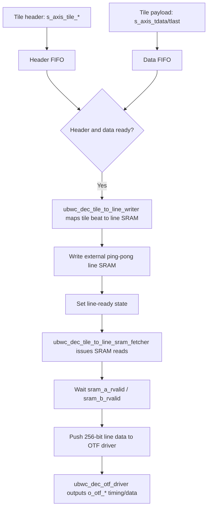

# UBWC Wrapper Usage Guide

This document applies to the following two top-level files:

- `ubwc_enc/ubwc_enc_wrapper_top.sv`
- `ubwc_dec_wrapper_top.v`

Additional output file:

- `docs/ubwc_reg_tables.xlsx`
- `docs/ubwc_enc_reg_table.csv`
- `docs/ubwc_dec_reg_table.csv`
- `scripts/gen_ubwc_reg_table_xlsx.py`

Note: the file you mentioned `ubwc_enc_wrapper_top.v`, is actually named in this repository as `ubwc_enc/ubwc_enc_wrapper_top.sv`.

## 0. Current Clock Profile

The current wrapper-level regression baseline uses the following independent clock domains:

| Domain | Frequency | Encoder port | Decoder port |
| --- | --- | --- | --- |
| APB | 100 MHz | `PCLK` | `PCLK` |
| AXI/control | 500 MHz | `i_axi_clk` | `i_axi_clk` |
| Core/VIVO | 200 MHz | `i_vivo_clk` | `i_vivo_clk` |
| OTF | 320 MHz | `i_otf_clk` | `i_otf_clk` |

The AXI/control, Core/VIVO, and OTF interfaces are independent clock domains. Integration must keep data movement between these domains on async FIFO or explicit CDC paths.

## 1. ubwc_enc_wrapper_top Usage Guide

### 1.1 Module Responsibilities

`ubwc_enc_wrapper_top.sv`  data flow is:

- The APB side writes encoder configuration.
- OTF input enters from `i_otf_*` into `ubwc_enc_otf_to_tile`.
- Externally provided `bank0/bank1` SRAM SRAM is used in the middle to organize lines into tiles.
- `ubwc_enc_vivo_top` handles UBWC encoding.
- Main image data and metadata are output through the AXI write port.

The APB side holds static configuration, per-frame address queues, interrupt control, and an explicit frame `start` token at `REG_IRQ_CTRL[5]`.

### 1.2 Required Register Groups

- Tile address related:`0x0008 REG_TILE_CFG0`, `0x000c REG_TILE_CFG1`
- Encoder CI related:`0x0010 REG_ENC_CI_CFG0` ~ `0x001c REG_ENC_CI_CFG3`
- OTF input related:`0x0020 REG_OTF_CFG0` ~ `0x002c REG_OTF_CFG3`
- Per-frame output address:`0x0030` ~ `0x004c`
- Metadata active area:`0x0050 REG_META_ACTIVE_SIZE`

### 1.3 Recommended Configuration Order

The current RTL has several designs that emit a valid pulse when a specific register is written, so the order should be fixed:

1. Write static format/layout configuration: `REG_TILE_CFG1 (0x000c)`, then `REG_TILE_CFG0 (0x0008)`.
2. Write `REG_ENC_CI_CFG1/2/3`, then write `REG_ENC_CI_CFG0 (0x0010)`.
3. Write `REG_OTF_CFG1/2/3`, `REG_META_ACTIVE_SIZE (0x0050)`, `REG_META_PITCH (0x0054)`, then `REG_OTF_CFG0 (0x0020)`.
4. For each frame/output buffer, write the four 64-bit base addresses from `0x0030` to `0x004c`.
5. Write `REG_IRQ_CTRL[5]=1` to issue one frame start token.

The corresponding testbench uses the same actual order because:

- Writing `REG_TILE_CFG0` triggers `o_tile_addr_gen_cfg_vld`
- Writing `REG_ENC_CI_CFG0` triggers `o_enc_ci_vld`
- Writing `REG_OTF_CFG0` triggers `o_otf_cfg_vld`

Among them, `tile_addr_gen_cfg_vld` is indeed used inside the wrapper;`o_enc_ci_vld` and `o_otf_cfg_vld` in the current `ubwc_enc_wrapper_top.sv` is not further propagated as a startup condition, so they are more like"compatibility-reserved pulses".

### 1.4 Startup Method

`ubwc_enc_wrapper_top.sv` uses a separate frame start token. Address writes only fill the pending address queues; they do not start a frame by themselves.

The real startup conditions are:

- Static APB configuration has already been written.
- The current output address group has been written.
- Software writes `REG_IRQ_CTRL[5]=1`.
- The upstream source sends the matching OTF frame and handshakes with `o_otf_ready`.

The start token lets the reset/status/address logic prepare the next frame. OTF data still enters only through the normal `i_otf_*` handshake.

The minimal flow can be understood as:

```text
1. Write registers
2. Write one output address group
3. Write REG_IRQ_CTRL[5]=1
4. The upstream source sends i_otf_vsync / i_otf_hsync / i_otf_de / i_otf_data
5. The wrapper starts tiling, UBWC encoding, and AXI writeback
```

Example minimal APB configuration order:

```text
write(0x000c, tile_cfg1);
write(0x0008, tile_cfg0);

write(0x0014, enc_ci_cfg1);
write(0x0018, enc_ci_cfg2);
write(0x001c, enc_ci_cfg3);
write(0x0010, enc_ci_cfg0);

write(0x0024, otf_cfg1);
write(0x0028, otf_cfg2);
write(0x002c, otf_cfg3);
write(0x0050, meta_active_size);
write(0x0054, meta_pitch);
write(0x0020, otf_cfg0);

write(0x0030, meta_base_y_lo);
write(0x0034, meta_base_y_hi);
write(0x0038, tile_base_y_lo);
write(0x003c, tile_base_y_hi);
write(0x0040, meta_base_uv_lo);
write(0x0044, meta_base_uv_hi);
write(0x0048, tile_base_uv_lo);
write(0x004c, tile_base_uv_hi);
write(0x0060, irq_enable | (1 << 5));  // start one frame

start_otf_input_stream();
```

### 1.5 Completion and Error Detection

Current `ubwc_enc_apb_reg_blk.v` exposes `REG_STATUS0 (0x0058)`:

- `bit0`: `enc_idle`
- `bit1`: `enc_error`
- `bit2`: `otf_to_tile_busy`
- `bit3`: `otf_to_tile_overflow`
- `bit4`: `otf_err_bline`
- `bit5`: `otf_err_bframe`
- `bit6`: `meta_err_0`, currently tied low
- `bit7`: `meta_err_1`, currently tied low
- `bit8`: `frame_done`
- `bit9`: `addr_cfg_invalid`
- `bit10`: `addr_cfg_valid0`
- `bit11`: `addr_cfg_valid1`

`REG_STATUS1 (0x005c)` exposes stage-done information, and `IRQ_CTRL (0x0060)` exposes interrupt enable/clear/pending state.

For software:

- Correct IRQ indicates the frame completion point.
- Error IRQ indicates address-slot missing, OTF bad line/frame, FIFO overflow, VIVO/encoder errors, or metadata errors.
- `addr_cfg_invalid` means the current `fcnt[0]` selected an address slot that software has not configured.
- Statistic registers are for debug/visibility and should not be used as the primary frame-done condition.

## 2. ubwc_dec_wrapper_top Usage Guide

### 2.1 Module Responsibilities

`ubwc_dec_wrapper_top.v`  data flow is:

- The APB side writes decoder configuration
- Reads metadata and tile data through AXI
- `ubwc_dec_vivo_top` performs UBWC decoding
- `ubwc_dec_tile_to_otf` reorganizes the output into an OTF video stream
- `o_otf_*` outputs the final video

It also depends on two external ping-pong SRAM blocks:

- `o_otf_sram_a_* / i_otf_sram_a_rdata`
- `o_otf_sram_b_* / i_otf_sram_b_rdata`

### 2.2 Required Register Groups

- Tile configuration:`0x0008`, `0x000c`, `0x0010`
- VIVO configuration:`0x0014`
- OTF output timing:`0x0018` ~ `0x0028`
- Metadata tile count:`0x002c`
- Per-frame base address:`0x0030` ~ `0x004c`
- Status registers:`0x0050`, `0x0054`

### 2.3 Recommended Configuration Order

Recommended write order:

1. Write `TILE_CFG0/1/2`
2. Write `VIVO_CFG`
3. Write `OTF_CFG0/1/2/3/4`
4. Write `APB_ADDR_META_CFG0` tile count
5. Write all four per-frame base address pairs; software writes IRQ_CTRL[5] after they are all valid

The key point is that software no longer writes a legacy `meta_start` pulse and does not use address high-word writes as start. DEC starts after both conditions are true: a complete per-frame address set is available and software writes `IRQ_CTRL[5]=1`.

### 2.4 Startup Method

`ubwc_dec_wrapper_top.v` starts after software writes a complete set of per-frame base addresses and then writes `IRQ_CTRL[5]=1`:

```text
write REG_META_BASE_Y_LO/HI
write REG_TILE_BASE_Y_LO/HI
write REG_META_BASE_UV_LO/HI
write REG_TILE_BASE_UV_LO/HI
```

RTL behavior:

- APB high-word writes complete each 64-bit base address entry
- When the complete address set and start token are both valid, and the metadata stage can accept a new frame, hardware locks one address set
- This generates `frame_start_pulse_axi` in the AXI clock domain
- Metadata read, tile read, VIVO decode, and tile_to_otf output all start together

To run multiple frames continuously, software writes the next frame address set and writes one `IRQ_CTRL[5]` start token for that frame.

### 2.5 Completion Detection

This `dec` version already has complete status registers, so software can poll directly.

Recommended detection method:

1. Issue one start first
2. Poll `STATUS1[4] == 1`
3. Also confirm `STATUS0[6] == 1`

The meanings of these two bits are:

- `STATUS1[4] = frame_done`
  This frame has really completed, and this bit is cleared on the next start
- `STATUS0[6] = frame_idle_done`
  All current stages are not busy, and `frame_active=0`

It is not recommended to only check `STATUS0[5]` or `STATUS0[6]`, because they may also be 1 before startup; the safest method is:

- Use the address-group commit as the frame boundary
- Then poll `STATUS1[4]`
- Finally use `STATUS0[6]` to confirm the pipeline is fully idle

### 2.6 Decoder Usage Flowchart

#### 2.6.1 Software/APB Bring-up Flow

```mermaid
flowchart TD
    A[Reset released] --> B[Write TILE_CFG0/1/2]
    B --> C[Write VIVO_CFG]
    C --> D[Write APB_ADDR_META_CFG0 tile count]
    D --> E[Write OTF_CFG0/1/2/3/4]
    E --> F[Write REG_META_BASE_Y/TILE_BASE_Y/META_BASE_UV/TILE_BASE_UV]
    F --> G[Last high-word write completes one frame address set]
    G --> H[Hardware locks address slot and creates frame_start in AXI clock]
    H --> I[Metadata AXI read starts]
    H --> J[Tile AXI read starts]
    I --> K[VIVO UBWC decode]
    J --> K
    K --> L[tile_to_otf line ring writes external OTF SRAM]
    L --> M[OTF driver reads line ring and outputs o_otf_*]
    M --> N{STATUS1[4] frame_done?}
    N -- No --> N
    N -- Yes --> O{STATUS0[6] frame_idle_done?}
    O -- No --> O
    O -- Yes --> P[Frame complete; next frame can start]
```

Key usage rule: DEC frame start is driven by address availability, not by a software start pulse.

#### 2.6.2 `ubwc_dec_tile_to_otf` Data Flow



In this flow, SRAM return data is qualified by `sram_a_rvalid` / `sram_b_rvalid`; tile write, SRAM fetch, and OTF output are split into dedicated modules.

For video-stream-side detection, you can also use `o_otf_de` valid output to count up to `H_ACT x V_ACT`, but the software-driver layer is better served by direct status-register polling.

Minimal configuration and startup example:

```text
write(0x0008, tile_cfg0);
write(0x000c, tile_cfg1);
write(0x0010, tile_cfg2);
write(0x0014, vivo_cfg);

write(0x0018, otf_cfg0);
write(0x001c, otf_cfg1);
write(0x0020, otf_cfg2);
write(0x0024, otf_cfg3);
write(0x0028, otf_cfg4);
write(0x002c, meta_tile_num);

write(0x0030, meta_base_rgba_y_lo);
write(0x0034, meta_base_rgba_y_hi);
write(0x0038, tile_base_rgba_y_lo);
write(0x003c, tile_base_rgba_y_hi);
write(0x0040, meta_base_uv_lo);
write(0x0044, meta_base_uv_hi);
write(0x0048, tile_base_uv_lo);
write(0x004c, tile_base_uv_hi);

poll_until((read(0x0054) & (1 << 4)) != 0);
poll_until((read(0x0050) & (1 << 6)) != 0);
```

## 3. 128x128 RGBA8888 Complete Configuration Example

### 3.1 Part 1: Image Information, OTF Configuration, and Flow Information

The following is a minimal bring-up example based on the **current RTL**. The target image is:

- Format:`RGBA8888`
- Resolution:`128 x 128`
- Default assumptions: no lossy mode, `highest_bank_bit=16`, `lvl1/lvl2/lvl3 = 0/1/1`, `bank_spread=1`

First convert these image parameters into the geometry required by the current implementation:

- `RGBA8888` uses `16 x 4 tile`
- `tile_x_numbers = ceil(128 / 16) = 8`
- `tile_y_numbers = ceil(128 / 4) = 32`
- `tile_pitch(bytes) = 128 * 4 = 512`
- `stored_height = 128`, because `128` is already `4-line` aligned

Suggested example addresses:

- Encoder output main-image base address:`0x0000_0000_8100_0000`
- Encoder output metadata base address:`0x0000_0000_8200_0000`
- Decoder input main-image base address:`0x0000_0000_8100_0000`
- Decoder input metadata base address:`0x0000_0000_8200_0000`

For `RGBA8888`, both wrappers use the `Y/RGBA base` and `META_Y base` registers for the single plane. UV base registers can be written as 0.

#### 3.1.1 ubwc_enc_wrapper_top OTF Configuration and Flow

OTF-related information used in this example:

- `format = 0`, meaning `RGBA8888`
- `width = 128`
- `height = 128`
- `tile_w = 16`
- `tile_h = 4`
- `y_tile_cols = 8`
- `uv_tile_cols = 0`
- `meta_active_width_px = 128`
- `meta_active_height_px = 128`

`enc` startup flow is:

```text
1. Write the TILE configuration
2. Write the main-image and metadata output addresses
3. Write the CI configuration
4. Write the OTF configuration
5. Write `REG_IRQ_CTRL[5]=1`
6. Start sending one frame of i_otf_* input
```

The most important points are:

- `enc` has a separate APB frame start token at `REG_IRQ_CTRL[5]`
- startup requires both the start token and the input OTF video stream handshake
- When the upstream source sends `i_otf_vsync / i_otf_hsync / i_otf_de / i_otf_data`, and `o_otf_ready` successfully handshakes, data processing starts

#### 3.1.2 ubwc_dec_wrapper_top OTF Configuration and Flow

This example uses a simplified OTF timing setup for bring-up:

- `img_width = 128`
- `format = 0`, meaning `RGBA8888`
- `H_TOTAL = 160`
- `H_SYNC = 4`
- `H_BP = 8`
- `H_ACT = 128`
- `V_TOTAL = 140`
- `V_SYNC = 2`
- `V_BP = 4`
- `V_ACT = 128`

`dec` startup flow is:

```text
1. Write the TILE configuration
2. Write the tile base address
3. Write the VIVO configuration
4. Write the metadata configuration
5. Write the OTF configuration
6. write the four per-frame base address pairs; DEC starts after software writes IRQ_CTRL[5]
7. Poll STATUS1[4] and STATUS0[6]
```

The most important points are:

- `dec` starts after the complete address set and IRQ_CTRL[5] start token are valid
- For completion, check `STATUS1[4] = frame_done`
- then check `STATUS0[6] = frame_idle_done`

#### 3.1.3 Easy-to-Miss Points in This Example

- `RGBA8888` is `16x4 tile`, not `32x8 tile`
- `tile_pitch` is measured in **bytes**, `128x128 RGBA8888` needs `512`
- For `RGBA8888` on `enc`, the current address-selection logic uses `Y base / META_Y base`
- For `RGBA8888` on `dec`, the current address-selection logic uses `Y/RGBA base / META_Y base`; UV base registers are not used and can be written as 0
- `dec` starts after the complete address set and IRQ_CTRL[5] start token are valid
- `enc` starts after the output address group and `IRQ_CTRL[5]` start token are ready, then consumes the OTF input stream

### 3.2 Part 2: Register Read/Write Information

#### 3.2.1 ubwc_enc_wrapper_top Register Writes

Key register values used in this example:

- `REG_TILE_CFG0 = 0x0001_100d`
  - `enc_ubwc_en = 1`
  - `lvl1/lvl2/lvl3 = 0/1/1`
  - `highest_bank_bit = 16`
  - `bank_spread_en = 1`
- `REG_TILE_CFG1 = 0x0200_0001`
  - `four_line_format = 1`
  - `is_lossy_rgba_2_1_format = 0`
  - `tile_pitch = 512`
- `REG_ENC_CI_CFG0 = 0x0000_0701`
  - `input_type = 1`
  - `alen = 7`
  - `format = 0` (`RGBA8888`)
  - forced PCM is generated dynamically by the OTF path
- `REG_ENC_CI_CFG1/2/3 = 0`
- `REG_OTF_CFG0 = 0x0000_0000`
- `REG_OTF_CFG1 = 0x0080_0080`
- `REG_OTF_CFG2 = 0x0004_0010`
- `REG_OTF_CFG3 = 0x0000_0008`
- `REG_META_ACTIVE_SIZE = 0x0080_0080`

Recommended register write order:

```text
1. Write REG_TILE_CFG1, then write REG_TILE_CFG0
2. Write the main-image/metadata base address
3. Write REG_ENC_CI_CFG1/2/3, write last REG_ENC_CI_CFG0
4. Write REG_OTF_CFG1/2/3 and REG_META_ACTIVE_SIZE, write last REG_OTF_CFG0
```

An APB write sequence that can be copied directly:

```text
write(0x000c, 0x02000001);  // REG_TILE_CFG1
write(0x0008, 0x0001100d);  // REG_TILE_CFG0

write(0x0030, 0x82000000);  // REG_META_BASE_Y_LO
write(0x0034, 0x00000000);  // REG_META_BASE_Y_HI
write(0x0038, 0x81000000);  // REG_TILE_BASE_Y_LO
write(0x003c, 0x00000000);  // REG_TILE_BASE_Y_HI

write(0x0040, 0x00000000);  // REG_META_BASE_UV_LO
write(0x0044, 0x00000000);  // REG_META_BASE_UV_HI
write(0x0048, 0x00000000);  // REG_TILE_BASE_UV_LO
write(0x004c, 0x00000000);  // REG_TILE_BASE_UV_HI, commit

write(0x0014, 0x00000000);  // REG_ENC_CI_CFG1
write(0x0018, 0x00000000);  // REG_ENC_CI_CFG2
write(0x001c, 0x00000000);  // REG_ENC_CI_CFG3
write(0x0010, 0x00000701);  // REG_ENC_CI_CFG0

write(0x0024, 0x00800080);  // REG_OTF_CFG1
write(0x0028, 0x00040010);  // REG_OTF_CFG2
write(0x002c, 0x00000008);  // REG_OTF_CFG3
write(0x0050, 0x00800080);  // REG_META_ACTIVE_SIZE
write(0x0020, 0x00000000);  // REG_OTF_CFG0
```

#### 3.2.2 ubwc_dec_wrapper_top Register Writes

Key register values used in this example:

- `TILE_CFG0 = 0x0000_0706`
  - `lvl1/lvl2/lvl3 = 0/1/1`
  - `highest_bank_bit = 16`
  - `bank_spread_en = 1`
  - `4line_format = 1`
  - `lossy_rgba_2_1 = 0`
- `TILE_CFG1 = 0x0000_0200`
  - `tile_pitch = 512`
- `TILE_CFG2 = 0x0000_000f`
- `VIVO_CFG = 0x0000_0001`
- `APB_ADDR_META_CFG0 = 0x0020_0008`
  - `meta_tile_x_numbers = 8`
  - `meta_tile_y_numbers = 32`
- `OTF_CFG0 = 0x0000_0080`
- `OTF_CFG1 = 0x0004_00a0`
- `OTF_CFG2 = 0x0080_0008`
- `OTF_CFG3 = 0x0002_008c`
- `OTF_CFG4 = 0x0080_0004`

Recommended register write order:

```text
1. Write TILE_CFG0/1/2
2. Write REG_META_BASE_Y/UV and REG_TILE_BASE_Y/UV address pairs
3. Write VIVO_CFG
4. Write OTF_CFG0/1/2/3/4
5. Write APB_ADDR_META_CFG0 tile count
6. Write REG_META_BASE_Y/UV and REG_TILE_BASE_Y/UV address pairs
7. Poll STATUS1[4], then poll STATUS0[6]
```

An APB write sequence that can be copied directly:

```text
write(0x0008, 0x00000706);  // TILE_CFG0
write(0x000c, 0x00000200);  // TILE_CFG1
write(0x0010, 0x0000000f);  // TILE_CFG2
write(0x0014, 0x00000001);  // VIVO_CFG

write(0x0018, 0x00000080);  // OTF_CFG0
write(0x001c, 0x000400a0);  // OTF_CFG1
write(0x0020, 0x00800008);  // OTF_CFG2
write(0x0024, 0x0002008c);  // OTF_CFG3
write(0x0028, 0x00800004);  // OTF_CFG4
write(0x002c, 0x00200008);  // APB_ADDR_META_CFG0

write(0x0030, 0x82000000);  // REG_META_BASE_Y_LO
write(0x0034, 0x00000000);  // REG_META_BASE_Y_HI
write(0x0038, 0x81000000);  // REG_TILE_BASE_Y_LO
write(0x003c, 0x00000000);  // REG_TILE_BASE_Y_HI
write(0x0040, 0x00000000);  // REG_META_BASE_UV_LO
write(0x0044, 0x00000000);  // REG_META_BASE_UV_HI
write(0x0048, 0x00000000);  // REG_TILE_BASE_UV_LO
write(0x004c, 0x00000000);  // REG_TILE_BASE_UV_HI

poll_until((read(0x0054) & (1 << 4)) != 0);  // STATUS1.frame_done
poll_until((read(0x0050) & (1 << 6)) != 0);  // STATUS0.frame_idle_done
```

## 4. Current Register Table

The following is a concise table based on the **current RTL**; see the detailed bit fields below:

- [ubwc_enc_reg_table.csv](/Users/magic.jw/Desktop/ubwc_dec/docs/ubwc_enc_reg_table.csv)
- [ubwc_dec_reg_table.csv](/Users/magic.jw/Desktop/ubwc_dec/docs/ubwc_dec_reg_table.csv)

### 4.1 ubwc_enc_wrapper_top Current Register Table

| Address | Register Name | Key Fields / Purpose | Notes |
|---|---|---|---|
| `0x0000` | `REG_VERSION` | Version number | Read-only |
| `0x0004` | `REG_DATE` | RTL date | Read-only |
| `0x0008` | `REG_TILE_CFG0` | `enc_ubwc_en`, `lvl1/2/3`, `highest_bank_bit`, `bank_spread_en` | Writing this register emits `o_tile_addr_gen_cfg_vld` |
| `0x000c` | `REG_TILE_CFG1` | `four_line_format`, `is_lossy_rgba_2_1_format`, `tile_pitch` | Recommended to write this register first |
| `0x0010` | `REG_ENC_CI_CFG0` | `input_type`, `alen`, `format` | `forced_pcm` is generated dynamically by the OTF path |
| `0x0014` | `REG_ENC_CI_CFG1` | `sb`, `lossy` | Other bits may default to `0` |
| `0x0018` | `REG_ENC_CI_CFG2` | `ubwc_cfg_0 ~ ubwc_cfg_9` | This example may write `0` |
| `0x001c` | `REG_ENC_CI_CFG3` | `ubwc_cfg_10 ~ ubwc_cfg_11` | This example may write `0` |
| `0x0020` | `REG_OTF_CFG0` | `otf_cfg_format` | Writing this register emits `o_otf_cfg_vld` |
| `0x0024` | `REG_OTF_CFG1` | `width`, `height` | Pixel units |
| `0x0028` | `REG_OTF_CFG2` | `tile_w`, `tile_h` | Pixel units |
| `0x002c` | `REG_OTF_CFG3` | `y_tile_cols`, `uv_tile_cols` | `RGBA8888` is commonly `y=tile_cols, uv=0` |
| `0x0030` | `REG_META_BASE_Y_LO` | Low 32 bits of the metadata base address | Current `RGBA8888` uses this slot |
| `0x0034` | `REG_META_BASE_Y_HI` | High 32 bits of the metadata base address |  |
| `0x0038` | `REG_TILE_BASE_Y_LO` | Low 32 bits of the main-image base address | Current `RGBA8888` uses this slot |
| `0x003c` | `REG_TILE_BASE_Y_HI` | High 32 bits of the main-image base address |  |
| `0x0040` | `REG_META_BASE_UV_LO` | Low 32 bits of the UV metadata base address | Single-plane `RGBA8888` can write `0` |
| `0x0044` | `REG_META_BASE_UV_HI` | High 32 bits of the UV metadata base address | Single-plane `RGBA8888` can write `0` |
| `0x0048` | `REG_TILE_BASE_UV_LO` | Low 32 bits of the UV base address | Single-plane `RGBA8888` can write `0` |
| `0x004c` | `REG_TILE_BASE_UV_HI` | High 32 bits of the UV base address | Last write commits this frame address set |
| `0x0050` | `REG_META_ACTIVE_SIZE` | `active_width_px`, `active_height_px` | Writing `0` means using the full frame |
| `0x0054` | `REG_META_PITCH` | `meta_data_plane_pitch` | Metadata pitch in bytes, separate from pixel-data pitch |
| `0x0058` | `REG_STATUS0` | `enc/otf/meta` live status bits | Metadata bits are currently tied low |

### 4.2 ubwc_dec_wrapper_top Current Register Table

| Address | Register Name | Key Fields / Purpose | Notes |
|---|---|---|---|
| `0x0000` | `REG_VERSION` | Version number | Read-only |
| `0x0004` | `REG_DATE` | RTL date | Read-only |
| `0x0008` | `TILE_CFG0` | `lvl1/2/3`, `highest_bank_bit`, `bank_spread_en`, `4line_format`, `lossy_rgba_2_1` | The `RGBA8888` example writes `0x00000706` |
| `0x000c` | `TILE_CFG1` | `tile_pitch` | Unit is bytes |
| `0x0010` | `TILE_CFG2` | `ci_input_type`, `ci_sb`, `ci_lossy`, `ci_alpha_mode` | This example keeps the TB default value |
| `0x0014` | `VIVO_CFG` | `vivo_ubwc_en`, `vivo_sreset` | Usually `vivo_ubwc_en=1` |
| `0x0018` | `OTF_CFG0` | `img_width`, `format` | `format=0` means `RGBA8888` |
| `0x001c` | `OTF_CFG1` | `h_total`, `h_sync` | OTF timing |
| `0x0020` | `OTF_CFG2` | `h_bp`, `h_act` | OTF timing |
| `0x0024` | `OTF_CFG3` | `v_total`, `v_sync` | OTF timing |
| `0x0028` | `OTF_CFG4` | `v_bp`, `v_act` | OTF timing |
| `0x002c` | `APB_ADDR_META_CFG0` | `meta_tile_x_numbers`, `meta_tile_y_numbers` | This example uses `8 x 32` |
| `0x0030` | `REG_META_BASE_Y_LO` | `meta_base_addr_rgba_y[31:0]` | `RGBA8888/NV12/P010 Y` uses this base |
| `0x0034` | `REG_META_BASE_Y_HI` | `meta_base_addr_rgba_y[63:32]` |  |
| `0x0038` | `REG_TILE_BASE_Y_LO` | `tile_base_addr_rgba_y[31:0]` | `RGBA8888` / `NV12/P010 Y` uses this base |
| `0x003c` | `REG_TILE_BASE_Y_HI` | `tile_base_addr_rgba_y[63:32]` |  |
| `0x0040` | `REG_META_BASE_UV_LO` | `meta_base_addr_uv[31:0]` | `NV12/P010 UV` uses this base; RGBA does not care |
| `0x0044` | `REG_META_BASE_UV_HI` | `meta_base_addr_uv[63:32]` |  |
| `0x0048` | `REG_TILE_BASE_UV_LO` | `tile_base_addr_uv[31:0]` | `NV12/P010 UV` uses this base; RGBA does not care |
| `0x004c` | `REG_TILE_BASE_UV_HI` | `tile_base_addr_uv[63:32]` |  |
| `0x0050` | `STATUS0` | `frame_active`, `meta/tile/vivo/otf_busy`, `frame_idle_done` | Recommended to use together with `STATUS1` |
| `0x0054` | `STATUS1` | `meta_done`, `tile_done`, `bit2 reserved`, `otf_done`, `frame_done` | `bit4 frame_done` is the best polling bit |
| `0x0060` | `IRQ_CTRL` | `irq_enable`, `irq_clear`, `irq_pending` | Correct/error IRQ latch control |
| `0x0068` ~ `0x0078` | `STAT_*` | stage counters | Metadata/tile/OTF line and data counters |

## 5. Summary of Differences Between the Two Wrappers

- `enc`: the APB side provides configuration registers, per-frame output address queues, start token, status and debug counters
- `dec`: the APB side has both configuration registers and complete `STATUS0/STATUS1` registers
- `enc` starts after a complete output address set and `IRQ_CTRL[5]` start token, then consumes the matching OTF input frame
- `dec` starts after a complete input UBWC address set and `IRQ_CTRL[5]` start token
- both wrappers expose correct/error IRQ pending state and frame completion status
